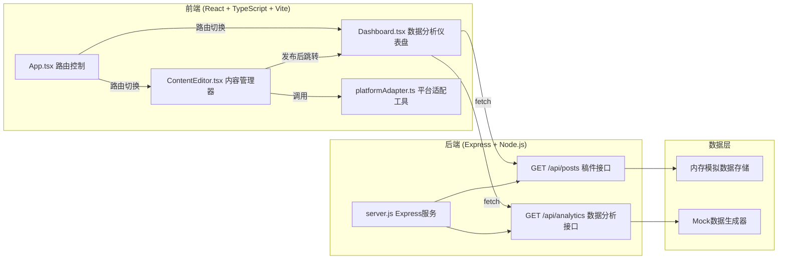

## 1. 架构设计



## 2. 技术描述

- **前端框架**：React@18 + TypeScript@5 + Vite@5
- **前端插件**：@vitejs/plugin-react@4
- **样式方案**：CSS Modules / 内联样式，CSS动画
- **图表库**：Recharts@2（高性能SVG图表，支持60fps渲染）
- **Markdown渲染**：react-markdown@9
- **HTTP请求**：原生fetch API
- **ID生成**：uuid@9
- **后端框架**：Express@4
- **跨域处理**：cors@2
- **开发模式**：Vite开发服务器 + Express后端独立运行

## 3. 目录结构与文件

```
auto199/
├── package.json          # 项目依赖与脚本
├── index.html            # 入口HTML
├── tsconfig.json         # TypeScript配置
├── vite.config.js        # Vite配置
├── server.js             # Express后端服务
└── src/
    ├── App.tsx           # 主组件，路由控制
    ├── pages/
    │   ├── ContentEditor.tsx   # 内容管理器（双栏布局）
    │   └── Dashboard.tsx       # 数据分析仪表盘
    └── utils/
        └── platformAdapter.ts  # 平台内容适配纯函数
```

## 4. 路由定义

| 路由 | 页面 | 功能 |
|------|------|------|
| /editor | 内容管理器 | 创建/编辑稿件，分发发布 |
| /dashboard | 数据分析仪表盘 | 查看三平台数据对比 |
| * | 默认跳转 | 重定向到/editor |

## 5. API 定义

### 5.1 GET /api/posts
获取稿件列表数据

**响应类型**：
```typescript
interface Post {
  id: string;
  title: string;
  summary: string;
  content: string;
  status: 'draft' | 'published';
  lastModified: string;
  platforms: PlatformType[];
}

type PlatformType = 'blog' | 'newsletter' | 'social';

// Response: Post[]
```

### 5.2 GET /api/analytics
获取小时级数据分析数据

**响应类型**：
```typescript
interface AnalyticsData {
  platform: PlatformType;
  totalReads: number;
  totalLikes: number;
  totalComments: number;
  hourlyData: HourlyMetric[];
}

interface HourlyMetric {
  hour: string;
  reads: number;
  likes: number;
  comments: number;
}

// Response: AnalyticsData[] (三个平台数据)
```

## 6. 数据类型定义

```typescript
// 平台类型
type PlatformType = 'blog' | 'newsletter' | 'social';

// 稿件状态
type PostStatus = 'draft' | 'published';

// 稿件数据
interface Post {
  id: string;
  title: string;
  summary: string;
  content: string;
  status: PostStatus;
  lastModified: Date;
  platforms: PlatformType[];
}

// 适配后的内容
interface AdaptedContent {
  platform: PlatformType;
  title: string;
  content: string;
  formattedContent: string;
}

// 分析数据
interface AnalyticsDataPoint {
  hour: string;
  reads: number;
  likes: number;
  comments: number;
}

interface PlatformAnalytics {
  platform: PlatformType;
  totalReads: number;
  totalLikes: number;
  totalComments: number;
  hourlyData: AnalyticsDataPoint[];
}
```

## 7. 关键技术实现点

### 7.1 性能优化
- **图表渲染**：使用Recharts的SVG优化，开启isAnimationActive控制动画，200数据点保持60fps
- **编辑器优化**：textarea使用debounce减少重渲染，输入延迟控制在50ms内
- **状态管理**：使用React useState/useReducer，避免不必要的重渲染

### 7.2 平台适配算法
```typescript
// blog: 保留完整Markdown
// newsletter: 截断200字 + "阅读更多"
// social: 压缩140字摘要 + 封面图占位
```

### 7.3 动画实现
- 进度环：CSS conic-gradient + animation，1.5s线性旋转一周
- 按钮点击：transform: scale(0.95) transition 0.1s
- 列表悬停：左侧border-left 5px solid #3B82F6，transition 0.2s
