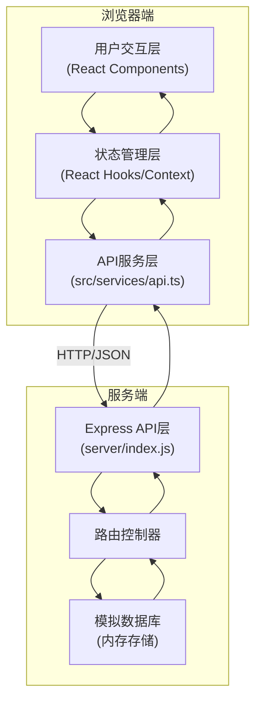

# NutriLog 技术架构文档

## 1. 技术栈选型

### 1.1 前端技术栈
| 技术 | 版本 | 选型理由 |
|-----|------|---------|
| React | 18.x | 组件化开发，生态成熟，支持并发特性 |
| TypeScript | 5.x | 静态类型检查，提升代码可维护性 |
| Vite | 5.x | 极速开发体验，ESM原生支持，HMR快 |
| Recharts | 2.x | React生态图表库，支持环形图、进度条 |
| @vitejs/plugin-react | 4.x | Vite React官方插件 |

### 1.2 后端技术栈
| 技术 | 版本 | 选型理由 |
|-----|------|---------|
| Node.js | 18+ | JavaScript运行时，前后端统一语言 |
| Express | 4.x | 轻量级Web框架，API开发简单高效 |
| CORS | 2.8.5 | 处理跨域请求 |

### 1.3 开发工具
| 工具 | 用途 |
|-----|------|
| npm | 包管理 |
| concurrently | 前后端并发启动 |

## 2. 项目目录结构

```
auto200/
├── package.json                 # 项目根配置
├── index.html                 # Vite入口HTML
├── tsconfig.json              # TypeScript配置
├── vite.config.js           # Vite构建配置
├── server/
│   └── index.js           # Express后端服务（含模拟数据库）
└── src/
    ├── App.tsx              # 主应用组件
    ├── services/
    │   └── api.ts         # API请求封装
    ├── components/
    │   ├── DietForm.tsx           # 用餐记录表单
    │   ├── NutritionDashboard.tsx # 营养仪表盘
    │   └── MealHistory.tsx      # 历史记录列表
    └── styles/             # 全局样式（内联CSS-in-JS或CSS Modules）
```

## 3. 架构设计

### 3.1 整体架构图



### 3.2 前端架构

#### 3.2.1 组件层级结构
```
App.tsx (全局状态管理 + 布局)
├── Navbar (顶部导航栏)
├── SuggestionBanner (智能建议横幅)
├── MainLayout (主布局容器)
│   ├── LeftPanel (左侧主内容区)
│   │   ├── DietForm (用餐记录表单)
│   │   └── MealHistory (历史记录列表)
│   └── RightPanel / MobileCollapsible (右侧仪表盘)
│       └── NutritionDashboard (营养仪表盘)
└── SettingsModal (设置弹窗)
    └── GoalSettings (目标设置表单)
```

#### 3.2.2 状态管理设计
采用 **React Context + useReducer** 管理全局状态：

```typescript
// 全局状态类型
interface AppState {
  goals: DailyGoals;
  todayMeals: MealRecord[];
  historyMeals: MealRecord[];
  todaySummary: DailySummary;
  suggestions: Suggestion[];
  showSettings: boolean;
  isMobileDashboardOpen: boolean;
}

// 操作类型
type ActionType =
  | { type: 'SET_GOALS'; payload: DailyGoals }
  | { type: 'ADD_MEAL'; payload: MealRecord }
  | { type: 'SET_TODAY_MEALS'; payload: MealRecord[] }
  | { type: 'SET_HISTORY'; payload: MealRecord[] }
  | { type: 'SET_SUMMARY'; payload: DailySummary }
  | { type: 'SET_SUGGESTIONS'; payload: Suggestion[] }
  | { type: 'TOGGLE_SETTINGS' }
  | { type: 'TOGGLE_MOBILE_DASHBOARD' };
```

#### 3.2.3 数据流
1. 用户操作 → Dispatch Action → Reducer 更新 State → 组件重新渲染
2. 副作用（API请求）→ useEffect → Dispatch Result Action

### 3.3 后端架构

#### 3.3.1 Express 中间件链
```
请求 → CORS 中间件 → JSON 解析中间件 → 路由分发 → 控制器 → 响应
```

#### 3.3.2 模拟数据库设计
使用内存对象存储：
```javascript
const db = {
  foods: [...],        // 食物数据库（至少20种）
  meals: [...],        // 用餐记录
  goals: {...},        // 用户目标
};
```

#### 3.3.3 营养计算引擎
```javascript
// 计算单份食物营养
function calculateFoodNutrition(food, grams) {
  const factor = grams / 100;
  return {
    calories: round(food.calories * factor),
    protein: round(food.protein * factor),
    fat: round(food.fat * factor),
    carbs: round(food.carbs * factor),
    sodium: round(food.sodium * factor),
  };
}

// 计算每日汇总
function calculateDailySummary(meals, goals) {
  // 累加所有营养
  // 与目标对比计算百分比
  // 生成智能建议
}
```

## 4. 关键技术实现

### 4.1 响应式布局实现
```css
/* 桌面端：左右两栏 */
.layout {
  display: grid;
  grid-template-columns: 1fr 350px;
  gap: 24px;
}

/* 平板端 */
@media (max-width: 1024px) {
  .layout { grid-template-columns: 1fr 300px; }
}

/* 移动端：底部折叠面板 */
@media (max-width: 768px) {
  .layout { grid-template-columns: 1fr; }
  .dashboard { position: fixed; bottom: 0; left: 0; right: 0; z-index: 50; }
}
```

### 4.2 毛玻璃效果实现
```css
.glass-card {
  background: rgba(255, 255, 255, 0.8);
  backdrop-filter: blur(10px);
  -webkit-backdrop-filter: blur(10px);
  border: 1px solid rgba(255, 255, 255, 0.5);
}
```

### 4.3 食物搜索实现
- 使用 **useMemo** + **filter** 实现前端即时搜索
- 防抖处理：setTimeout 300ms
- 结果高亮匹配关键词

### 4.4 性能优化策略

#### 4.4.1 虚拟列表渲染
```typescript
// 使用 Intersection Observer 或简单的偏移计算
// 仅渲染可视区域内的历史记录卡片
// 计算滚动位置 → 确定可见索引范围 → 只渲染可见项
```

#### 4.4.2 动画性能
- 环形图/进度条使用 **transform** 和 **opacity** 属性动画（GPU加速）
- 使用 CSS `will-change: transform` 提示浏览器优化
- Recharts 原生动画支持

#### 4.4.3 计算优化
- 营养计算结果使用 **useMemo** 缓存
- 避免不必要的重渲染：**React.memo** 包装纯展示组件
- 大数据列表使用唯一 **key** prop

### 4.5 智能建议算法
```javascript
function generateSuggestions(meals, goals) {
  const suggestions = [];
  
  // 检测每餐脂肪是否超标
  meals.forEach(meal => {
    const mealFat = sumNutrition(meal.foods, 'fat');
    const dailyFatTarget = goals.fat;
    
    if (mealFat > dailyFatTarget * 0.5) {
      suggestions.push({
        type: 'warning',
        mealType: meal.mealType,
        text: `${getMealName(meal.mealType)}脂肪偏高，建议更换为蒸鱼或水煮蔬菜`,
      });
    }
  });
  
  // 检测蛋白质是否不足
  const totalProtein = sumDailyNutrition(meals, 'protein');
  if (totalProtein < goals.protein * 0.3) {
    suggestions.push({
      type: 'info',
      text: '今日蛋白质摄入不足，建议增加鸡胸肉、鸡蛋等高蛋白食物',
    });
  }
  
  return suggestions;
}
```

## 5. 模拟食物数据库（至少20种）

| 食物名称 | 热量(kcal) | 蛋白质(g) | 脂肪(g) | 碳水(g) | 钠(mg) |
|---------|-----------|----------|--------|--------|--------|
| 白米饭 | 116 | 2.6 | 0.3 | 25.9 | 3 |
| 煮鸡蛋 | 151 | 12.7 | 10.5 | 1.5 | 125 |
| 煎鸡胸肉 | 195 | 31.0 | 7.0 | 0 | 75 |
| 清蒸鱼 | 113 | 20.5 | 3.5 | 0 | 60 |
| 番茄炒蛋 | 180 | 10.2 | 12.5 | 5.8 | 320 |
| 炒青菜 | 65 | 2.5 | 4.5 | 4.2 | 280 |
| 红烧肉 | 450 | 18.5 | 40.2 | 5.5 | 230 |
| 水饺 | 250 | 12.0 | 15.0 | 18.0 | 450 |
| 牛奶 | 54 | 3.0 | 3.2 | 3.4 | 37 |
| 豆浆 | 30 | 1.8 | 0.7 | 1.1 | 25 |
| 面包 | 312 | 8.3 | 5.1 | 58.6 | 520 |
| 燕麦粥 | 80 | 3.0 | 1.5 | 14.0 | 10 |
| 苹果 | 52 | 0.3 | 0.2 | 13.8 | 1 |
| 香蕉 | 89 | 1.1 | 0.3 | 22.8 | 1 |
| 牛肉 | 250 | 26.0 | 15.0 | 0 | 60 |
| 猪肉 | 395 | 13.2 | 37.0 | 2.4 | 59 |
| 豆腐 | 76 | 8.1 | 4.8 | 1.9 | 7 |
| 面条 | 130 | 4.5 | 0.8 | 25.0 | 28 |
| 沙拉 | 150 | 5.0 | 10.0 | 12.0 | 180 |
| 炒饭 | 180 | 6.5 | 8.0 | 22.0 | 420 |
| 披萨 | 266 | 11.0 | 10.0 | 33.0 | 580 |
| 汉堡 | 295 | 17.0 | 15.0 | 25.0 | 680 |
| 薯条 | 312 | 3.4 | 15.5 | 41.0 | 240 |
| 可乐 | 43 | 0 | 0 | 10.6 | 15 |
| 咖啡 | 2 | 0.3 | 0 | 0 | 5 |
| 绿茶 | 1 | 0.2 | 0 | 0.2 | 3 |

## 6. 开发与构建流程

### 6.1 开发启动
```bash
# 安装依赖
npm install

# 启动前后端并发服务
npm run dev
# → 同时启动 Vite (端口5173) 和 Express (端口3001)
```

### 6.2 构建配置
- Vite 配置 React 插件
- TypeScript 严格模式
- Express 使用 concurrently 并发启动
- Vite 代理 `/api` 到 Express 服务

### 6.3 Vite 代理配置
```javascript
server: {
  proxy: {
    '/api': {
      target: 'http://localhost:3001',
      changeOrigin: true,
    },
  },
}
```
