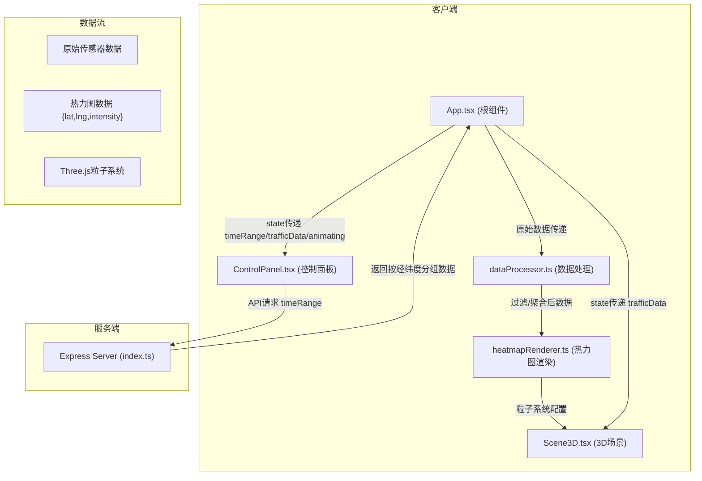

## 1. 架构设计



## 2. 技术描述
- **前端**：React 18 + TypeScript + Vite + Three.js + @react-three/fiber + @react-three/drei + zustand
- **后端**：Node.js + Express 4 + TypeScript + cors
- **构建工具**：Vite（@vitejs/plugin-react）
- **数据模拟**：uuid + 随机数生成模拟传感器数据

## 3. 目录结构
```
auto201/
├── package.json
├── tsconfig.json
├── vite.config.ts
├── index.html
├── src/
│   ├── server/
│   │   └── index.ts          # Express服务器，模拟数据API
│   ├── utils/
│   │   ├── dataProcessor.ts   # 数据过滤、格点聚合、热力图数据生成
│   │   └── heatmapRenderer.ts # Three.js粒子系统创建与更新
│   ├── components/
│   │   ├── Scene3D.tsx        # 3D场景主组件（建筑、路网、热力图）
│   │   └── ControlPanel.tsx   # 顶部控制面板
│   ├── App.tsx                # 应用根组件，全局状态管理
│   └── main.tsx               # 应用入口
```

## 4. API定义

### 4.1 GET /api/traffic-data
获取交通传感器数据

**请求参数：**
```typescript
interface TrafficDataQuery {
  timeRange: '1h' | '24h' | '7d';
}
```

**响应数据：**
```typescript
interface SensorReading {
  id: string;
  lat: number;
  lng: number;
  vehicleCount: number;
  timestamp: number;
  roadName: string;
}

interface TrafficDataResponse {
  data: SensorReading[];
  timeRange: string;
  generatedAt: number;
}
```

## 5. 核心数据类型

```typescript
// 热力图数据点
interface HeatmapPoint {
  lat: number;
  lng: number;
  intensity: number;  // 0-1 归一化强度
  roadName: string;
  vehicleCount: number;
}

// 全局应用状态
interface AppState {
  timeRange: '1h' | '24h' | '7d';
  trafficData: SensorReading[];
  heatmapData: HeatmapPoint[];
  isLoading: boolean;
  loadProgress: number;
  isAnimating: boolean;
  animationSpeed: 1 | 2 | 4 | 8;
  compareMode: boolean;
  selectedPoint: HeatmapPoint | null;
  pitchAngle: number;
}

// 粒子配置
interface ParticleConfig {
  position: [number, number, number];
  color: string;
  size: number;
  opacity: number;
}
```

## 6. 文件间调用关系

| 模块 | 被调用者 | 调用场景 |
|-----|---------|---------|
| App.tsx | ControlPanel.tsx | 渲染控制面板，传递state和回调 |
| App.tsx | Scene3D.tsx | 渲染3D场景，传递热力图数据 |
| App.tsx | dataProcessor.ts | 接收原始数据后调用processTrafficData()生成热力图数据 |
| ControlPanel.tsx | Express API | 切换时间范围/刷新时请求/api/traffic-data |
| Scene3D.tsx | heatmapRenderer.ts | 接收热力图数据后调用createParticles()/updateParticles() |
| dataProcessor.ts | - | 纯函数模块，仅被调用，处理数据过滤与聚合 |
| heatmapRenderer.ts | - | 纯函数/类模块，返回Three.js对象配置供r3f使用 |
