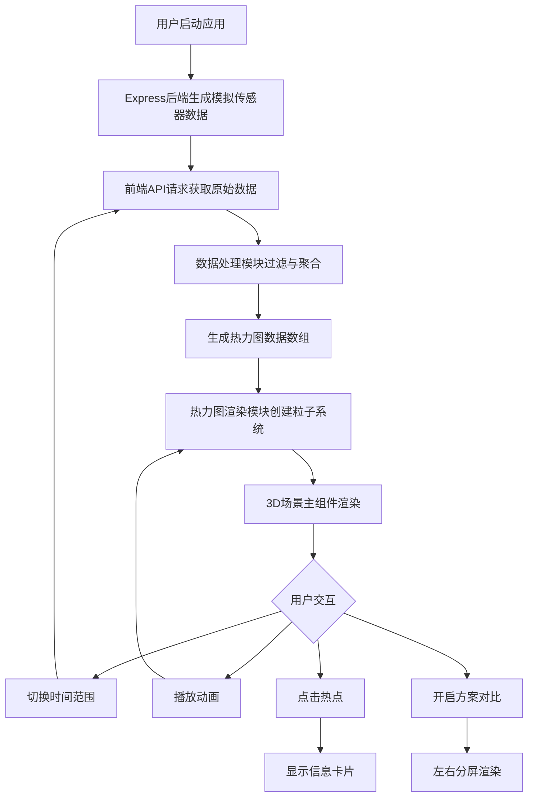

## 1. 产品概述
3D城市交通流量实时热力可视化应用，将交通流量传感器原始数据转化为直观的三维可视化，帮助城市管理者快速识别拥堵热点并评估交通疏导方案效果。
- 主要用途：城市交通监测、拥堵分析、方案对比评估
- 目标用户：城市交通管理部门、交通规划师、智慧城市运营人员
- 核心价值：通过3D可视化直观呈现交通流量密度变化，提升交通管理决策效率

## 2. 核心特性

### 2.1 功能模块
1. **3D城市场景**：三维地图展示城市路网、基础建筑模型、街道网格
2. **交通热力图**：基于传感器数据的动态粒子热力图渲染
3. **数据过滤面板**：时间范围选择（1小时/24小时/7天）、数据刷新控制
4. **方案对比模式**：左右分屏对比当前数据与历史平均数据
5. **热点交互**：粒子点击高亮、信息卡片展示区域交通详情
6. **动画播放**：按时间顺序动态演变热力图，支持多倍速播放
7. **视角控制**：鼠标拖拽旋转、滚轮缩放、触摸手势支持

### 2.2 页面详情
| 页面名称 | 模块名称 | 功能描述 |
|---------|---------|---------|
| 主应用页面 | 顶部控制栏 | 时间范围选择器、刷新按钮、自动刷新开关、播放/暂停、方案对比按钮、速度调节 |
| 主应用页面 | 3D场景区域 | 城市建筑模型、道路网格、热力粒子系统、Bloom发光后处理 |
| 主应用页面 | 信息卡片 | 显示区域道路名称、车流量、拥堵等级，底部滑入动画 |
| 主应用页面 | 加载动画 | 数据加载时显示进度条（300px×6px，蓝色，圆角） |
| 主应用页面 | 分屏对比视图 | 左右两个独立3D场景，中间垂直分割线（2px白色半透明） |
| 主应用页面 | 俯仰角指示器 | 俯视45度以上时显示当前俯仰角数值（半透明黑底白字） |
| 主应用页面 | 移动端抽屉 | 视口<768px时控制面板折叠为右侧滑入抽屉（280px宽） |

## 3. 核心流程
用户启动应用→默认加载近1小时交通数据→数据过滤处理→生成热力图粒子→渲染3D场景→用户可切换时间范围/播放动画/点击热点查看详情/开启方案对比模式

## 4. 用户界面设计
### 4.1 设计风格
- 主题色：深色主题，背景#0F172A，文字#F8FAFC
- 强调色：#3B82F6（蓝色按钮），#00FF00→#FFFF00→#FF0000（热力渐变）
- 按钮：圆角8px，悬停亮度+20%，微缩0.95倍，点击脉冲波纹
- 卡片：背景#1E293B，圆角12px，阴影5px rgba(0,0,0,0.5)
- 动画：EaseInOut曲线，300ms过渡
- 布局：顶栏64px（移动端48px），3D场景占剩余视口，控制面板顶栏右侧（右间距24px）

### 4.2 页面设计概览
| 页面名称 | 模块名称 | UI元素 |
|---------|---------|-------|
| 主应用页面 | 顶部控制栏 | 深色背景#1E293B，底部分割线#334155，右侧排列控制按钮 |
| 主应用页面 | 3D场景 | Three.js渲染，Bloom后处理（强度0.5，半径0.4，阈值0.2），粒子发光 |
| 主应用页面 | 信息卡片 | 从底部向上滑动200ms + 1.05→1倍缩放，圆形关闭按钮右上角，悬停变红 |
| 主应用页面 | 进度条 | 300px×6px，#3B82F6填充，#E5E7EB背景，圆角 |
| 主应用页面 | 俯仰角指示 | 14px白色文字，半透明黑底圆角5px |
| 主应用页面 | 移动端抽屉 | 右侧滑入280px宽，#1E293B背景 |

### 4.3 响应式设计
- 桌面端优先（≥768px），顶栏64px，控制面板展开
- 移动端（<768px）：顶栏48px，控制面板折叠为右侧抽屉，支持触摸手势（双指旋转、捏合缩放）

### 4.4 3D场景设计
- 环境：深色夜景风格，模拟城市夜间灯光氛围
- 光照：环境光+方向光，建筑使用MeshStandardMaterial
- 相机：PerspectiveCamera，初始俯视45度，缩放范围1-100单位
- 后处理：Bloom效果（强度0.5，半径0.4，阈值0.2）使发光粒子更醒目
- 粒子系统：最多3000个粒子，大小0.5-3.0单位，透明度0.3-0.9，1Hz上下浮动0.1单位
- 交互：OrbitControls支持任意方向旋转、缩放，移动端触摸支持
