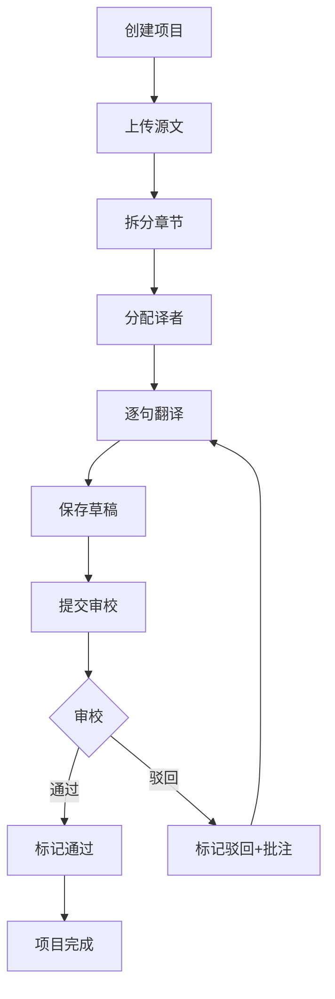

## 1. 产品概述

翻译协作管理平台，为独立译者和小型翻译团队提供稿件管理、进度追踪与协作审校的一体化解决方案。

- 核心目标：解决翻译团队协作效率低、进度不透明、审校流程混乱等痛点
- 目标用户：独立译者、小型翻译团队（3-10人）、本地化项目经理

## 2. 核心功能

### 2.1 用户角色

| 角色 | 核心权限 |
|------|----------|
| 项目发起人 | 创建项目、上传源文、分配章节、查看仪表盘统计 |
| 译者 | 接收分配章节、逐句翻译、保存草稿、提交审校 |
| 审校者 | 逐句对比审校、添加批注、通过/驳回译文 |

### 2.2 功能模块

1. **项目仪表盘**：进度状态环形图、译者工作量统计条形图
2. **项目文件管理**：目录树导航、章节选择、翻译编辑器
3. **翻译编辑器**：双列对比视图、逐句编辑、备注功能
4. **审校面板**：三栏布局、批注管理、通过/驳回操作

### 2.3 页面详情

| 页面名称 | 模块名称 | 功能描述 |
|-----------|-------------|---------------------|
| 项目仪表盘 | 环形进度图 | 展示待分配/翻译中/待审校/已完成四种状态的章节占比 |
| 项目仪表盘 | 译者统计条形图 | 统计每位译者本周翻译字数、审校句数和驳回率 |
| 文件管理页 | 目录树 | 280px宽深灰色侧边栏，带缩进和折叠展开动画 |
| 文件管理页 | 翻译编辑器 | 双列对比视图，可拖拽分割线，逐句编辑区 |
| 翻译编辑器 | 句段编辑 | 点击进入编辑模式，蓝色边框，保存/取消按钮，保存后淡绿色闪烁 |
| 翻译编辑器 | 备注功能 | 黄色便签图标悬浮显示，点击展开输入框 |
| 审校面板 | 三栏布局 | 左栏原文、中栏译文、右栏批注与操作面板 |
| 审校面板 | 批注管理 | 按时间倒序显示批注，带头像和时间戳 |
| 审校面板 | 通过/驳回 | 通过显示绿色边框，驳回显示红色边框，原文标记红点 |

## 3. 核心流程

用户创建翻译项目 → 上传源文文件 → 系统拆分章节 → 分配给译者 → 译者逐句翻译并保存 → 提交审校 → 审校者对比批注 → 通过或驳回 → 项目完成。

## 4. 用户界面设计

### 4.1 设计风格

- **主色调**：蓝色 #3182CE（翻译中/主操作）、绿色 #48BB78（已完成/通过）、橙色 #ED8936（待审校）、灰色 #A0AEC0（待分配）
- **背景色**：深灰 #2D3748（侧边栏）、浅灰 #F7FAFC（原文区）、纯白 #FFFFFF（译文区）
- **强调色**：红色 #F56565（驳回）、黄色 #ECC94B（便签备注）
- **字体**：16px 字号，行高 1.8，采用现代无衬线字体
- **按钮样式**：圆角按钮，带 hover 缩放和过渡动画
- **布局风格**：卡片式布局，侧边栏 + 主内容区的经典结构

### 4.2 页面设计概览

| 页面名称 | 模块名称 | UI元素 |
|-----------|-------------|-------------|
| 项目仪表盘 | 环形进度图 | SVG圆环，直径180px，彩色弧线带渐变效果，悬停放大 |
| 项目仪表盘 | 译者条形图 | Recharts柱状图，1.5秒入场动画，多数据系列 |
| 文件管理页 | 目录树 | 缩进层级，折叠箭头旋转动画，hover背景渐变 |
| 文件管理页 | 分割线 | 可拖拽，cursor-col-resize，拖拽时高亮 |
| 翻译编辑器 | 句段区块 | 默认浅边框，编辑时蓝色边框，保存时绿色闪烁动画 |
| 翻译编辑器 | 便签图标 | 悬浮在两栏之间，黄色，点击展开输入框 |
| 审校面板 | 批注列表 | 倒序排列，头像圆形缩略图，时间戳，通过/驳回按钮 |
| 审校面板 | 状态标记 | 绿色/红色边框，原文红点指示器 |

### 4.3 响应式设计

- **桌面端**（1024px以上）：完整三栏/双栏布局
- **平板端**（768px-1024px）：审校页面三栏改为上下两栏布局，侧边栏可折叠
- **交互优化**：所有列表hover缩放1.02，背景渐变过渡，切换内容不超过500ms

### 4.4 动效设计

- 目录树折叠/展开：箭头旋转动画 0.3s ease
- 句段保存成功：背景淡绿色闪烁 0.3s
- 条形图入场：从0增长到目标值，持续1.5s
- 列表项hover：缩放1.02 + 背景渐变，过渡0.2s
- 页面切换：内容淡入，加载时间 < 500ms
