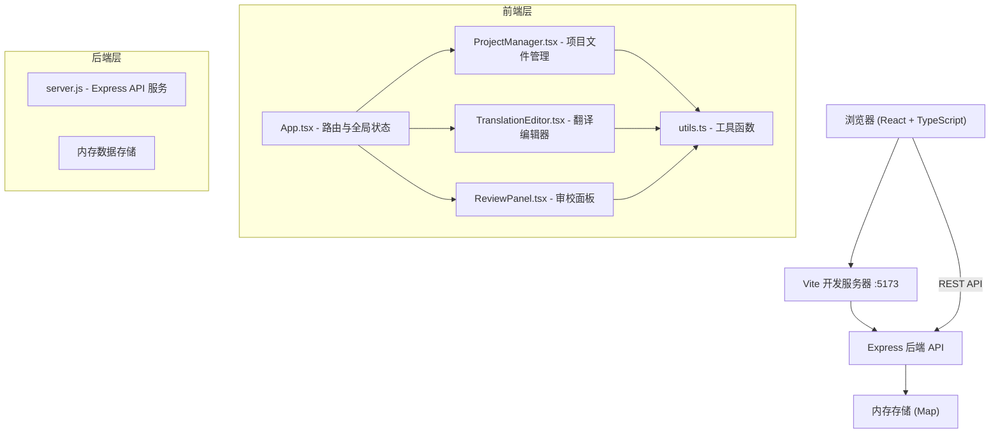
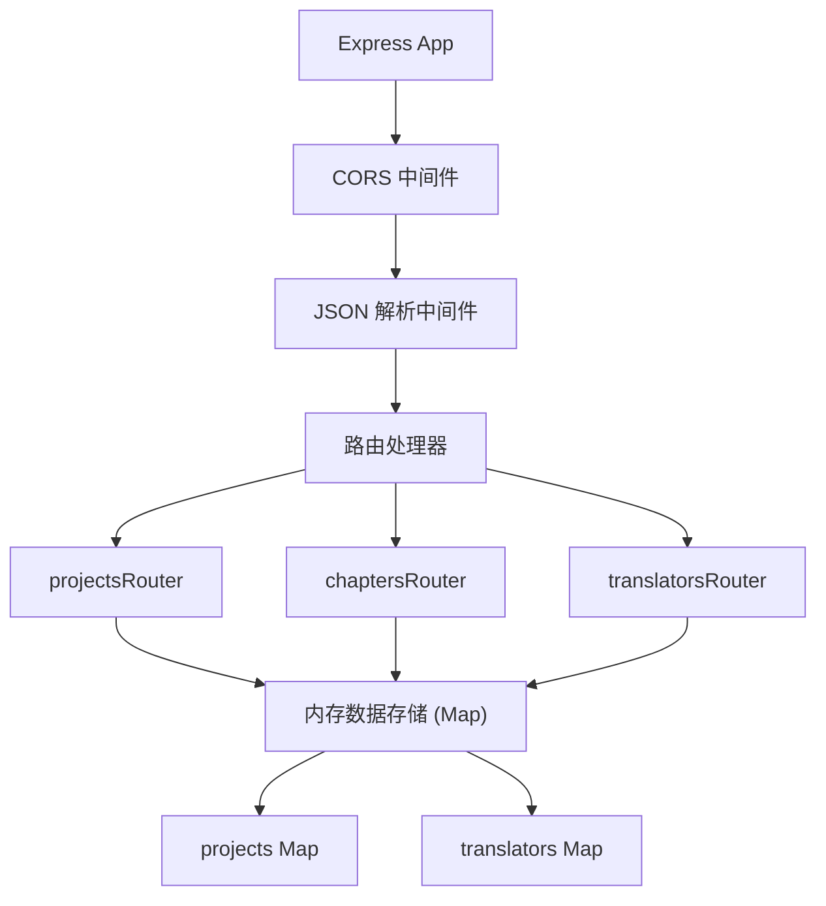
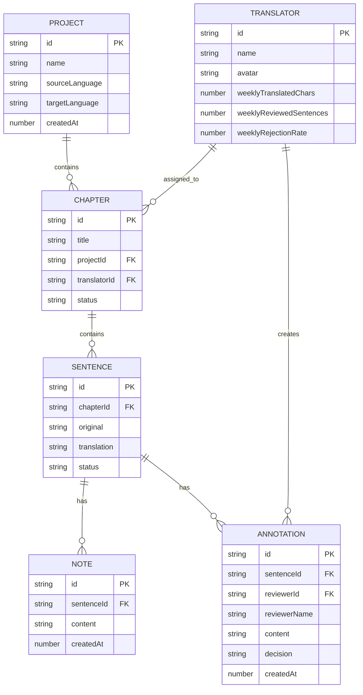

## 1. 架构设计



## 2. 技术说明

- **前端框架**：React@18 + TypeScript
- **构建工具**：Vite@5 + @vitejs/plugin-react
- **后端框架**：Express@4
- **数据存储**：内存存储（使用 JavaScript Map）
- **图表库**：Recharts（用于条形图）
- **其他依赖**：uuid（ID生成）、cors（跨域支持）
- **开发端口**：前端 5173，后端 API（与前端集成）

## 3. 路由定义

| 页面区域 | 说明 |
|-------|---------|
| Dashboard | 项目仪表盘，展示环形进度图和译者统计 |
| ProjectManager | 项目文件管理，目录树 + 翻译编辑器 |
| ReviewPanel | 审校面板，三栏布局审校界面 |

应用内部通过状态切换视图，不使用 react-router，保持简洁。

## 4. API 定义

### 4.1 类型定义

```typescript
type ChapterStatus = 'unassigned' | 'translating' | 'reviewing' | 'completed';

interface Sentence {
  id: string;
  original: string;
  translation: string;
  translatorId?: string;
  status: 'draft' | 'submitted' | 'approved' | 'rejected';
  notes: Note[];
  annotations: Annotation[];
}

interface Note {
  id: string;
  content: string;
  createdAt: number;
}

interface Annotation {
  id: string;
  reviewerId: string;
  reviewerName: string;
  content: string;
  decision: 'approved' | 'rejected';
  createdAt: number;
}

interface Chapter {
  id: string;
  title: string;
  sentences: Sentence[];
  translatorId?: string;
  status: ChapterStatus;
  children?: Chapter[];
}

interface Project {
  id: string;
  name: string;
  sourceLanguage: string;
  targetLanguage: string;
  chapters: Chapter[];
  createdAt: number;
}

interface Translator {
  id: string;
  name: string;
  avatar: string;
  weeklyTranslatedChars: number;
  weeklyReviewedSentences: number;
  weeklyRejectionRate: number;
}
```

### 4.2 接口列表

| 方法 | 路径 | 说明 |
|------|------|------|
| GET | `/api/projects` | 获取所有项目列表 |
| GET | `/api/projects/:id` | 获取单个项目详情（含章节） |
| POST | `/api/projects` | 创建新项目 |
| GET | `/api/chapters/:id` | 获取章节详情（含句段） |
| PUT | `/api/chapters/:id/sentences/:sentenceId` | 更新句段译文 |
| POST | `/api/chapters/:id/sentences/:sentenceId/notes` | 添加备注 |
| POST | `/api/chapters/:id/sentences/:sentenceId/annotations` | 添加审校批注 |
| PUT | `/api/chapters/:id/sentences/:sentenceId/status` | 更新句段审校状态 |
| GET | `/api/translators` | 获取译者列表及统计数据 |
| GET | `/api/projects/:id/progress` | 获取项目进度统计 |

## 5. 服务端架构



## 6. 数据模型

### 6.1 ER 图



### 6.2 内存初始化

服务启动时，使用模拟数据填充 Map：
- 1 个示例翻译项目（含 3-5 个章节）
- 4-5 名译者（带统计数据）
- 每章节 10-15 个句段（部分已翻译，部分待翻译）
- 若干备注和批注样本数据
