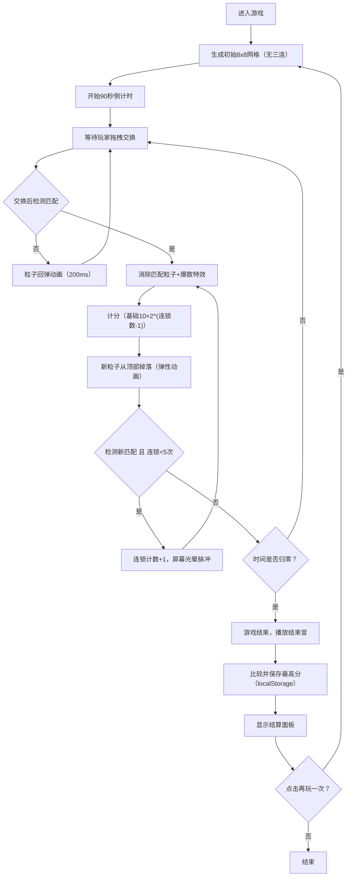

## 1. 产品概述
一款基于量子纠缠主题的三消类休闲游戏，玩家通过交换相邻量子粒子形成三连匹配进行消除，获得积分并在限定时间内挑战最高分。
- 核心玩法：8x8粒子网格，拖拽交换相邻粒子形成水平/垂直三连匹配消除
- 目标用户：休闲游戏玩家，科幻主题爱好者
- 产品价值：提供快节奏、有策略性的消除游戏体验，融合科幻量子主题视觉风格

## 2. 核心功能

### 2.1 用户角色
| 角色 | 注册方式 | 核心权限 |
|------|----------|----------|
| 普通玩家 | 无需注册 | 进行游戏、查看得分、保存最高分 |

### 2.2 功能模块
1. **游戏主界面**：粒子网格、顶部UI（倒计时、得分、音效开关）、深空背景
2. **游戏逻辑系统**：粒子生成、匹配检测、消除、新粒子掉落、链式反应、计分
3. **动画特效系统**：消除爆散粒子、链式光晕脉冲、交换缩放、回弹动画、掉落弹性
4. **音效系统**：交换音、消除音、连锁音、游戏结束音（Web Audio API合成）
5. **结算系统**：倒计时结束弹出结算面板，显示总分和历史最高分（localStorage）

### 2.3 页面详情
| 页面名称 | 模块名称 | 功能描述 |
|----------|----------|----------|
| 游戏主界面 | 粒子网格 | 8x8网格渲染，5种粒子类型（红圆/蓝方/绿三角/紫菱形/金五角星），拖拽交换交互 |
| 游戏主界面 | 顶部UI栏 | 60px高毛玻璃效果，倒计时数字+进度条，金色分数，音效开关按钮 |
| 游戏主界面 | 结算面板 | 居中300x200px半透明面板，大号金色得分、小号灰色最高分、渐变色再玩一次按钮 |
| 游戏主界面 | 背景层 | 深空蓝垂直渐变（#0B0E1A → #1A2040） |

## 3. 核心流程
玩家进入游戏 → 随机生成初始8x8网格（保证无三连）→ 90秒倒计时开始 → 玩家拖拽交换相邻粒子 → 系统检测匹配 → 有匹配：消除粒子→触发链式反应（最多5次连锁，分数倍增）→新粒子掉落填充→继续等待操作 → 无匹配：粒子回弹动画 → 时间归零 → 显示结算面板 → 保存最高分至localStorage → 点击再玩一次重新开始

## 4. 用户界面设计

### 4.1 设计风格
- **主色调**：深空蓝渐变（#0B0E1A 至 #1A2040）为背景，粒子5色区分（红#FF4757、蓝#3742FA、绿#2ED573、紫#A55EEA、金#FFD700）
- **粒子样式**：每种粒子使用径向渐变+高光光泽效果，独特形状（圆/方/三角/菱形/五角星）
- **按钮样式**：结算按钮使用线性渐变（#4A90D9 → #357ABD），圆角，hover亮度提升
- **字体**：使用现代无衬线字体，倒计时为大号白色粗体，得分为金色加粗
- **布局**：粒子网格居中，格子50x50px间距2px，格背景半透明深蓝（#0D1128, α=0.8），边框1px淡蓝（#2A3A5C）
- **交互过渡**：所有UI元素过渡动画transition: 0.2s

### 4.2 页面设计总览
| 页面名称 | 模块名称 | UI元素 |
|----------|----------|--------|
| 游戏主界面 | 粒子网格 | 8×8居中布局，格子半透明背景+淡蓝边框，粒子带渐变光泽，拖拽交换+缩放脉冲动画 |
| 游戏主界面 | 顶部UI栏 | 60px高，毛玻璃backdrop-filter:blur，左侧倒计时（白字大号+进度条），中间得分（金#FFD700加粗），右侧音效开关图标 |
| 游戏主界面 | 特效层 | 消除位置30个微型粒子爆散扩散渐隐，链式消除时屏幕边缘半透明光晕脉冲 |
| 游戏主界面 | 结算面板 | 300x200px居中，#0A0E1A α=0.85背景，圆角20px，大号金#FFD700得分，小号灰色最高分，渐变色再玩一次按钮 |

### 4.3 响应式
- 桌面优先设计，Canvas自适应居中
- 触摸事件支持，移动端可正常拖拽操作
- 最小支持宽度480px

### 4.4 性能要求
- 游戏循环稳定60FPS
- Canvas渲染无卡顿，使用requestAnimationFrame
- 爆散粒子同时存在不超过50个
- 链式消除动画总时长控制在1.5秒内
