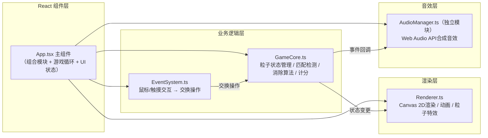

## 1. 架构设计
纯前端单页应用，模块化分层架构。各模块职责单一，通过事件/回调解耦。



## 2. 技术描述
- **前端框架**：React@18 + TypeScript@5（严格模式）
- **构建工具**：Vite@5 + @vitejs/plugin-react@4
- **渲染**：Canvas 2D API（原生，无额外渲染库）
- **音效**：Web Audio API（原生合成，无需音频文件）
- **数据持久化**：localStorage（保存最高分）
- **初始化方式**：手动创建配置文件（用户指定了具体文件结构）

## 3. 路由定义
| 路由 | 用途 |
|------|------|
| / | 游戏主界面（单页面无路由） |

## 4. 数据模型

### 4.1 核心类型定义

```typescript
// 粒子类型枚举
enum ParticleType {
  RED_CIRCLE = 0,    // 红色圆形
  BLUE_SQUARE = 1,   // 蓝色方形
  GREEN_TRIANGLE = 2,// 绿色三角
  PURPLE_DIAMOND = 3,// 紫色菱形
  GOLD_STAR = 4      // 金色五角星
}

// 单个粒子状态
interface Particle {
  id: number;
  type: ParticleType;
  row: number;           // 当前行（逻辑位置）
  col: number;           // 当前列（逻辑位置）
  renderX: number;       // 渲染X坐标（用于动画插值）
  renderY: number;       // 渲染Y坐标（用于动画插值）
  targetX: number;       // 目标X（动画终点）
  targetY: number;       // 目标Y（动画终点）
  scale: number;         // 缩放（交换脉冲动画）
  opacity: number;       // 透明度（消除渐隐）
  isMatched: boolean;    // 是否处于匹配消除状态
  isNew: boolean;        // 是否为新生成粒子
  spawnProgress: number; // 生成动画进度 0~1
}

// 匹配组信息
interface MatchGroup {
  particles: Particle[];
  isChained: boolean;    // 是否为连锁匹配
}

// 爆散微型粒子
interface BurstParticle {
  x: number;
  y: number;
  vx: number;
  vy: number;
  color: string;
  life: number;          // 剩余生命 0~1
  maxLife: number;
  size: number;
}

// 游戏状态
interface GameState {
  grid: (Particle | null)[][];   // 8x8网格
  score: number;
  highScore: number;
  timeLeft: number;              // 秒
  isPlaying: boolean;
  isProcessing: boolean;         // 连锁消除中禁止操作
  chainCount: number;            // 当前连锁数
  soundEnabled: boolean;
  showResult: boolean;
}
```

## 5. 模块职责与接口

### 5.1 GameCore.ts
- **职责**：粒子状态管理、匹配检测算法、消除逻辑、计分、链式反应控制
- **核心接口**：
  - `constructor(rows: number, cols: number, types: number)`
  - `init(): void` - 初始化无三连网格
  - `swap(row1: number, col1: number, row2: number, col2: number): boolean` - 尝试交换，返回是否有效
  - `findMatches(): MatchGroup[]` - 检测所有三连及以上匹配
  - `resolveMatches(): Promise<void>` - 异步执行消除→掉落→连锁循环
  - `getState(): GameState` - 获取当前游戏快照
  - `on(event: string, callback: Function)` - 事件订阅（match/chain/gameover等）

### 5.2 Renderer.ts
- **职责**：Canvas绘制、粒子动画插值、爆散粒子系统、光晕特效
- **核心接口**：
  - `constructor(canvas: HTMLCanvasElement, cellSize: number, spacing: number)`
  - `render(state: GameState, dt: number): void` - 每帧渲染
  - `createBurst(x: number, y: number, color: string, count: number): void` - 生成爆散特效
  - `triggerGlowPulse(intensity: number): void` - 触发屏幕光晕脉冲
  - `setSelectedParticle(row: number | null, col: number | null): void`
  - `setSwapAnimation(from: {row,col}, to: {row,col}, progress: number, isReverting: boolean): void`

### 5.3 EventSystem.ts
- **职责**：监听Canvas鼠标/触摸事件，解析拖拽动作，映射为交换操作
- **核心接口**：
  - `constructor(canvas: HTMLCanvasElement, cellSize: number, spacing: number, offsetX: number, offsetY: number)`
  - `onSwap(callback: (r1,c1,r2,c2) => void): void` - 注册交换回调
  - `onSelectStart(callback: (r,c) => void): void` - 选中开始
  - `destroy(): void` - 清理事件监听

### 5.4 AudioManager.ts（音效模块）
- **职责**：Web Audio API合成音效、统一控制开关
- **核心接口**：
  - `getInstance(): AudioManager`（单例）
  - `setEnabled(enabled: boolean): void`
  - `playSwap(): void` - 短促上升音调
  - `playMatch(): void` - 清脆铃音
  - `playChain(level: number): void` - 音调逐步升高
  - `playGameOver(): void` - 低沉长音

## 6. 关键算法

### 6.1 匹配检测（BFS扩展）
对每个格子向左右扩展水平匹配，向上下扩展垂直匹配，长度≥3即记录为匹配组。时间复杂度O(R×C)。

### 6.2 初始网格生成（保证无三连）
随机填充 → 逐格检测 → 若产生三连则随机更换为与左/上不同的类型 → 直至全部合规。

### 6.3 新粒子掉落填充
逐列从下至上扫描空位 → 上方粒子下落填补 → 顶部生成新粒子 → 记录每个粒子的动画起止坐标用于弹性缓动。

### 6.4 动画缓动函数
- 回弹：easeOutBack
- 弹性落地：easeOutElastic
- 交换脉冲：sin^2(t × π)

## 7. 性能优化策略
- 粒子ID复用，避免频繁对象分配
- Canvas仅重绘变化区域（如需），或使用脏标记
- 爆散粒子对象池
- 逻辑更新与渲染解耦，固定步长dt=16ms
- requestAnimationFrame驱动循环
