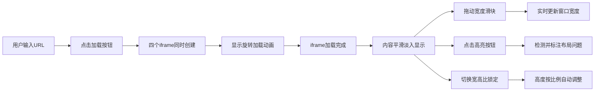

## 1. 产品概述

响应式布局断点预览与对比工具是一款面向前端开发者的在线调试工具，帮助开发者快速预览和测试网页在不同设备断点下的布局表现。通过多窗口同时渲染、可拖动宽度调整和布局问题高亮检测，显著提升响应式设计的调试效率。

- **目标用户**：前端开发者、UI设计师、响应式布局测试人员
- **核心价值**：替代浏览器开发者工具的繁琐操作，提供多断点同时对比的可视化调试体验

## 2. 核心功能

### 2.1 用户角色

| 角色 | 注册方式 | 核心权限 |
|------|----------|----------|
| 普通用户 | 无需注册 | 使用全部预览和调试功能 |

### 2.2 功能模块

1. **URL输入模块**：顶部URL输入栏，支持输入网页地址并加载
2. **多断点预览模块**：四个预设断点窗口（360px、768px、1024px、1440px）同时渲染
3. **宽度控制模块**：每个窗口底部滑动条，支持独立调整窗口宽度（240px-2000px）
4. **断点标签模块**：自动根据宽度识别设备类型（手机/平板/桌面/大屏）
5. **宽高比锁定模块**：一键锁定16:9宽高比，模拟横竖屏设备
6. **布局检测模块**：高亮显示文本溢出、元素重叠、水平滚动等布局问题
7. **响应式布局模块**：工具自身自适应，窗口<1200px时2×2排列

### 2.3 页面详情

| 页面名称 | 模块名称 | 功能描述 |
|----------|----------|----------|
| 主应用页 | URL输入栏 | 渐变边框输入框，聚焦发光效果，加载按钮 |
| 主应用页 | 预览窗口网格 | 4列卡片布局，支持响应式变为2×2 |
| 主应用页 | 预览卡片 | 圆角16px卡片，包含顶部标签栏、iframe区域、底部控制条 |
| 主应用页 | 宽度控制条 | 圆形滑块拖动，实时显示宽度数值 |
| 主应用页 | 高亮按钮 | 点击后高亮布局问题，脉冲光晕效果 |
| 主应用页 | 宽高比锁定开关 | 全局锁定/解锁16:9比例 |

## 3. 核心流程

用户输入网页URL → 点击加载按钮 → 四个预览窗口同时创建iframe并显示加载动画 → iframe加载完成后平滑淡入页面内容 → 用户拖动底部滑块调整窗口宽度 → 实时观察布局变化 → 点击高亮按钮检测布局问题 → 可切换宽高比锁定模式

## 4. 用户界面设计

### 4.1 设计风格

- **主背景色**：#1A1B1E（深色主题）
- **卡片背景色**：#2A2B2E
- **主题色渐变**：#4A90D9 → #7B68EE
- **警告色**：#FF6B6B（红色）
- **信息色**：#4A90D9（蓝色）
- **卡片圆角**：16px
- **输入框圆角**：8px
- **卡片阴影**：0 4px 20px rgba(0,0,0,0.3)
- **卡片间距**：24px

### 4.2 页面设计概述

| 页面名称 | 模块名称 | UI元素 |
|----------|----------|--------|
| 主应用页 | URL输入栏 | 渐变边框、输入框发光效果、加载按钮 |
| 主应用页 | 预览卡片 | 深色卡片、圆角16px、阴影、顶部标签栏（等宽字体14px） |
| 主应用页 | 加载动画 | 60fps旋转渐变动画、居中显示 |
| 主应用页 | 宽度控制条 | 圆形滑块（直径20px，#4A90D9）、拖动缩放反馈（scale:1.2） |
| 主应用页 | 高亮按钮 | 灰色默认态，激活态#FF6B6B + 脉冲光晕 |
| 主应用页 | 布局问题标注 | 文本溢出（红色虚线描边）、重叠（半透红闪烁）、水平滚动（蓝色箭头） |

### 4.3 响应式

- 桌面端（≥1200px）：4列横向排列
- 平板端（<1200px）：2列2行排列，窗口宽度自动铺满
- 宽度控制条支持触摸拖动
- 所有交互元素最小尺寸适配触摸操作

### 4.4 动效设计

- **加载动画**：60fps旋转渐变动画
- **内容淡入**：300ms平滑过渡
- **滑块拖动**：scale: 1.2 缩放反馈
- **高亮按钮**：脉冲光晕动画
- **输入框聚焦**：边框发光扩散效果
