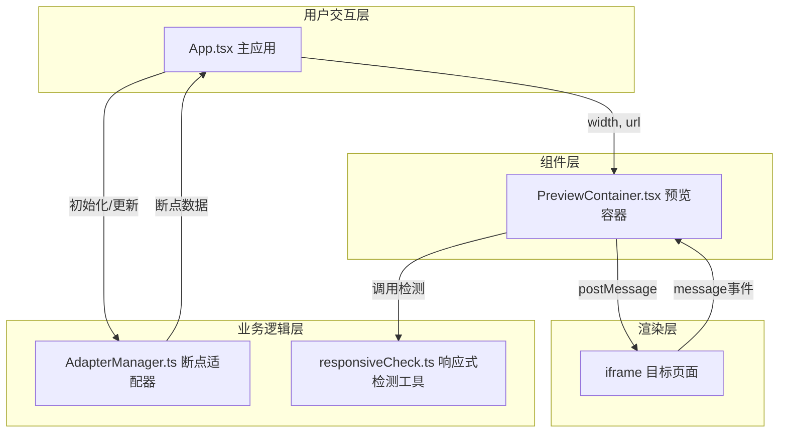

## 1. 架构设计



## 2. 技术描述

- **前端框架**：React@18 + TypeScript
- **构建工具**：Vite@5 + @vitejs/plugin-react
- **状态管理**：React useState/useReducer（轻量级场景）
- **样式方案**：CSS Modules + CSS Variables
- **iframe通信**：postMessage 消息机制
- **包管理器**：npm

### 核心技术选型说明

1. **Vite**：快速的开发服务器启动和热更新，适合开发调试工具
2. **TypeScript 严格模式**：确保类型安全，减少运行时错误
3. **模块化架构**：按职责分离，预览容器、断点管理、检测工具各自独立

## 3. 项目文件结构

```
├── package.json              # 项目依赖与脚本
├── vite.config.js            # Vite配置（React插件）
├── tsconfig.json             # TypeScript配置（严格模式）
├── index.html                # 入口HTML
└── src/
    ├── App.tsx               # 主应用组件
    ├── PreviewContainer.tsx  # 单个iframe预览容器组件
    ├── AdapterManager.ts     # 断点适配器管理模块
    └── utils/
        └── responsiveCheck.ts # 响应式检测工具函数
```

### 文件间调用关系

| 文件 | 依赖/调用 | 数据流向 |
|------|-----------|----------|
| App.tsx | AdapterManager.ts, PreviewContainer.tsx | 接收用户URL → 传递给PreviewContainer → 调用AdapterManager管理断点 |
| PreviewContainer.tsx | responsiveCheck.ts | 从App接收width和url → 渲染iframe → 监听message事件 → 调用responsiveCheck |
| AdapterManager.ts | 无外部依赖 | 由App调用初始化与更新方法 → 返回断点列表数据 |
| responsiveCheck.ts | 无外部依赖 | 被PreviewContainer调用 → 返回布局检测结果 |

## 4. 数据模型

### 4.1 断点数据结构

```typescript
interface Breakpoint {
  id: string;
  name: string;
  width: number;
  height: number;
  deviceType: 'mobile' | 'tablet' | 'desktop' | 'large';
}
```

### 4.2 布局检测结果

```typescript
interface LayoutIssue {
  type: 'overflow' | 'overlap' | 'scroll';
  selector: string;
  description: string;
  position: { top: number; left: number; width: number; height: number };
}
```

## 5. 核心模块设计

### 5.1 AdapterManager（断点适配器管理）

- **职责**：管理断点列表，支持增删改查，提供宽度微调方法
- **默认断点**：360px、768px、1024px、1440px
- **最大断点数量**：6个
- **宽度范围**：240px - 2000px
- **设备类型判断**：<480px手机、480-900px平板、900-1440px桌面、>1440px大屏

### 5.2 PreviewContainer（预览容器）

- **职责**：管理单个iframe的渲染、加载状态、消息通信
- **加载状态**：loading → loaded，带旋转动画和淡入效果
- **消息通信**：通过postMessage与iframe内页面交互
- **布局检测**：特定时机调用responsiveCheck分析布局问题

### 5.3 responsiveCheck（响应式检测工具）

- **职责**：分析页面布局问题
- **检测项**：文本溢出、元素重叠、水平滚动
- **输出**：布局问题列表，包含位置和类型信息

## 6. 性能约束实现方案

### 6.1 主线程帧率 ≥ 45fps

- iframe加载使用懒加载和分批处理
- 动画效果使用CSS transform和opacity（GPU加速）
- 避免主线程长任务，使用requestAnimationFrame调度

### 6.2 拖动响应延迟 ≤ 50ms

- 宽度调整使用CSS transform而非修改iframe src
- 拖动事件使用requestAnimationFrame节流
- 避免拖动过程中的重排重绘

### 6.3 不触发iframe重加载

- 宽度调整仅修改iframe容器的CSS宽度
- 使用transform: scale() 或直接width属性调整
- 保持iframe的src不变
