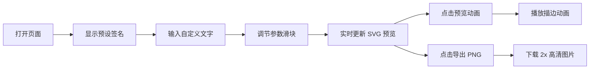

## 1. 产品概述

手写风格 SVG 签名生成器是一款在线工具，用户通过简单的参数调节即可快速生成个性化手写签名图片，无需手动绘制复杂路径。

- 核心用途：为用户提供便捷的手写签名生成服务，适用于电子合同、个人名片、社交媒体头像等场景
- 目标用户：需要个性化数字签名的个人用户和商务人士
- 市场价值：降低手写签名设计门槛，提供即时预览和导出功能

## 2. 核心功能

### 2.1 功能模块

1. **签名预览区**：SVG 画布实时展示手写签名效果
2. **参数控制区**：文字输入、速度调节、抖动幅度、连笔程度、墨水渗透效果
3. **动画预览**：模拟真实书写过程的描边动画
4. **图片导出**：一键导出 2x 高清 PNG 图片

### 2.2 页面详情

| 页面名称 | 模块名称 | 功能描述 |
|-----------|-------------|---------------------|
| 主页 | SVG 画布 | 600x220 画布，实时渲染手写签名，支持描边动画 |
| 主页 | 文字输入 | 支持最多 10 个中文字符或 20 个英文字符 |
| 主页 | 书写速度滑块 | 0.5x - 3.0x，影响笔画粗细和抖动量 |
| 主页 | 笔画抖动滑块 | 0 - 8px，模拟真人手部微颤 |
| 主页 | 连笔程度滑块 | 30% - 100%，控制笔画连接概率和弧线半径 |
| 主页 | 墨水渗透滑块 | 0 - 5px SVG 模糊滤镜 |
| 主页 | 动画预览按钮 | 按设定速度播放书写动画 |
| 主页 | 导出 PNG 按钮 | 导出 2x 高清 PNG 并自动下载 |

## 3. 核心流程

用户打开页面 → 看到预设"张三"签名 → 输入自定义文字 → 调节各项参数（实时预览）→ 点击预览动画查看书写过程 → 点击导出 PNG 下载图片

## 4. 用户界面设计

### 4.1 设计风格

- 主色调：柔和紫色 #7C3AED
- 背景色：#FFFFFF（卡片）、#FAFAFA（画布）
- 边框色：#E5E7EB（2px 边框）
- 圆角：16px（卡片）、12px（数值标签）
- 标题字体：Inter 20px 加粗
- 签名字体：纯 SVG 路径生成手写效果，不依赖系统字体

### 4.2 页面设计概述

| 页面名称 | 模块名称 | UI 元素 |
|-----------|-------------|-------------|
| 主页 | 卡片容器 | 700px 宽度，居中布局，白底灰边，圆角 16px |
| 主页 | SVG 画布 | 600x220，背景 #FAFAFA，居中显示 |
| 主页 | 滑块控件 | 渐变过渡动画，跟随 thumb 的数值标签，拖动时放大 1.1 倍 |
| 主页 | 按钮 | 紫色高亮，悬停效果，平滑过渡 |

### 4.3 响应式

- 桌面端优先，居中卡片布局
- 参数区采用两列网格布局，空间利用更合理
- 滑块控件针对鼠标操作优化，数值标签跟随移动

### 4.4 动效设计

- 滑块渐变过渡动画：所有滑块值变化时平滑过渡
- 数值标签动画：拖动时跟随移动并放大 1.1 倍，松开恢复
- SVG 重绘：参数变化 200ms 内完成更新
- 描边动画：逐笔画播放书写过程，按速度参数调整时长
- 按钮交互：悬停、点击状态平滑过渡
