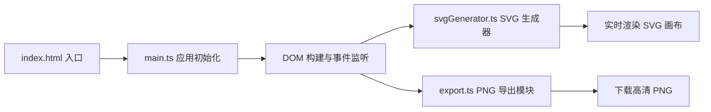

## 1. 架构设计

纯前端应用，无需后端服务。采用模块化架构，核心逻辑与 UI 分离。



## 2. 技术描述

- **前端框架**：原生 JavaScript + TypeScript，无 UI 框架
- **构建工具**：Vite 5.x
- **核心依赖**：
  - typescript：类型安全
  - vite：开发服务器与构建
  - canvas-to-blob-polyfill：canvas 转 blob 兼容性支持
- **签名生成**：纯算法生成 SVG 路径，不依赖系统字体
- **渲染方式**：原生 SVG + CSS 动画

## 3. 项目文件结构

| 文件路径 | 职责描述 |
|---------|---------|
| `package.json` | 项目依赖与脚本配置 |
| `index.html` | 入口页面，包含主界面结构和样式 |
| `tsconfig.json` | TypeScript 严格模式配置 |
| `vite.config.js` | Vite 基础配置 |
| `src/main.ts` | 应用初始化，DOM 构建，事件监听 |
| `src/svgGenerator.ts` | 核心模块，手写风格 SVG 生成算法 |
| `src/export.ts` | SVG 转 2x 高清 PNG 导出模块 |

## 4. 核心模块设计

### 4.1 SVG 生成器模块 (svgGenerator.ts)

**核心接口**：
```typescript
interface SignatureParams {
  text: string;
  speed: number;        // 0.5 - 3.0
  jitter: number;       // 0 - 8
  connection: number;   // 0.3 - 1.0
  bleed: number;        // 0 - 5
}

interface StrokeData {
  path: string;
  length: number;
  duration: number;
}

function generateSignature(params: SignatureParams): {
  svg: string;
  strokes: StrokeData[];
  totalDuration: number;
}
```

**算法要点**：
1. **字符分解**：将输入文字分解为基本笔画单元
2. **笔画生成**：使用贝塞尔曲线模拟手写路径，加入随机抖动
3. **连笔逻辑**：根据连笔参数决定笔画间连接概率和过渡曲线
4. **墨水效果**：应用 SVG feGaussianBlur 滤镜实现渗透效果
5. **动画数据**：计算每笔路径长度和动画时长

### 4.2 导出模块 (export.ts)

**核心接口**：
```typescript
async function exportToPng(
  svgElement: SVGSVGElement,
  scale: number = 2
): Promise<void>
```

**实现要点**：
1. 将 SVG 序列化为 data URL
2. 创建 Image 对象加载 SVG
3. 绘制到 2x 尺寸的 Canvas
4. 使用 canvas-to-blob 转换为 Blob
5. 触发浏览器下载

## 5. 性能指标

| 操作 | 耗时要求 | 优化策略 |
|-----|---------|---------|
| 参数调整 → SVG 更新 | ≤ 200ms | 防抖处理、路径缓存、避免重排 |
| 整体渲染耗时 | ≤ 300ms | 增量更新、CSS 硬件加速 |
| PNG 导出 | ≤ 500ms | 离屏 Canvas、优化编码参数 |

## 6. 关键技术实现

### 6.1 手写笔画算法

- 使用二次贝塞尔曲线 (Q) 和三次贝塞尔曲线 (C) 构建笔画
- 每个控制点加入基于 jitter 参数的随机偏移
- 笔画宽度随速度参数动态调整（速度越快笔画越细）
- 预设常见汉字笔画库，支持动态组合

### 6.2 描边动画实现

- 使用 `stroke-dasharray` 和 `stroke-dashoffset` CSS 属性
- 每笔路径 `getTotalLength()` 计算精确长度
- `requestAnimationFrame` 控制逐笔播放顺序
- 动画时长与 speed 参数成反比

### 6.3 滑块交互实现

- 自定义 range input 样式，紫色渐变轨道
- 数值标签使用绝对定位，根据滑块值计算位置
- `input` 事件实时更新位置，`mousedown/mouseup` 控制缩放动画
- CSS transition 实现平滑过渡效果
