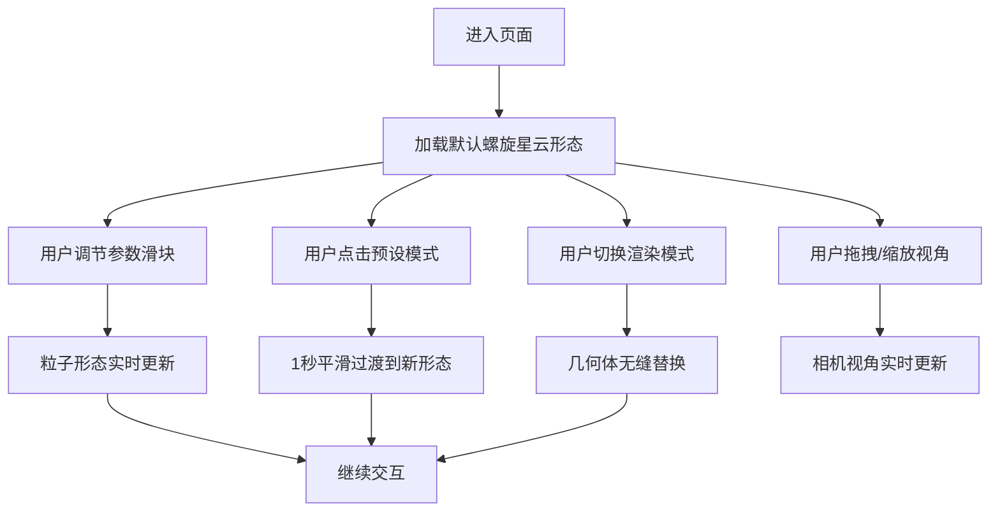

## 1. 产品概述

交互式Three.js动态流体粒子系统编辑器，解决粒子系统参数调整过程不直观、无法实时预览粒子运动效果变化的问题。面向3D视觉设计师、前端开发者和创意编程爱好者，提供直观的参数调节界面和实时预览能力。

## 2. 核心功能

### 2.2 功能模块

1. **3D预览区**：全屏Three.js渲染画布，展示动态粒子系统
2. **参数控制面板**：7个可实时调节的滑块控件
3. **预设形态模式**：5种预设粒子形态快速切换
4. **渲染模式切换**：点阵模式与网格模式无缝切换
5. **场景控制组**：重置视角、截图、自动旋转等控制

### 2.3 页面详情

| 页面名称 | 模块名称 | 功能描述 |
|----------|----------|----------|
| 主页面 | 3D预览区 | 全屏粒子系统渲染，支持拖拽旋转、滚轮缩放，背景深蓝渐变 |
| 主页面 | 参数控制面板 | 7个滑块（粒子数量、发射半径、寿命、涡流强度、波浪频率、重力、扩散角度），带数值标签和输入框 |
| 主页面 | 预设模式按钮组 | 螺旋、爆炸、波浪、旋风、瀑布5种预设，1秒平滑过渡动画 |
| 主页面 | 渲染模式切换 | 点阵模式（Points材质）和网格模式（Mesh四面体）切换 |
| 主页面 | 右上角控制组 | 重置视角、截图保存、渲染模式切换、自动旋转开关 |

## 3. 核心流程

用户进入页面后看到默认螺旋星云形态的5000粒子系统。可通过左侧面板拖动滑块实时调整参数，或点击预设按钮快速切换形态。可切换点阵/网格渲染模式，通过拖拽和缩放调整视角，右上角控制组提供辅助功能。

## 4. 用户界面设计

### 4.1 设计风格

- **主色调**：深蓝(#0B1120) + 青蓝(#00E5FF) + 紫色(#7C3AED) 科幻渐变
- **背景色**：3D区深蓝渐变(#0B1120到#1E293B)，控制面板#1E293B
- **控制面板**：毛玻璃效果(backdrop-filter: blur(16px))，半透明底
- **按钮样式**：圆角8px，hover发光效果，0.3s ease-out过渡
- **字体**：使用JetBrains Mono等宽字体配合现代无衬线字体
- **粒子颜色**：根据速度动态变化（低速蓝#00B4D8→中速紫#7C3AED→高速红#EF4444）

### 4.2 页面设计概述

| 页面名称 | 模块名称 | UI元素 |
|----------|----------|----------|
| 主页面 | 整体布局 | 左侧340px固定面板，右侧自适应3D区，1440px以上适配 |
| 主页面 | 参数面板 | 折叠面板样式，带箭头图标动画，每个参数组有标题和滑块 |
| 主页面 | 3D预览区 | 星空背景粒子层（小亮点缓慢闪烁），粒子系统主体 |
| 主页面 | 右上角控制组 | 半透明蒙层，圆角12px，4个功能按钮 |

### 4.3 响应性

- 桌面优先设计，适配1440px以上显示器
- 控制面板固定宽度340px，3D区域自适应填充剩余空间
- 滑块和按钮尺寸适合鼠标操作，触控优化作为补充

### 4.4 3D场景指导

- **环境**：深蓝渐变背景，星空粒子层营造宇宙氛围
- **光照**：两盏方向光+环境光，网格模式下有明显光影效果
- **相机**：PerspectiveCamera，初始距离15单位，fov 60°
- **交互**：OrbitControls支持拖拽旋转、滚轮缩放、右键平移
- **粒子系统**：BufferGeometry管理大量粒子，ShaderMaterial自定义着色
- **后处理**：轻微bloom效果增强粒子发光感
- **性能目标**：10,000粒子时≥30FPS，滑块响应延迟<50ms
