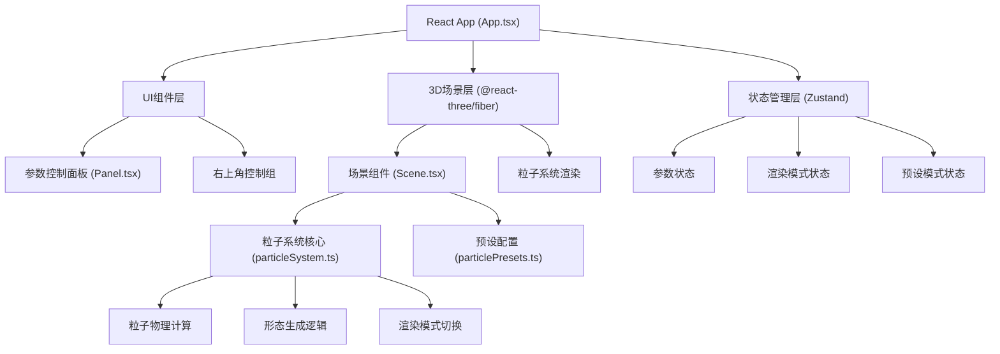

## 1. 架构设计



## 2. 技术描述

- **前端框架**：React 18 + TypeScript
- **3D渲染**：Three.js + @react-three/fiber + @react-three/drei
- **构建工具**：Vite 5 + @vitejs/plugin-react
- **状态管理**：Zustand（轻量高效，适合高频参数更新）
- **工具库**：lodash（防抖、插值等）
- **样式方案**：CSS Modules + CSS Variables，配合Tailwind CSS
- **图标库**：lucide-react

## 3. 目录结构

```
src/
├── App.tsx                 # 主组件，状态管理和布局
├── main.tsx               # 入口文件
├── index.css              # 全局样式和CSS变量
├── particleSystem.ts      # 粒子系统核心类
├── particlePresets.ts     # 预设形态配置
├── store/
│   └── useParticleStore.ts # Zustand状态管理
├── ui/
│   ├── Panel.tsx          # 参数控制面板
│   ├── Scene.tsx          # 3D场景组件
│   ├── Slider.tsx         # 滑块组件
│   └── ControlButtons.tsx # 右上角控制组
└── utils/
    └── three-utils.ts     # Three.js工具函数
```

## 4. 数据模型

### 4.1 粒子参数接口

```typescript
interface ParticleParams {
  count: number;           // 粒子数量 500-15000
  emissionRadius: number;  // 发射半径 1-10
  lifetime: number;        // 粒子寿命 0.5-5s
  vortexStrength: number;  // 涡流强度 0-5
  waveFrequency: number;   // 波浪频率 0.1-3.0
  gravity: number;         // 重力影响 -1到1
  spreadAngle: number;     // 扩散角度 0-180°
}

interface ParticleSystemState {
  params: ParticleParams;
  renderMode: 'points' | 'mesh';
  presetMode: string;
  autoRotate: boolean;
  isTransitioning: boolean;
}

interface PresetConfig {
  name: string;
  icon: string;
  params: ParticleParams;
  transitionDuration: number;
}
```

## 5. 性能优化策略

1. **粒子渲染**：使用BufferGeometry + InstancedMesh处理大量粒子
2. **参数更新**：Zustand选择器避免不必要重渲染，lodash.debounce处理高频滑块事件
3. **动画循环**：useFrame钩子中仅更新必要的Uniforms和粒子位置
4. **渲染模式切换**：预创建两种几何体，切换时仅更换可见性而非重建
5. **过渡动画**：使用lerp线性插值实现参数平滑过渡，避免卡顿

## 6. 关键实现点

1. **粒子系统类**：封装粒子初始化、物理更新（涡流、波浪、重力）、颜色映射
2. **着色器材质**：自定义Vertex/Fragment Shader实现点大小衰减和速度颜色映射
3. **形态过渡**：使用requestAnimationFrame驱动参数lerp插值，1秒平滑过渡
4. **截图功能**：Canvas.toDataURL() + 动态创建a标签下载PNG
5. **星空背景**：独立的Points层，透明度随时间正弦变化模拟闪烁
