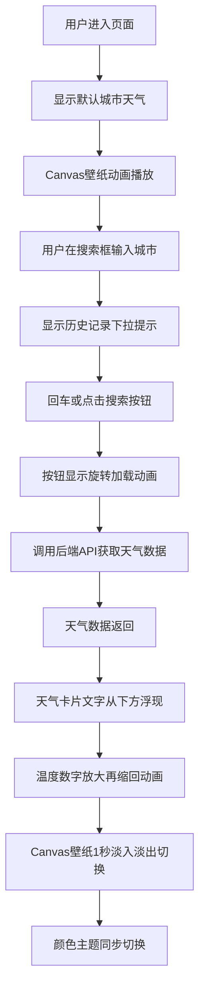

## 1. 产品概述

沉浸式天气主题壁纸切换应用，根据用户选择的城市实时获取天气数据，动态切换背景壁纸、Canvas动画效果和颜色主题，打造沉浸式天气视觉体验。

- 核心价值：将天气数据转化为沉浸式视觉体验，让用户直观感受不同天气的氛围
- 目标用户：追求视觉美感、喜欢动态壁纸的用户
- 核心功能：城市搜索、天气展示、动态Canvas壁纸、主题自动切换

## 2. 核心功能

### 2.1 用户角色
| 角色 | 注册方式 | 核心权限 |
|------|---------|---------|
| 普通用户 | 无需注册 | 搜索城市、查看天气、切换壁纸主题 |

### 2.2 功能模块
1. **天气主页面**：城市搜索、天气卡片展示、Canvas动态壁纸背景
2. **壁纸引擎**：根据天气状况生成对应的Canvas动画和颜色主题
3. **天气数据API**：后端模拟天气数据接口

### 2.3 页面详情
| 页面名称 | 模块名称 | 功能描述 |
|---------|---------|---------|
| 主页面 | 城市搜索 | 搜索框输入城市，历史记录下拉提示，回车或按钮触发搜索，加载动画 |
| 主页面 | 天气卡片 | 展示温度、天气图标、风速、湿度、空气质量，渐入动画，数值平滑过渡 |
| 主页面 | Canvas壁纸 | 晴天/雨天/雪天/阴天四种动画效果，淡入淡出切换，帧率30fps+ |
| 主页面 | 主题系统 | 根据天气切换颜色主题，毛玻璃卡片效果，光晕特效 |

## 3. 核心流程

用户进入页面 → 看到默认城市天气与对应壁纸动画 → 在搜索框输入城市名 → 显示历史记录下拉 → 回车或点击搜索 → 按钮旋转加载 → 获取天气数据 → 天气卡片渐入展示 → Canvas壁纸淡入淡出切换 → 颜色主题同步切换

## 4. 用户界面设计

### 4.1 设计风格
- **整体风格**：沉浸式、氛围感、极简主义
- **颜色策略**：根据天气动态切换主题色
  - 晴天：暖橙到浅黄渐变，金色光晕
  - 雨天：深蓝到灰紫渐变，水滴光效
  - 雪天：白蓝渐变，银色闪光
  - 阴天：灰蓝渐变，柔和朦胧
- **卡片样式**：半透明毛玻璃效果，边缘光晕
- **字体**：现代无衬线字体，数字使用等宽字体
- **动效**：所有过渡500ms平滑动画，页面元素错峰渐入

### 4.2 页面设计概述
| 页面名称 | 模块名称 | UI元素 |
|---------|---------|--------|
| 主页面 | 顶部搜索区 | 搜索框（placeholder闪烁）、搜索按钮（加载旋转）、城市名（浮现动画） |
| 主页面 | 天气卡片 | 大温度数字（放大缩小动效）、天气图标、风速/湿度/空气质量（数值过渡）、微光效边缘 |
| 主页面 | Canvas背景 | 全屏Canvas动画，1秒淡入淡出切换，30fps+帧率 |

### 4.3 响应式
- 桌面端：顶部居中搜索栏，左侧天气卡片，右侧Canvas背景
- 移动端：卡片占满宽度，搜索框与城市名垂直排列，Canvas全屏背景
- 触摸优化：搜索框点击区域放大，按钮尺寸适合触控

### 4.4 Canvas动画指导
- **晴天**：中心太阳光晕，缓慢旋转光柱，暖色调粒子
- **雨天**：大量透明雨滴斜线飘落，底部溅地涟漪效果
- **雪天**：白色粒子随机飘落，微风摇摆效果，雪花大小不一
- **阴天**：半透明灰色云层缓慢移动，层次叠加增加深度
