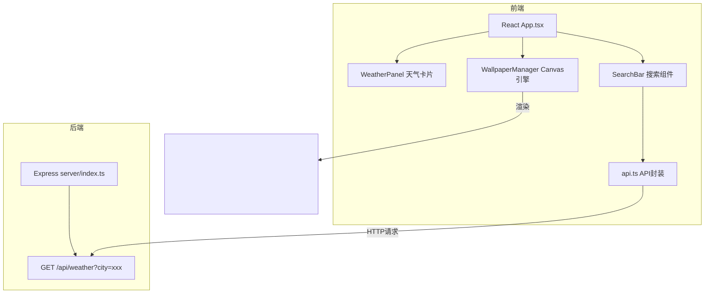

## 1. 架构设计



## 2. 技术描述

- **前端**：React 18 + TypeScript + Vite
- **后端**：Express 4 + TypeScript
- **构建工具**：Vite，路径别名 @ 指向 src
- **状态管理**：React useState/useEffect 本地状态
- **样式方案**：CSS Modules + CSS 变量（动态主题切换）
- **动画技术**：Canvas 2D API + requestAnimationFrame
- **包管理器**：npm

## 3. 文件结构

```
.
├── package.json              # 项目依赖与脚本
├── vite.config.js            # Vite 构建配置
├── tsconfig.json             # TypeScript 严格模式配置
├── index.html                # 入口页面
├── server/
│   └── index.ts              # Express 服务器，模拟天气API
└── src/
    ├── App.tsx               # 主组件，状态管理
    ├── WeatherPanel.tsx      # 天气详情卡片组件
    ├── WallpaperManager.ts   # Canvas 壁纸引擎核心
    └── utils/
        └── api.ts            # 天气 API 封装
```

## 4. API 定义

### GET /api/weather?city=xxx

**请求参数**：
- `city`: string - 城市名称

**响应数据** WeatherData：
```typescript
interface WeatherData {
  city: string;           // 城市名称
  temperature: number;    // 温度（摄氏度）
  condition: 'sunny' | 'rainy' | 'snowy' | 'cloudy';  // 天气状况
  windSpeed: number;      // 风速（km/h）
  humidity: number;       // 湿度（%）
  airQuality: number;     // 空气质量指数（AQI）
  description: string;    // 天气描述文字
}
```

## 5. 核心模块说明

### WallpaperManager 壁纸引擎
- 输入：天气状况 condition、Canvas 元素
- 输出：持续渲染的 Canvas 动画
- 功能：
  - 四种天气动画模式（sunny/rainy/snowy/cloudy）
  - 30fps+ 帧率保证
  - 1秒淡入淡出切换过渡
  - 主题颜色方案管理
  - 与 React 通过回调联动

### 性能优化策略
- Canvas 使用 requestAnimationFrame
- 粒子对象池复用
- 离屏渲染优化
- 监听页面可见性暂停动画
- 节流搜索输入

## 6. 启动脚本

```bash
npm install    # 安装依赖
npm run dev    # 启动前后端开发服务器
```
