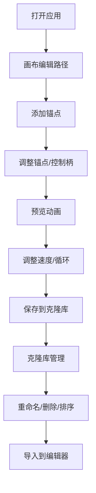

## 1. 产品概述

SVG路径动画编辑器是一款面向设计师和前端开发者的在线创作工具，让用户通过直观的拖拽和调整锚点来创建和编辑SVG路径，并实时预览路径的绘制动画效果，同时支持将编辑好的路径保存到本地克隆库中方便复用和管理。

- 解决的问题：传统SVG路径编辑需要专业工具复杂，路径动画代码编写繁琐，缺乏路径资源复用管理能力
- 目标用户：UI设计师、前端开发者、动效设计师
- 产品价值：降低SVG路径创建和动画开发效率，通过可视化编辑降低学习成本

## 2. 核心功能

### 2.1 功能模块

1. **SVG编辑器画布模块：锚点创建与编辑、贝塞尔曲线控制柄调整、SVG文件导入
2. **路径动画预览模块：绘制动画、速度调节、循环播放、渐变色效果
3. **克隆库管理模块：路径保存、路径列表展示、重命名删除、拖拽排序、导入导出

### 2.2 页面详情

| 页面名称 | 模块名称 | 功能描述 |
|-----------|-------------|---------------------|
| 主编辑器 | 画布区域 | 点击添加锚点、拖拽锚点实时更新曲线、控制柄调整曲率 |
| 主编辑器 | 顶部工具栏 | 上传SVG文件、预览动画按钮、速度选择、保存按钮 |
| 主编辑器 | 克隆库侧边栏 | 路径缩略图展示、路径列表、重命名、删除、拖拽排序、导入 |
| 路径动画预览 | 动画渲染 | stroke-dashoffset实现绘制动画、渐变色过渡、循环播放 |

## 3. 核心流程

用户打开应用 → 在画布上点击添加锚点创建路径 → 拖拽锚点和控制柄调整曲线形状 → 点击预览动画查看绘制效果 → 调整速度和循环播放 → 点击保存将路径存入克隆库 → 在克隆库中管理和复用路径

## 4. 用户界面设计

### 4.1 设计风格
- 主色调：靛蓝色(#6366F1)与品红色(#EC4899)渐变色作为品牌色
- 侧边栏：暗色主题(#1F2937深灰背景)
- 主区域：浅色主题(#F8FAFC浅灰背景)
- 工具栏：#E2E8F0中灰背景、高度48px
- 锚点：蓝色小圆点直径8px
- 控制柄：紫色小圆点直径4px、灰色细线连接
- 按钮：hover时scale(1.05)+背景#CBD5E1，点击时scale(0.95)下沉效果
- 字体：现代无衬线字体

### 4.2 页面设计概览

| 页面名称 | 模块名称 | UI元素 |
|-----------|-------------|-------------|
| 主编辑器 | 整体布局 | 左右两栏、左侧280px侧边栏、右侧自适应 |
| 主编辑器 | SVG画布 | 600x500视口、box-shadow阴影 |
| 主编辑器 | 工具栏 | 顶部工具栏、按钮和下拉菜单 |
| 克隆库 | 路径卡片 | 80x80缩略图、路径名称、操作按钮 |
| 动画预览 | 动画效果 | 渐变色绘制动画、速度调节 |

### 4.3 响应式设计
- 桌面端优先设计，最小支持宽度1024px
- 侧边栏固定宽度280px，主区域自适应

### 4.4 动效设计
- 按钮hover微缩放和背景变化
- 按钮点击下沉效果
- SVG路径绘制stroke-dashoffset动画
- 渐变色过渡动画
