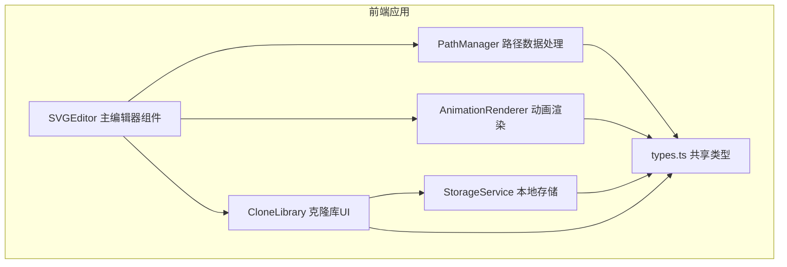

## 1. 架构设计



## 2. 技术说明
- 前端：React@18 + TypeScript@5 + Vite@5
- 构建工具：Vite + @vitejs/plugin-react
- 工具库：lodash
- 状态管理：React Hooks (useState, useRef, useEffect)
- 本地存储：localStorage
- 样式：内联样式 + CSS
- 无后端，纯前端应用

## 3. 模块职责

| 模块 | 文件 | 职责 |
|------|------|------|
| SVGEditor.tsx | src/editor/SVGEditor.tsx | 主编辑器组件，管理画布、路径数据和交互事件 |
| PathManager.ts | src/editor/PathManager.ts | 锚点坐标计算、贝塞尔曲线插值、路径序列化 |
| AnimationRenderer.ts | src/editor/AnimationRenderer.ts | 解析路径字符串、驱动stroke-dashoffset动画 |
| CloneLibrary.tsx | src/clonary/CloneLibrary.tsx | 克隆库UI组件，显示路径列表、重命名、删除、导入 |
| StorageService.ts | src/clonary/StorageService.ts | localStorage持久化、增删改查接口 |
| types.ts | src/types.ts | 共享类型定义 |

## 4. 数据模型

### 4.1 核心类型定义

```typescript
interface PathPoint {
  x: number;
  y: number;
  handleIn?: { x: number; y: number };
  handleOut?: { x: number; y: number };
}

interface PathData {
  id: string;
  name: string;
  points: PathPoint[];
  createdAt: number;
  updatedAt: number;
}

interface AnimationConfig {
  speed: number;
  loop: boolean;
  duration: number;
}
```

## 5. 性能优化策略

- SVG渲染性能：使用requestAnimationFrame确保拖拽帧率≥30fps
- 克隆库列表：虚拟滚动或批量渲染优化，50条路径初始渲染≤500ms
- 状态更新：使用useMemo和useCallback减少不必要的重渲染
- 本地存储：节流写入操作
