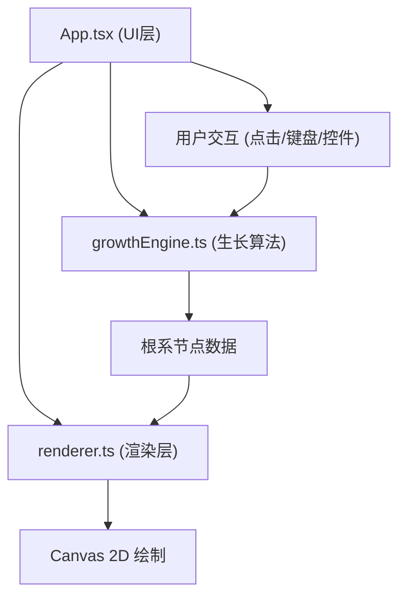

## 1. 架构设计


## 2. 技术描述
- **前端框架**：React 18 + TypeScript 5
- **构建工具**：Vite 5 + @vitejs/plugin-react
- **渲染技术**：Canvas 2D API
- **状态管理**：React Hooks (useRef, useState, useEffect)
- **样式方案**：原生CSS (App.css)

## 3. 模块职责划分

| 模块 | 职责 | 核心数据结构 |
|------|------|-------------|
| growthEngine.ts | 种子初始化、根节点生成、侧根分支逻辑、生长方向计算（重力+水分梯度） | RootNode, GrowthConfig |
| renderer.ts | Canvas绘制、颜色处理、水分梯度渲染、性能优化（节点合并） | RenderOptions |
| App.tsx | UI布局、参数面板、暂停/继续控制、截图功能、事件监听 | - |
| App.css | 控制面板样式、布局、动画效果 | - |

## 4. 核心数据结构

### RootNode 接口
```typescript
interface RootNode {
  x: number;
  y: number;
  angle: number;
  length: number;
  speed: number;
  depth: number;
  isMain: boolean;
  isTip: boolean;
  isMerged: boolean;
  children: RootNode[];
  parent: RootNode | null;
}
```

### GrowthConfig 接口
```typescript
interface GrowthConfig {
  speedMultiplier: number;
  showMoisture: boolean;
  moisturePoints: MoisturePoint[];
}
```

## 5. 关键算法设计

### 5.1 分形生长算法
1. 主根从点击位置开始，初始角度垂直向下（90度）
2. 每帧生长5-10像素
3. 每隔固定帧数（30-50帧）检查是否分支
4. 侧根角度：主根角度 ± 30度随机偏移
5. 侧根长度：主根长度的0.3-0.6倍

### 5.2 速度衰减算法
- 每深入100像素，生长速度降低5%
- 公式：`currentSpeed = baseSpeed * (1 - Math.floor(depth / 100) * 0.05)`
- 最小速度不低于基础速度的30%

### 5.3 水分梯度影响
- 开启水分梯度时生成50-100个随机蓝点
- 根生长方向计算：`finalAngle = baseAngle + moistureInfluence * attractFactor`
- 每个根节点感知周围150像素内的水分点，计算平均吸引力方向

### 5.4 性能优化
- 节点数量超过8000时，将深度超过最大深度80%的静止节点标记为合并
- 合并节点使用点阵绘制而非连续线条
- 采用分层绘制：先绘制合并点阵，再绘制活跃根系
