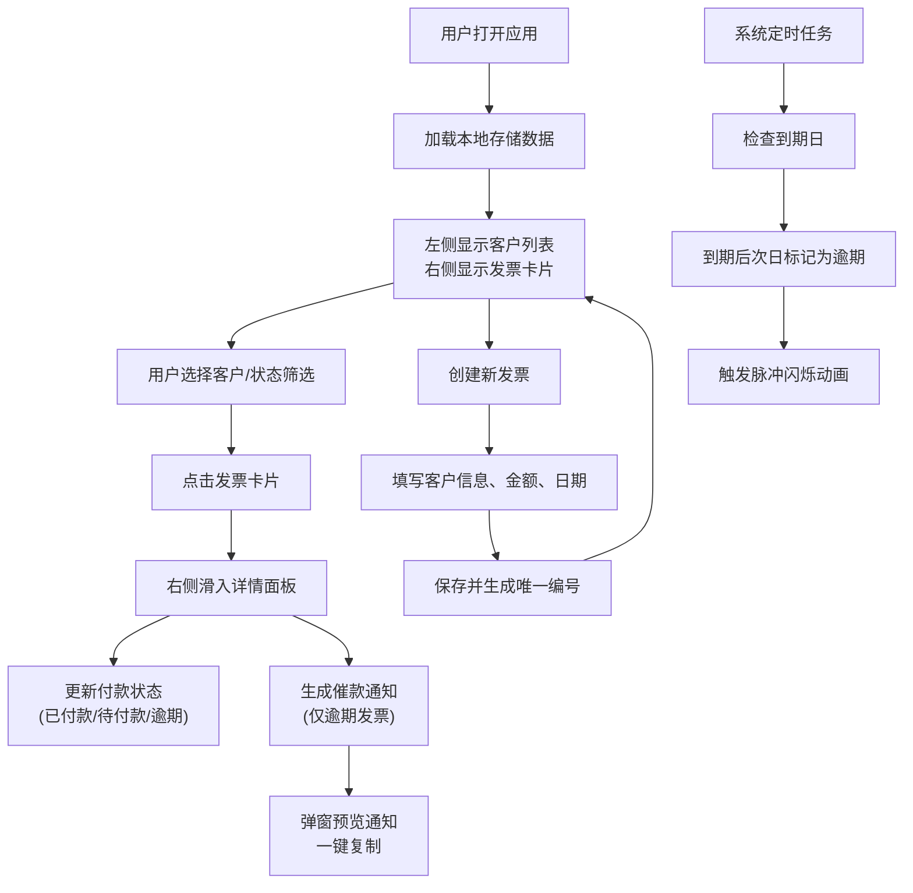

## 1. 产品概述

自由职业者发票管理系统，帮助设计师、开发者、写手等自由职业者高效管理多个客户的发票、跟踪付款状态并自动生成逾期提醒通知。解决自由职业者经常忘记按时发送发票、难以追踪款项到账情况、手动催款效率低下的核心痛点。

- 目标用户：设计师、开发者、写手等自由职业者
- 核心价值：自动化发票管理流程，提升财务效率，减少坏账风险

## 2. 核心功能

### 2.1 用户角色
| 角色 | 注册方式 | 核心权限 |
|------|----------|----------|
| 自由职业者 | 无需注册，本地数据存储 | 发票创建与管理、付款状态跟踪、逾期提醒生成、客户管理 |

### 2.2 功能模块
1. **发票管理仪表盘**：发票卡片列表、状态筛选、详情面板
2. **发票创建与编辑**：客户信息、项目描述、金额（多币种）、日期管理
3. **付款跟踪系统**：状态标记、自动逾期检测、付款时间线
4. **逾期提醒通知**：催款文案生成、通知预览、一键复制
5. **客户管理面板**：客户列表、未结金额统计、按客户筛选

### 2.3 页面详情
| 页面名称 | 模块名称 | 功能描述 |
|---------|----------|----------|
| 主仪表盘 | 发票卡片列表 | 以卡片形式展示所有发票，支持状态色条标识，点击展开详情 |
| 主仪表盘 | 详情滑入面板 | 从右侧滑入显示发票完整信息、付款记录时间线、操作按钮 |
| 主仪表盘 | 客户面板 | 左侧固定面板展示客户列表，按发票数量排序，显示未结金额 |
| 主仪表盘 | 状态筛选器 | 按付款状态筛选发票列表 |
| 通知弹窗 | 催款通知预览 | 居中弹窗展示催款邮件内容，支持一键复制 |
| 发票创建弹窗 | 发票表单 | 新建发票表单，包含客户、金额、日期等字段 |

## 3. 核心流程

### 用户主流程
用户打开应用后，左侧显示客户列表，右侧显示发票卡片。用户可：
1. 点击左侧客户筛选该客户的所有发票
2. 使用状态下拉菜单筛选不同状态的发票
3. 点击发票卡片查看详情并更新付款状态
4. 为逾期发票生成催款通知并复制发送
5. 创建新发票并发送给客户

系统自动流程：
- 每日自动检查到期日，将到期后次日的待付款发票标记为逾期
- 状态转换时触发卡片脉冲闪烁动画

## 4. 用户界面设计

### 4.1 设计风格
- 主色调：深蓝 #1E3A5F（专业、稳重）
- 背景色：浅灰 #F9FAFB（干净、清晰）
- 状态强调色：
  - 已付款：绿色 #10B981
  - 逾期：红色 #EF4444
  - 待付款：橙色 #F59E0B
  - 草稿：灰色 #9CA3AF
- 卡片/弹窗阴影：2px 4px 12px rgba(0,0,0,0.1)
- 按钮悬停：颜色加深20%，0.2秒过渡动画
- 字体：使用现代无衬线字体，标题加粗，正文清晰易读

### 4.2 页面设计概述
| 页面名称 | 模块名称 | UI元素 |
|---------|----------|--------|
| 主仪表盘 | 客户面板 | 宽度300px，深蓝背景#1E3A5F，白色文字，客户项显示名称和红色未结金额，按发票数量排序 |
| 主仪表盘 | 发票卡片 | 宽度300px，圆角12px，浅灰背景#F9FAFB，边框1px #E5E7EB，顶部状态色条，加载时错开弹出动画（50ms延迟，0.3秒ease-out） |
| 主仪表盘 | 详情面板 | 宽度460px，白色背景，右侧滑入，0.4秒cubic-bezier动画 |
| 主仪表盘 | 付款时间线 | 竖排时间轴，圆点颜色与状态对应，连接线浅灰#D1D5DB |
| 主仪表盘 | 状态筛选 | 下拉菜单，白色背景，圆角8px，展开带动画 |
| 通知弹窗 | 催款预览 | 居中弹窗，宽度600px，白色背景，圆角16px，阴影2px 4px 12px rgba(0,0,0,0.15)，一键复制按钮 |

### 4.3 响应式设计
- 桌面端（≥768px）：左右两栏布局，左侧客户面板固定300px，右侧主内容区自适应
- 移动端（<768px）：左栏收窄变为顶部折叠菜单，主内容区全宽显示
- 触控优化：增大点击区域，适配移动端操作习惯

### 4.4 动画与交互细节
- 卡片加载：错开从底部弹出，延迟50ms per card，动画0.3秒 ease-out
- 状态转换：卡片脉冲闪烁动画0.5秒
- 详情面板：右侧滑入，0.4秒 cubic-bezier
- 按钮悬停：颜色加深20%，0.2秒过渡
- 下拉菜单：展开带动画效果

## 5. 性能要求
- 发票列表渲染（最多200张卡片）首屏加载 ≤ 1秒
- 状态切换后卡片列表更新 ≤ 200ms
- 数据存储使用localStorage，支持离线使用
