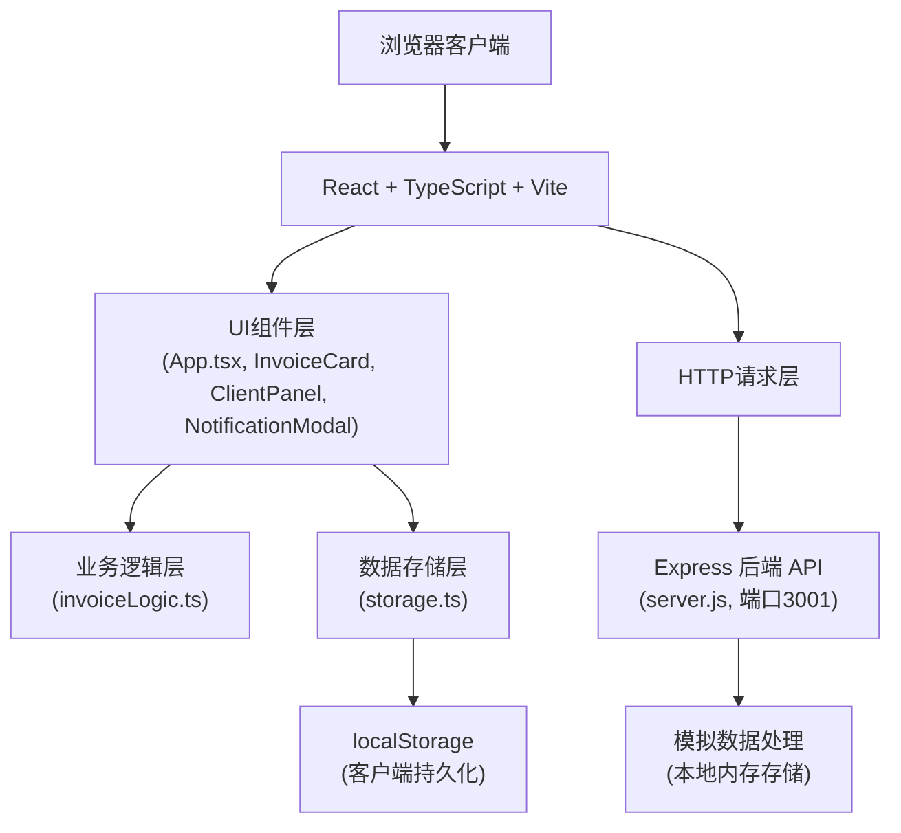
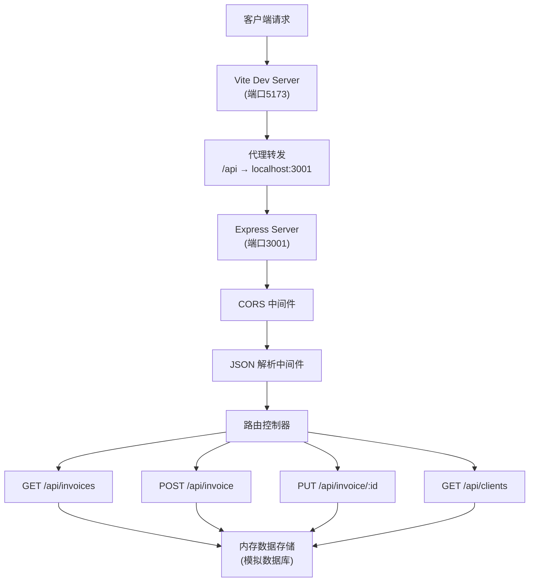

## 1. 架构设计



## 2. 技术描述

- **前端框架**：React@18 + TypeScript
- **构建工具**：Vite@5
- **后端服务**：Express@4（模拟API，端口3001）
- **跨域处理**：cors@2
- **唯一ID生成**：uuid@9
- **数据存储**：localStorage（客户端）+ 内存存储（服务端）
- **HTTP代理**：Vite dev server 代理 /api 请求到后端端口3001

## 3. 路由定义

| 路由 | 用途 |
|------|------|
| / | 主应用仪表盘（单页应用，无多路由） |

## 4. API 定义

### 类型定义
```typescript
interface Invoice {
  id: string;
  invoiceNumber: string;
  clientName: string;
  clientEmail: string;
  projectDescription: string;
  amount: number;
  currency: string;
  invoiceDate: string;
  dueDate: string;
  status: 'draft' | 'pending' | 'paid' | 'overdue';
  paymentHistory: PaymentRecord[];
  createdAt: string;
  updatedAt: string;
}

interface PaymentRecord {
  id: string;
  status: 'draft' | 'pending' | 'paid' | 'overdue';
  timestamp: string;
  note?: string;
}

interface Client {
  name: string;
  totalInvoices: number;
  outstandingAmount: number;
}
```

### API 接口
| 方法 | 路径 | 描述 | 请求参数 | 响应 |
|------|------|------|----------|------|
| GET | /api/invoices | 获取所有发票列表 | - | Invoice[] |
| POST | /api/invoice | 创建新发票 | Omit<Invoice, 'id' \| 'invoiceNumber' \| 'createdAt' \| 'updatedAt'> | Invoice |
| PUT | /api/invoice/:id | 更新发票信息 | Partial<Invoice> | Invoice |
| GET | /api/clients | 获取客户汇总列表 | - | Client[] |

## 5. 服务器架构图



## 6. 数据模型

### 6.1 数据模型定义

```mermaid
erDiagram
    INVOICE {
        string id PK
        string invoiceNumber UK
        string clientName
        string clientEmail
        string projectDescription
        number amount
        string currency
        string invoiceDate
        string dueDate
        string status
        string createdAt
        string updatedAt
    }
    
    PAYMENT_RECORD {
        string id PK
        string invoiceId FK
        string status
        string timestamp
        string note
    }
    
    CLIENT {
        string name PK
        number totalInvoices
        number outstandingAmount
    }
    
    INVOICE ||--o{ PAYMENT_RECORD : has
    INVOICE }o--|| CLIENT : belongs to
```

### 6.2 数据结构说明

#### Invoice 发票
- `id`: UUID 唯一标识
- `invoiceNumber`: 唯一发票编号，格式如 INV-2024-0001
- `clientName`: 客户名称
- `clientEmail`: 客户邮箱
- `projectDescription`: 项目描述
- `amount`: 发票金额
- `currency`: 币种（CNY, USD, EUR 等）
- `invoiceDate`: 发票日期
- `dueDate`: 到期日
- `status`: 状态（draft草稿, pending待付款, paid已付款, overdue逾期）
- `paymentHistory`: 付款状态变更记录时间线
- `createdAt`, `updatedAt`: 时间戳

#### Client 客户汇总
- `name`: 客户名称
- `totalInvoices`: 该客户发票总数
- `outstandingAmount`: 未结金额总和

## 7. 项目文件结构

```
auto222/
├── package.json
├── index.html
├── tsconfig.json
├── vite.config.js
├── server/
│   └── server.js
└── src/
    ├── App.tsx
    ├── components/
    │   ├── InvoiceCard.tsx
    │   ├── ClientPanel.tsx
    │   └── NotificationModal.tsx
    └── utils/
        ├── storage.ts
        └── invoiceLogic.ts
```

## 8. 核心模块说明

### storage.ts - 本地存储工具
- `getInvoices()`: 从localStorage获取所有发票
- `saveInvoices()`: 保存发票列表到localStorage
- `addInvoice()`: 添加新发票
- `updateInvoice()`: 更新发票信息
- `getClients()`: 计算客户汇总数据

### invoiceLogic.ts - 业务逻辑
- `generateInvoiceNumber()`: 生成唯一发票编号
- `checkOverdueInvoices()`: 自动检测逾期发票
- `updateInvoiceStatus()`: 更新状态并添加时间线记录
- `generateReminderText()`: 生成催款通知文案
- `calculateOverdueDays()`: 计算逾期天数

### App.tsx - 主应用
- 全局状态管理（发票列表、选中发票、筛选条件）
- 自动逾期检测定时器
- 主布局渲染（左客户面板 + 右发票列表 + 详情面板）
