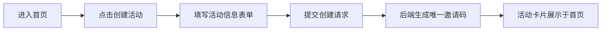
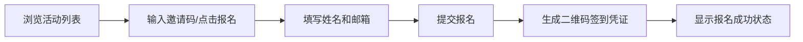
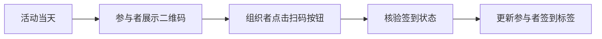

## 1. 产品概述

在线阅读俱乐部活动管理与互动社区应用，帮助独立书店经营者将线下阅读活动的报名、签到与书友互动迁移到线上，解决表格和社交群组管理混乱、缺乏沟通记录的问题。

- 主要目的：为独立书店提供一站式活动管理平台，实现活动创建、报名、签到全流程数字化，并提供书友互动社区
- 解决问题：线下活动管理效率低下、报名签到流程混乱、缺乏活动后交流渠道、无数据统计分析
- 目标用户：独立书店经营者（组织者）和参与阅读活动的读者（参与者）

---

## 2. 核心功能

### 2.1 用户角色

| 角色 | 注册方式 | 核心权限 |
|------|----------|----------|
| 组织者 | 默认内置权限 | 创建活动、查看签到状态、数据统计看板、核验签到 |
| 参与者 | 填写姓名邮箱报名 | 浏览活动、报名活动、签到、社区讨论、发表书评 |

### 2.2 功能模块

1. **首页（活动列表）**：活动卡片展示、活动筛选、创建活动入口、报名入口
2. **活动详情页**：活动信息展示、报名表单、签到二维码、参与者列表
3. **社区讨论区**：书评发布、评论回复、点赞功能、按时间倒序展示
4. **数据统计看板**：柱状图展示近6个月参与人数与签到率、概览卡片
5. **通知系统**：活动开始前24小时提醒、签到截止前1小时提醒

### 2.3 页面详情

| 页面名称 | 模块名称 | 功能描述 |
|----------|----------|----------|
| 首页 | 活动卡片列表 | 以卡片形式展示所有活动，按状态区分左侧渐变条，支持hover阴影效果 |
| 首页 | 创建活动表单 | 组织者填写活动名称、日期、地点、简介、名额上限、报名截止时间，生成邀请码 |
| 首页 | 报名入口 | 参与者输入邀请码，填写姓名邮箱完成报名 |
| 活动详情页 | 签到模块 | 生成二维码签到凭证，组织者点击模拟扫码核验签到 |
| 活动详情页 | 参与者列表 | 展示报名状态标签（黄色-已报名未签到，绿色-已签到） |
| 社区讨论区 | 书评发布 | 限制2000字以内，支持表情符号，显示用户头像（姓名首字母） |
| 社区讨论区 | 互动功能 | 回复他人评论、点赞（爱心图标变色+缩放动画） |
| 统计看板 | 柱状图 | Canvas绘制近6个月参与人数与签到率，悬停显示数值提示框 |
| 统计看板 | 概览卡片 | 总活动数、总报名人次、平均签到率 |
| 通知组件 | Toast通知 | 右上角滑入动画，深色背景白色文字，有关闭按钮 |

---

## 3. 核心流程

### 3.1 组织者创建活动流程

### 3.2 参与者报名流程

### 3.3 签到流程

### 3.4 社区互动流程

---

## 4. 用户界面设计

### 4.1 设计风格

- **主背景色**：米白 #FFF8F0
- **卡片背景**：#FFFAF0，边框 1px solid #E0D5C1，圆角 16px，宽度 320px
- **状态渐变条**：
  - 未开始：#10B981 → #34D399（绿色）
  - 进行中：#F97316 → #FB923C（橙色）
  - 已结束：#9CA3AF → #D1D5DB（灰色）
- **标签颜色**：
  - 已报名未签到：#FBBF24（黄色）
  - 已签到：#34D399（绿色）
- **柱体颜色**：#06B6D4 → #3B82F6（蓝青色渐变）
- **点赞颜色**：未点赞 #9CA3AF → 已点赞 #EF4444（红色）
- **通知背景**：#1E293B，文字 #FFFFFF

### 4.2 字体

- **标题字体**：Georgia（衬线体）
- **正文字体**：Inter（无衬线体）

### 4.3 交互效果

- **按钮hover**：0.2秒背景色加深 + translateY(-2px) 轻微上移
- **卡片hover**：添加阴影 0 4px 12px rgba(0,0,0,0.08)
- **点赞动画**：0.2秒缩放动画
- **Toast滑入**：0.4秒右上角滑入动画

### 4.4 页面设计概述

| 页面名称 | 模块名称 | UI元素 |
|----------|----------|--------|
| 首页 | 导航栏 | 纸质书卷风格，logo + 菜单，移动端汉堡菜单 |
| 首页 | 活动卡片网格 | 最大宽度1200px居中，响应式布局，桌面端多列，移动端单列 |
| 首页 | 创建活动表单 | 模态框形式，表单控件符合设计风格 |
| 活动详情页 | 信息区域 | 活动详情、时间、地点、名额信息 |
| 活动详情页 | 签到二维码 | 居中展示，二维码下方操作按钮 |
| 活动详情页 | 参与者列表 | 头像+姓名+签到标签 |
| 社区讨论区 | 评论列表 | 按时间倒序，头像+内容+时间+互动按钮 |
| 统计看板 | 柱状图区域 | Canvas绘制，悬停提示框 |
| 统计看板 | 概览卡片 | 三列并排展示关键指标 |

### 4.5 响应式

- **设计原则**：桌面端优先，移动端自适应
- **断点**：<768px 为移动端
- **移动端适配**：
  - 卡片宽度100%填充
  - 单列堆叠布局
  - 导航栏变为汉堡菜单
- **媒体查询**：基于 min-width

### 4.6 性能优化

- 代码分割与懒加载
- API请求300-800ms模拟延迟测试loading状态
- 前端渲染保持60fps
- 首页加载时间不超过1.5秒
