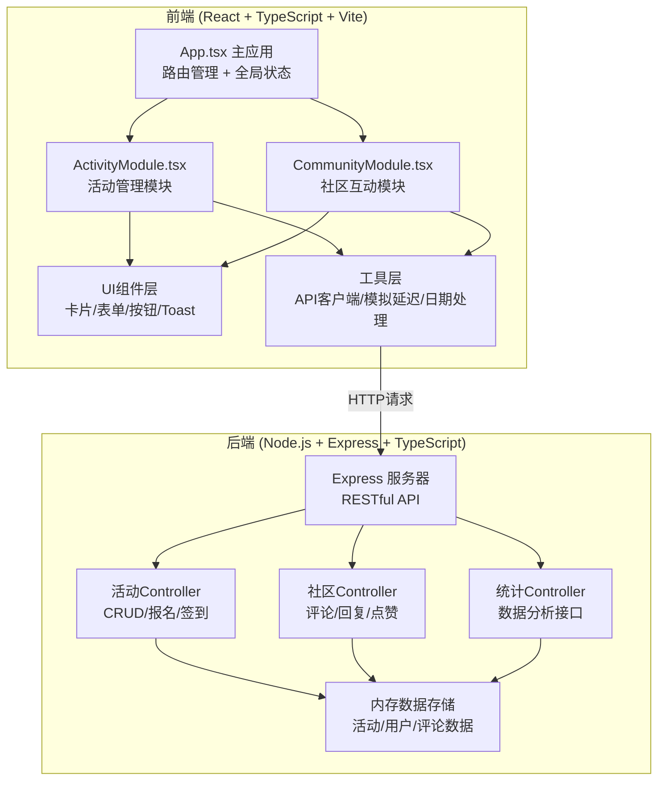
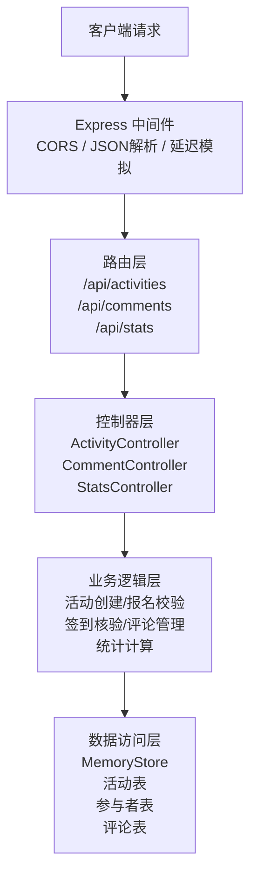
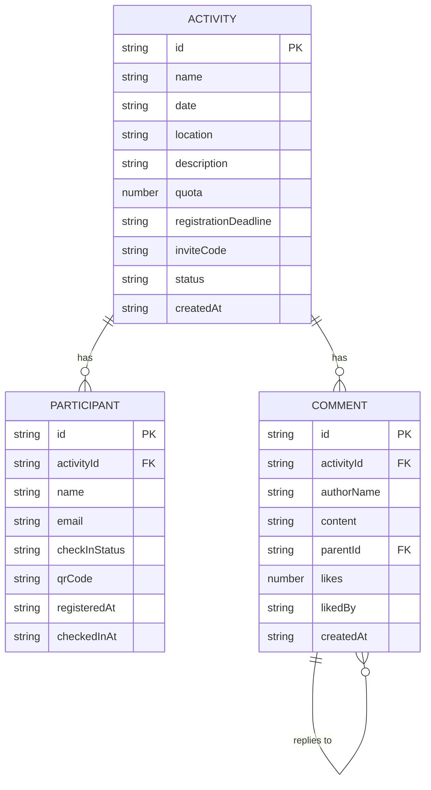

## 1. 架构设计



### 数据流方向

1. 用户输入 → App.tsx → ActivityModule/CommunityModule → API客户端 → Express后端
2. Express后端 → Controller → 内存存储 → 返回数据 → API客户端 → 模块组件 → 渲染UI

---

## 2. 技术描述

- **前端框架**：React 18 + TypeScript
- **构建工具**：Vite 5
- **路由管理**：React Router DOM 6
- **状态管理**：React Hooks (useState, useEffect, useContext)
- **后端框架**：Express 4 + TypeScript
- **HTTP客户端**：Fetch API
- **数据存储**：内存存储（开发阶段）
- **唯一ID**：uuid
- **跨域处理**：cors

---

## 3. 路由定义

| 路由路径 | 页面组件 | 用途 |
|----------|----------|------|
| `/` | HomePage | 首页 - 活动列表展示、创建活动、报名入口 |
| `/activity/:id` | ActivityDetailPage | 活动详情页 - 活动信息、签到、参与者列表 |
| `/community/:activityId` | CommunityPage | 社区讨论区 - 书评、评论、互动 |
| `/dashboard` | DashboardPage | 数据统计看板 - 图表、概览卡片 |

---

## 4. API 定义

### 4.1 类型定义

```typescript
// 活动状态
type ActivityStatus = 'upcoming' | 'ongoing' | 'ended';

// 参与者签到状态
type CheckInStatus = 'registered' | 'checked-in';

// 活动接口
interface Activity {
  id: string;
  name: string;
  date: string;
  location: string;
  description: string;
  quota: number;
  registrationDeadline: string;
  inviteCode: string;
  status: ActivityStatus;
  createdAt: string;
}

// 参与者接口
interface Participant {
  id: string;
  activityId: string;
  name: string;
  email: string;
  checkInStatus: CheckInStatus;
  qrCode: string;
  registeredAt: string;
  checkedInAt?: string;
}

// 评论接口
interface Comment {
  id: string;
  activityId: string;
  authorName: string;
  content: string;
  parentId?: string;
  likes: number;
  likedBy: string[];
  createdAt: string;
}

// 统计数据接口
interface MonthlyStats {
  month: string;
  participants: number;
  checkInRate: number;
}

interface DashboardStats {
  totalActivities: number;
  totalRegistrations: number;
  averageCheckInRate: number;
  monthlyData: MonthlyStats[];
}
```

### 4.2 活动相关接口

| 方法 | 路径 | 描述 | 请求体 | 响应 |
|------|------|------|--------|------|
| `GET` | `/api/activities` | 获取活动列表 | - | `Activity[]` |
| `GET` | `/api/activities/:id` | 获取活动详情 | - | `Activity` |
| `POST` | `/api/activities` | 创建活动 | `{ name, date, location, description, quota, registrationDeadline }` | `Activity` |
| `POST` | `/api/activities/register` | 报名活动 | `{ inviteCode, name, email }` | `Participant` |
| `POST` | `/api/activities/:id/checkin` | 签到 | `{ participantId }` | `{ success: boolean, participant: Participant }` |
| `GET` | `/api/activities/:id/participants` | 获取参与者列表 | - | `Participant[]` |

### 4.3 社区相关接口

| 方法 | 路径 | 描述 | 请求体 | 响应 |
|------|------|------|--------|------|
| `GET` | `/api/activities/:id/comments` | 获取评论列表 | - | `Comment[]` |
| `POST` | `/api/activities/:id/comments` | 发布评论 | `{ authorName, content, parentId? }` | `Comment` |
| `POST` | `/api/comments/:id/like` | 点赞/取消点赞 | `{ userName }` | `{ likes: number, liked: boolean }` |

### 4.4 统计相关接口

| 方法 | 路径 | 描述 | 请求体 | 响应 |
|------|------|------|--------|------|
| `GET` | `/api/stats/dashboard` | 获取看板统计数据 | - | `DashboardStats` |

---

## 5. 服务器架构图



---

## 6. 数据模型

### 6.1 ER 图



### 6.2 内存数据结构

```typescript
// 内存存储结构
interface MemoryStore {
  activities: Activity[];
  participants: Participant[];
  comments: Comment[];
}

// 初始化示例数据
const initialStore: MemoryStore = {
  activities: [
    {
      id: '1',
      name: '《百年孤独》深度共读',
      date: '2026-07-15T19:00:00',
      location: '静思书店二楼阅读区',
      description: '一起探讨马尔克斯的魔幻现实主义世界，分享阅读感悟。',
      quota: 20,
      registrationDeadline: '2026-07-14T23:59:59',
      inviteCode: 'BNXD2026',
      status: 'upcoming',
      createdAt: '2026-06-20T10:00:00'
    }
  ],
  participants: [],
  comments: []
};
```

---

## 7. 文件结构与调用关系

### 7.1 目录结构

```
├── package.json
├── vite.config.js
├── tsconfig.json
├── index.html
├── src/
│   ├── app/
│   │   └── App.tsx          # 主应用，路由管理，全局状态
│   ├── modules/
│   │   ├── activity/
│   │   │   └── ActivityModule.tsx  # 活动管理模块
│   │   └── community/
│   │       └── CommunityModule.tsx # 社区互动模块
│   ├── components/          # UI组件
│   │   ├── ActivityCard.tsx
│   │   ├── ActivityForm.tsx
│   │   ├── RegistrationForm.tsx
│   │   ├── ParticipantList.tsx
│   │   ├── CommentItem.tsx
│   │   ├── CommentForm.tsx
│   │   ├── BarChart.tsx
│   │   ├── Toast.tsx
│   │   └── QRCodeDisplay.tsx
│   ├── hooks/               # 自定义Hooks
│   │   ├── useActivities.ts
│   │   ├── useComments.ts
│   │   └── useToast.ts
│   ├── api/                 # API客户端
│   │   ├── activityApi.ts
│   │   ├── commentApi.ts
│   │   └── statsApi.ts
│   ├── types/               # 类型定义
│   │   └── index.ts
│   └── utils/               # 工具函数
│       ├── delay.ts         # 模拟延迟
│       ├── qrcode.ts        # 二维码生成
│       └── dateFormat.ts
└── server/
    └── index.ts             # Express服务器
```

### 7.2 调用关系

- `App.tsx` → 导入并渲染 `ActivityModule`、`CommunityModule`，管理路由
- `ActivityModule.tsx` → 调用 `useActivities` Hook → 调用 `activityApi` → 后端API
- `CommunityModule.tsx` → 调用 `useComments` Hook → 调用 `commentApi` → 后端API
- 所有组件 → 共享 `Toast` 通知组件 → 通过 `useToast` Hook 触发
- 后端 `server/index.ts` → 定义所有路由 → 处理业务逻辑 → 操作内存数据
