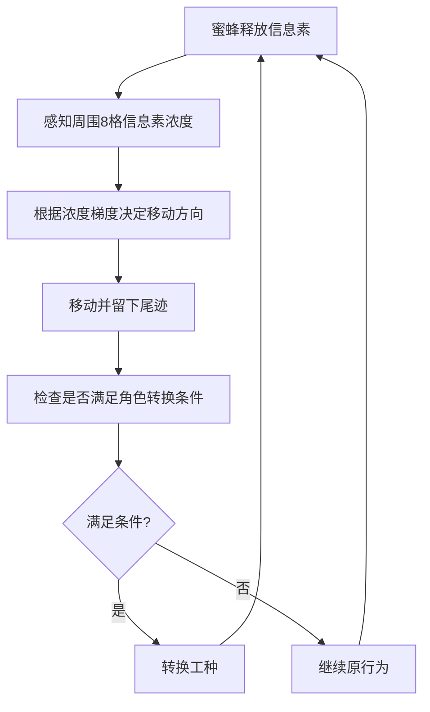
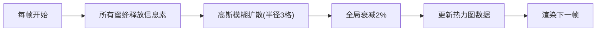

## 1. 产品概述

本项目是一个基于Web的蜂群信息素通信与分工协作可视化模拟系统，通过Three.js在浏览器中构建蜂巢3D场景，模拟蜜蜂通过释放和感知信息素来协调任务分配的核心机制，为用户提供交互式的群体智能研究与演示工具。

- 核心目标：解决现有群体智能模拟多聚焦于觅食或路径规划，缺乏对蜂群内部信息素通信机制逼真展现与交互控制的问题
- 目标用户：科研工作者、教育工作者、AI/群体智能爱好者
- 核心价值：直观展示蜂群自组织行为的底层机制，提供可干预的实验平台

## 2. 核心特性

### 2.1 用户角色

| 角色 | 注册方式 | 核心权限 |
|------|----------|----------|
| 访客用户 | 无需注册 | 浏览模拟场景、调整参数、查看统计数据、执行干预操作 |

### 2.2 功能模块

1. **蜂巢3D可视化模块**：半透明六边形蜂巢结构渲染、蜜蜂个体渲染、移动尾迹渲染、信息素热力图渲染
2. **模拟引擎模块**：蜜蜂Agent管理、信息素网格管理、扩散与挥发算法、任务分配与角色转换逻辑
3. **用户交互模块**：场景旋转缩放、宏观干预按钮（增蜂/警报/蜜源）、热力图切换、场景重置
4. **实时统计模块**：蜜蜂总量统计、工种比例柱状图、蜂巢健康度实时显示

### 2.3 页面详情

| 页面名称 | 模块名称 | 功能描述 |
|---------|----------|----------|
| 主页面 | 3D场景区 | 全屏显示蜂巢3D可视化，支持鼠标旋转缩放交互 |
| 主页面 | 右侧控制面板 | 三个干预按钮：增加工蜂、触发警报、释放蜜源信号，以及热力图切换 |
| 主页面 | 左上角统计面板 | 总蜜蜂数量、各工种比例柱状图、蜂巢健康度百分比 |
| 主页面 | 左下角重置按钮 | 圆形红色按钮，重置整个模拟场景 |

## 3. 核心流程

### 3.1 系统运行流程

用户打开页面 → 初始化3D场景与模拟引擎 → 生成初始蜜蜂种群（40工蜂+10哺育蜂+5守卫蜂） → 启动主循环（每帧更新） → 用户可随时进行交互干预 → 点击重置按钮可重新开始

### 3.2 蜜蜂行为流程

### 3.3 信息素更新流程

## 4. 用户界面设计

### 4.1 设计风格

- **整体风格**：深色蜂巢主题，营造沉浸式氛围
- **主色调**：琥珀橙 #E67E22
- **辅色调**：蜂蜜黄 #F1C40F
- **强调色**：警告红 #E74C3C
- **背景色**：深琥珀色 #1E1510
- **蜂脾材质**：半透明金色 #D4A574，透明度0.3
- **UI控件**：统一圆角12px，按钮带弹簧动画效果
- **字体**：采用现代无衬线字体，标题加粗，正文清晰可读
- **蜜蜂颜色编码**：
  - 工蜂：橙色 #FF9F43
  - 哺育蜂：绿色 #2ED573
  - 守卫蜂：红色 #FF4757
  - 雄蜂：灰色 #747D8C

### 4.2 页面设计概述

| 页面名称 | 模块名称 | UI元素 |
|---------|----------|--------|
| 主页面 | 3D场景区 | 居中六边形蜂巢结构，可自由旋转缩放，蜜蜂球体移动带半透明尾迹 |
| 主页面 | 右侧控制面板 | 宽度320px，背景#1E272E，圆角12px，三个按钮带弹簧动画 |
| 主页面 | 左上角统计面板 | 宽度260px，背景#2C3E50半透明，圆角10px，柱状图高度平滑动画 |
| 主页面 | 左下角重置按钮 | 直径48px圆形，背景#E74C3C，鼠标悬停有缩放效果 |

### 4.3 响应式设计

- 桌面端优先设计，保证1920x1080分辨率下完美呈现
- 自适应窗口大小变化，3D场景始终铺满可用空间
- UI面板采用固定定位，不随3D场景缩放
- 触摸屏设备支持双指缩放和单指旋转操作

### 4.4 3D场景指引

- **环境与氛围**：深琥珀色背景，柔和金色环境光，模拟蜂巢内部温暖氛围
- **光照设置**：半球光（天空色金色，地面色深棕色）+ 方向光（暖白色，带阴影）
- **相机设置**：PerspectiveCamera，初始距离50单位，可通过OrbitControls自由旋转缩放，限制最小距离20，最大距离100
- **场景构成**：
  - 多层六边形蜂脾（每层为六边形网格，边长10单位，深度5单位）
  - 蜜蜂个体为小型球体（半径0.3单位），不同工种颜色区分
  - 尾迹采用半透明粒子系统，随时间渐变消散
  - 信息素热力图采用叠加平面网格，按工种分RGB通道混合显示
- **交互与动画**：
  - OrbitControls支持阻尼平滑效果
  - 蜜蜂移动采用线性插值，路径平滑
  - 尾迹粒子透明度随时间衰减
  - 热力图切换按钮图标渐变动画（0.4秒，扫帚→网格）
  - 柱状图高度变化采用3秒平滑过渡
- **后处理**：轻微泛光效果增强场景氛围感
- **性能预算**：50只蜜蜂+热力图开启时不低于30fps，超过150只自动关闭尾迹
