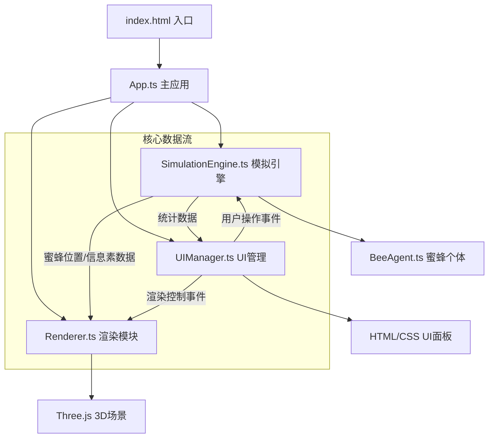

## 1. 架构设计



## 2. 技术栈说明

- **前端框架**：原生TypeScript（无React/Vue等框架，UI使用HTML/CSS实现）
- **3D引擎**：Three.js r150+
- **构建工具**：Vite 5.x
- **类型系统**：TypeScript 5.x（严格模式）
- **开发语言**：TypeScript
- **无后端依赖**：纯前端运行，数据保存在内存中

### 核心依赖说明：
- `three`：3D渲染引擎，负责蜂巢、蜜蜂、尾迹、热力图的3D渲染
- `@types/three`：Three.js的TypeScript类型定义
- `typescript`：类型安全
- `vite`：快速开发构建工具
- `@vitejs/plugin-react`：（按需求保留配置，但实际不使用React）

## 3. 目录结构

```
auto225/
├── index.html                          # 入口HTML
├── package.json                        # 项目依赖
├── vite.config.js                      # Vite配置
├── tsconfig.json                       # TypeScript配置
├── .trae/
│   └── documents/
│       ├── PRD-蜂群信息素模拟系统.md
│       └── TECH-蜂群信息素模拟系统.md
└── src/
    ├── app/
    │   ├── App.ts                      # 主应用入口
    │   ├── Renderer.ts                 # 3D渲染模块
    │   └── UIManager.ts                # UI管理模块
    └── engine/
        ├── SimulationEngine.ts         # 模拟引擎核心
        └── BeeAgent.ts                 # 蜜蜂个体Agent
```

## 4. 模块详细设计

### 4.1 App.ts - 主应用模块

**职责**：
- 初始化场景、相机、渲染器
- 组合Engine、Renderer、UIManager三大模块
- 负责requestAnimationFrame主循环
- 全局状态管理与事件协调

**核心方法**：
- `constructor()`：初始化所有模块
- `init()`：创建初始场景
- `animate()`：主循环，调用各模块update方法
- `onResize()`：处理窗口大小变化

### 4.2 SimulationEngine.ts - 模拟引擎模块

**职责**：
- 管理BeeAgent数组（蜜蜂种群）
- 维护3D信息素网格（3D数组，每格存储4个工种的浓度值）
- 时间步进逻辑（信息素扩散、挥发）
- 暴露蜜蜂位置与热力图数据给渲染模块

**核心数据结构**：
```typescript
enum BeeRole {
  WORKER = 'worker',      // 工蜂
  NURSE = 'nurse',        // 哺育蜂
  GUARD = 'guard',        // 守卫蜂
  DRONE = 'drone'         // 雄蜂
}

interface PheromoneCell {
  worker: number;         // 工蜂信息素浓度 0-100
  nurse: number;          // 哺育蜂信息素浓度 0-100
  guard: number;          // 守卫蜂信息素浓度 0-100
  drone: number;          // 雄蜂信息素浓度 0-100
}

type PheromoneGrid = PheromoneCell[][][];  // [x][y][z]
```

**核心方法**：
- `update(deltaTime: number)`：每帧更新
- `addBees(count: number, role: BeeRole)`：添加蜜蜂
- `triggerAlarm()`：触发警报，释放高浓度警戒信息素
- `releaseFoodSignal()`：释放蜜源信号
- `reset()`：重置模拟
- `getBeePositions()`：获取所有蜜蜂位置
- `getPheromoneData()`：获取信息素网格数据
- `getStatistics()`：获取统计数据

### 4.3 BeeAgent.ts - 蜜蜂个体模块

**职责**：
- 存储位置、工种、目标位置、信息素释放速率
- 感知邻居信息素浓度并决定移动方向
- 实现角色转换逻辑

**核心属性**：
```typescript
interface BeeState {
  id: number;
  position: Vector3;
  targetPosition: Vector3;
  role: BeeRole;
  pheromoneRate: number;    // 信息素释放速率 1-100
  speed: number;            // 移动速度
  trail: Vector3[];         // 尾迹点队列
}
```

**核心方法**：
- `update(grid: PheromoneGrid, deltaTime: number)`：单帧更新
- `senseNeighbors(grid: PheromoneGrid)`：感知周围8格信息素
- `decideMovement()`：根据信息素梯度决定移动方向
- `checkRoleTransition(grid: PheromoneGrid)`：检查是否需要转换工种
- `releasePheromone(grid: PheromoneGrid)`：释放信息素

### 4.4 Renderer.ts - 渲染模块

**职责**：
- 使用Three.js构建蜂巢场景
- 渲染蜜蜂个体（球体+尾迹粒子）
- 渲染信息素热力图（叠加平面网格）
- 接收SimulationEngine的数据进行帧更新

**核心组件**：
- 蜂巢结构：多层六边形网格组合
- 蜜蜂：SphereGeometry + MeshBasicMaterial，不同工种不同颜色
- 尾迹：BufferGeometry + Points，半透明粒子，随时间衰减
- 热力图：多层PlaneGeometry + ShaderMaterial，按工种RGB通道混合

**核心方法**：
- `initScene()`：初始化3D场景
- `createHoneycomb()`：创建蜂巢结构
- `updateBees(positions: BeeState[])`：更新蜜蜂位置
- `updatePheromoneHeatmap(data: PheromoneGrid)`：更新热力图
- `setHeatmapVisible(visible: boolean)`：切换热力图显示
- `setTrailsVisible(visible: boolean)`：切换尾迹显示
- `render()`：渲染一帧

### 4.5 UIManager.ts - UI管理模块

**职责**：
- 创建和更新右侧控制面板（320px宽）
- 创建和更新左上角统计面板（260px宽）
- 创建左下角重置按钮
- 通过事件回调与Engine和Renderer交互
- 使用纯HTML/CSS绘制，无额外UI框架

**核心UI元素**：
- 右侧控制面板：
  - 增加工蜂按钮（+10，上限200）
  - 触发警报按钮
  - 释放蜜源信号按钮
  - 热力图切换按钮（带图标渐变动画）
- 左上角统计面板：
  - 总蜜蜂数量显示
  - 各工种比例柱状图（3秒更新，平滑动画）
  - 蜂巢健康度百分比（<30%时红色闪烁）
- 左下角重置按钮（圆形，直径48px，红色）

**核心方法**：
- `createUI()`：创建所有UI元素
- `updateStatistics(stats: StatisticsData)`：更新统计面板
- `bindEvents(callbacks: UICallbacks)`：绑定事件回调
- `showHeatmapIcon(show: boolean)`：切换热力图图标动画

## 5. 核心算法设计

### 5.1 信息素扩散算法（高斯模糊）

```
对于每个网格单元：
newValue = Σ (neighborValue * gaussianWeight)
其中gaussianWeight为半径3的高斯核权重
```

### 5.2 信息素挥发算法

```
每帧更新：
cell.worker *= 0.98  // 衰减2%
cell.nurse *= 0.98
cell.guard *= 0.98
cell.drone *= 0.98

最小值为0，不超过100
```

### 5.3 蜜蜂角色转换逻辑

```
如果蜜蜂为闲置工蜂：
  检测周围哺育蜂信息素浓度
  如果浓度 > 阈值(60)，有30%概率转换为哺育蜂
  
如果检测到高浓度警戒信息素：
  守卫蜂转向巢穴入口移动
  附近工蜂有20%概率转换为守卫蜂
```

### 5.4 蜂巢健康度计算

```
health = (averagePheromoneConcentration / 50) * (beeCount / optimalCount) * 100%

其中：
- averagePheromoneConcentration: 信息素网格平均浓度
- beeCount: 当前蜜蜂总数
- optimalCount: 最佳蜜蜂数量（默认80）

结果限制在0-100%范围内
```

## 6. 性能优化策略

1. **对象池技术**：蜜蜂和尾迹粒子使用对象池复用，避免频繁GC
2. **批量渲染**：同类型蜜蜂使用InstancedMesh合并渲染
3. **LOD策略**：远距离蜜蜂简化为点精灵
4. **动态降质**：蜜蜂数量>150时自动关闭尾迹渲染
5. **帧率控制**：目标60fps，通过deltaTime实现与帧率无关的物理更新
6. **网格优化**：信息素网格按需更新，只更新有蜜蜂活动的区域

## 7. 配置文件说明

### 7.1 package.json
```json
{
  "name": "bee-colony-simulation",
  "version": "1.0.0",
  "scripts": {
    "dev": "vite",
    "build": "tsc && vite build",
    "preview": "vite preview"
  },
  "dependencies": {
    "three": "^0.150.0"
  },
  "devDependencies": {
    "@types/three": "^0.150.0",
    "typescript": "^5.0.0",
    "vite": "^5.0.0",
    "@vitejs/plugin-react": "^4.0.0"
  }
}
```

### 7.2 vite.config.js
- 配置resolve别名 `@` 指向 `src`
- 启用严格模式
- 配置server端口为5173

### 7.3 tsconfig.json
- target: ESNext
- module: ESNext
- strict: true
- moduleResolution: bundler
- 路径别名配置与vite一致
