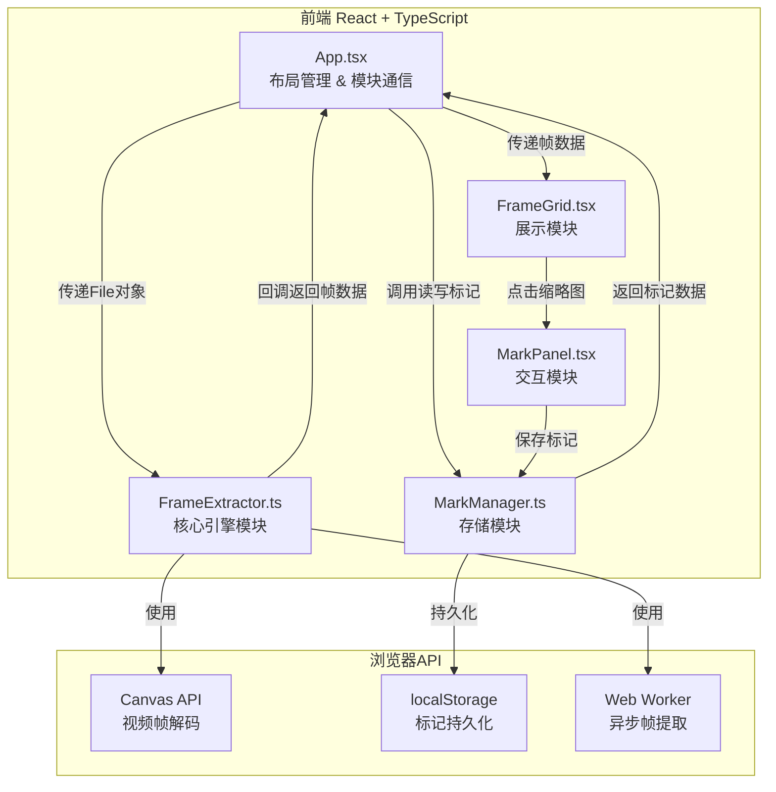

## 1. 架构设计



## 2. 技术说明
- 前端：React@18 + TypeScript + Vite
- 初始化工具：vite-init (react-ts模板)
- 状态管理：Zustand
- 样式：Tailwind CSS
- 后端：无（纯前端应用）
- 数据库：localStorage（浏览器本地存储）
- 依赖：react, react-dom, typescript, vite, @vitejs/plugin-react, file-saver, uuid

## 3. 路由定义
| 路由 | 用途 |
|------|------|
| / | 单页应用，包含所有功能模块 |

## 4. API定义
无后端API，所有数据在浏览器本地处理。

### 4.1 核心数据类型
```typescript
interface FrameData {
  id: string;
  index: number;
  timestamp: number;
  blob: Blob;
  url: string;
}

interface MarkData {
  frameId: string;
  tags: TagItem[];
  rating: number;
  note: string;
}

interface TagItem {
  name: string;
  color: string;
}

interface ProjectData {
  id: string;
  fileName: string;
  createdAt: number;
  frameCount: number;
  markCount: number;
  frames: FrameData[];
  marks: Record<string, MarkData>;
}
```

## 5. 文件结构与调用关系

```
项目根目录/
├── package.json                    # 依赖与脚本
├── index.html                      # 入口页面
├── tsconfig.json                   # TypeScript配置
├── vite.config.js                  # Vite构建配置
└── src/
    ├── main.tsx                    # 应用入口
    ├── app/
    │   └── App.tsx                 # 主组件 → 调用engine获取帧数据，调用storage保存标记
    ├── engine/
    │   └── FrameExtractor.ts       # 核心引擎 → 接收File，Canvas解码，输出Blob数组
    ├── storage/
    │   └── MarkManager.ts          # 存储模块 → localStorage持久化，CRUD+导出
    ├── ui/
    │   ├── FrameGrid.tsx           # 展示模块 → 响应式网格渲染缩略图
    │   └── MarkPanel.tsx           # 交互模块 → 标记弹窗界面
    └── index.css                   # 全局样式
```

### 数据流向
1. **帧提取流**：App.tsx传递File → FrameExtractor处理 → 回调返回帧数据 → App.tsx更新状态 → FrameGrid渲染
2. **标记管理流**：MarkPanel交互 → App.tsx调用MarkManager → MarkManager操作localStorage → 返回结果 → App.tsx更新UI
3. **搜索过滤流**：用户输入搜索条件 → App.tsx过滤帧列表 → FrameGrid重新渲染
4. **导出流**：App.tsx调用MarkManager导出方法 → MarkManager生成文件 → 触发下载
5. **项目管理流**：App.tsx调用MarkManager保存/加载项目 → 侧边栏更新项目列表

## 6. 数据模型

```mermaid
erDiagram
    Project ||--o{ Frame : contains
    Project ||--o{ Mark : has
    Frame ||--o| Mark : "annotated by"

    Project {
        string id PK
        string fileName
        number createdAt
        number frameCount
        number markCount
    }

    Frame {
        string id PK
        number index
        number timestamp
        string imageUrl
    }

    Mark {
        string frameId PK_FK
        json tags
        number rating
        string note
    }

    Tag {
        string name
        string color
    }
```
