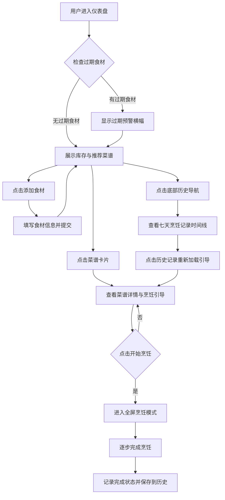

## 1. 产品概述

家庭厨房AI辅助菜谱推荐与食材库存联动管理应用，帮助用户管理家中食材库存，智能推荐可制作的菜品，并提供分步烹饪引导。

- 主要目标：减少食材浪费，简化家庭烹饪决策流程，提升烹饪体验
- 目标用户：家庭主妇/煮夫、烹饪爱好者、忙碌的上班族
- 产品价值：通过库存与菜谱的智能联动，实现"有什么做什么"的便捷烹饪体验

## 2. 核心功能

### 2.1 功能模块

1. **仪表盘页面**：库存概览、过期预警、推荐菜谱列表
2. **菜谱详情页**：菜谱信息展示、食材匹配对比、分步烹饪引导、全屏烹饪模式
3. **历史记录页**：七天烹饪记录时间线、完成状态追踪、快速重新加载

### 2.2 页面详情

| 页面名称 | 模块名称 | 功能描述 |
|-----------|-------------|---------------------|
| 仪表盘 | 过期预警横幅 | 检测24小时内过期食材，展开查看详情，一键跳转消耗推荐 |
| 仪表盘 | 添加食材模态框 | 输入名称、选择单位（克/毫升/个）、数量，提交后刷新列表 |
| 仪表盘 | 食材库存列表 | 徽章形式展示、支持按名称搜索、按库存量从高到低排序 |
| 仪表盘 | 推荐菜谱网格 | 三列布局、匹配度百分比显示、高匹配度绿色闪烁标识 |
| 菜谱详情 | 左侧信息面板 | 名称、简介、所需食材清单及库存对比（不足标红） |
| 菜谱详情 | 右侧烹饪引导 | 步骤编号、描述、预计时长、0.3秒 fade-in 切换动画 |
| 菜谱详情 | 全屏烹饪模式 | 仅显示当前步骤和操作提示，沉浸式烹饪体验 |
| 历史记录 | 时间线列表 | 七天记录展示、完成状态（绿色/灰色）、点击重新加载引导 |

## 3. 核心流程

## 4. 用户界面设计

### 4.1 设计风格

- **主色调**：翠绿 #10B981，悬停 #059669
- **辅助色**：橙色 #F97316（预警）、红色 #EF4444（库存不足）、绿色 #10B981（完成/高匹配）
- **背景色**：暖白 #FEFCF3
- **文字颜色**：主色深灰 #1F2937，辅色 #4B5563
- **卡片样式**：圆角 12px，阴影 0 2px 8px rgba(0,0,0,0.06)
- **按钮样式**：圆角、翠绿背景、0.2秒 ease 过渡
- **字体**：现代无衬线字体，清晰层次

### 4.2 页面设计概述

| 页面名称 | 模块名称 | UI元素 |
|-----------|-------------|-------------|
| 仪表盘 | 过期预警横幅 | 高50px、橙色背景、圆角8px、点击展开食材列表（#FFF7ED背景） |
| 仪表盘 | 添加食材模态框 | 宽400px、白色背景、圆角12px、半透明遮罩#000 opacity 0.4 |
| 仪表盘 | 食材徽章 | 宽180px、高40px、#F3F4F6背景、圆角8px、右侧删除按钮 |
| 仪表盘 | 菜谱卡片 | 宽320px、三列网格、左上角匹配度>80%绿色闪烁小圆点 |
| 菜谱详情 | 烹饪引导步骤 | 平滑切换、0.3秒 fade-in 动画 |
| 历史记录 | 时间线 | 日期、菜谱名、完成状态标识（绿色/灰色） |

### 4.3 响应式设计

- **桌面端（≥768px）**：左右两栏布局（左栏320px库存区，右栏菜谱区），菜谱三列网格
- **移动端（<768px）**：单列布局，食材徽章和菜谱卡片宽度自适应
- **触摸优化**：按钮和可点击区域足够大，适合触摸操作

## 5. 性能要求

- 首次页面加载时间 < 2秒
- 推荐列表刷新 < 1秒
- 步骤切换动画 60fps 流畅度
