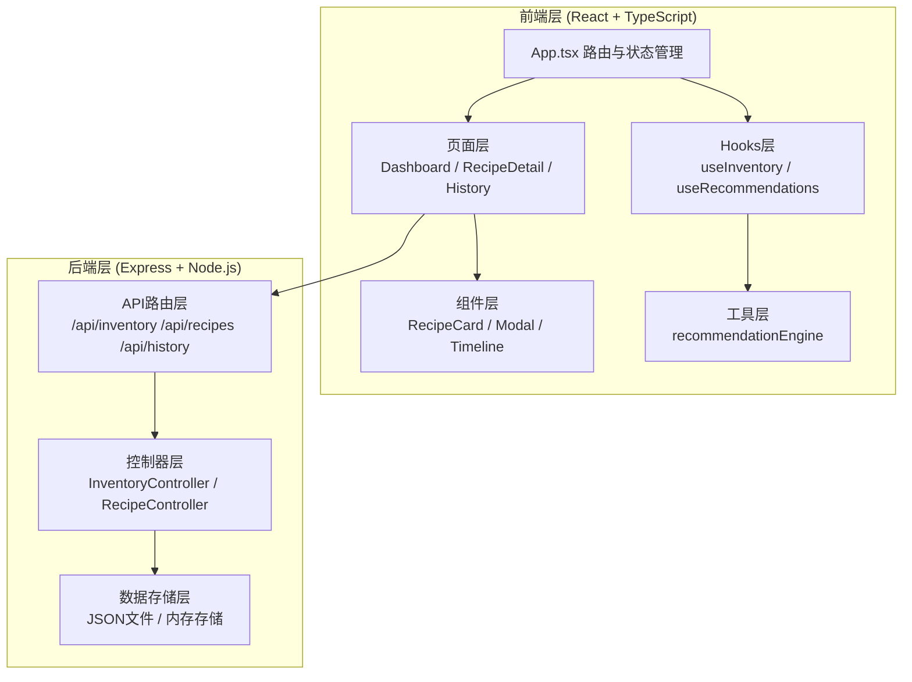
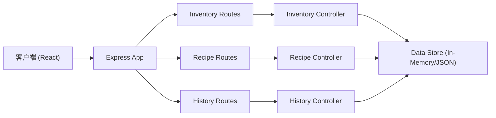

## 1. 架构设计



## 2. 技术描述

- **前端框架**：React@18 + TypeScript
- **构建工具**：Vite + @vitejs/plugin-react
- **后端框架**：Express@4 + CORS
- **状态管理**：React Hooks + Context
- **路由**：React Router DOM
- **唯一ID**：uuid
- **数据存储**：Mock数据 + 内存存储（开发阶段）

## 3. 路由定义

| 路由 | 用途 |
|-------|---------|
| / | 仪表盘页面 - 库存管理与菜谱推荐 |
| /recipe/:id | 菜谱详情页 - 信息展示与烹饪引导 |
| /history | 历史记录页 - 七天烹饪记录时间线 |

## 4. API 定义

### 4.1 类型定义

```typescript
// 食材单位
type Unit = 'g' | 'ml' | 'piece';

// 食材库存项
interface InventoryItem {
  id: string;
  name: string;
  quantity: number;
  unit: Unit;
  expirationDate: string; // ISO date
  createdAt: string;
}

// 菜谱食材
interface RecipeIngredient {
  name: string;
  quantity: number;
  unit: Unit;
}

// 烹饪步骤
interface CookingStep {
  step: number;
  description: string;
  duration: number; // 分钟
}

// 菜谱
interface Recipe {
  id: string;
  name: string;
  description: string;
  cookTime: number; // 分钟
  ingredients: RecipeIngredient[];
  steps: CookingStep[];
  image?: string;
}

// 推荐结果
interface RecipeRecommendation {
  recipe: Recipe;
  matchPercentage: number;
  matchedIngredients: string[];
  missingIngredients: string[];
}

// 烹饪历史记录
interface CookingHistory {
  id: string;
  recipeId: string;
  recipeName: string;
  date: string;
  completed: boolean;
}
```

### 4.2 REST API 端点

| 方法 | 路径 | 描述 | 请求体 | 响应 |
|------|------|------|--------|------|
| GET | /api/inventory | 获取库存列表 | - | InventoryItem[] |
| POST | /api/inventory | 添加食材 | { name, quantity, unit, expirationDate } | InventoryItem |
| DELETE | /api/inventory/:id | 删除食材 | - | { success: boolean } |
| GET | /api/recipes | 获取所有菜谱 | - | Recipe[] |
| GET | /api/recipes/:id | 获取单个菜谱 | - | Recipe |
| GET | /api/recipes/recommend | 智能推荐菜谱 | query: { ingredients } | RecipeRecommendation[] |
| GET | /api/history | 获取烹饪历史 | - | CookingHistory[] |
| POST | /api/history | 添加烹饪记录 | { recipeId, recipeName, completed } | CookingHistory |

## 5. 服务器架构



## 6. 文件结构

```
auto227/
├── package.json
├── vite.config.js
├── tsconfig.json
├── index.html
├── src/
│   ├── App.tsx              # 主应用组件，路由与状态管理
│   ├── main.tsx             # 入口文件
│   ├── index.css            # 全局样式
│   ├── pages/
│   │   ├── Dashboard.tsx    # 仪表盘页面
│   │   ├── RecipeDetail.tsx # 菜谱详情页
│   │   └── History.tsx      # 历史记录页
│   ├── components/
│   │   ├── RecipeCard.tsx   # 菜谱卡片组件
│   │   ├── InventoryBadge.tsx   # 食材徽章组件
│   │   ├── AddIngredientModal.tsx # 添加食材模态框
│   │   ├── CookingGuide.tsx # 烹饪引导组件
│   │   ├── ExpiryBanner.tsx # 过期预警横幅
│   │   └── Navbar.tsx       # 底部导航栏
│   ├── hooks/
│   │   └── useInventory.ts  # 库存管理Hook
│   ├── utils/
│   │   ├── recommendationEngine.ts # 推荐算法引擎
│   │   ├── api.ts           # API调用封装
│   │   └── types.ts         # 类型定义
│   └── store/
│       └── mockData.ts      # Mock数据
└── server/
    ├── index.js             # Express服务器入口
    ├── routes/
    │   ├── inventory.js     # 库存路由
    │   ├── recipes.js       # 菜谱路由
    │   └── history.js       # 历史记录路由
    ├── controllers/
    │   ├── inventoryController.js
    │   ├── recipeController.js
    │   └── historyController.js
    └── data/
        └── store.js         # 内存数据存储
```
