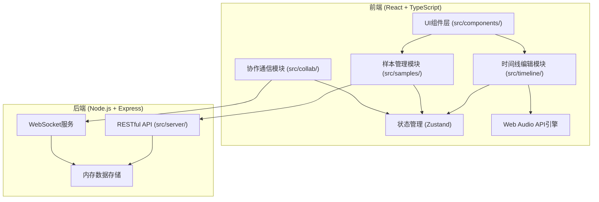

## 1. 架构设计



## 2. 技术描述

- **前端**：React@18 + TypeScript@5 + Vite@5 + Zustand@4
- **音频处理**：Web Audio API（AudioContext、AudioBufferSourceNode、GainNode）
- **实时通信**：ws@8（WebSocket库）
- **后端**：Express@4 + TypeScript@5
- **构建工具**：Vite@5（端口3000）
- **HTTP客户端**：原生fetch API
- **唯一ID**：uuid@9

## 3. 目录结构

```
src/
├── main.tsx              # React入口
├── App.tsx               # 根组件
├── store/
│   └── useProjectStore.ts # 全局状态管理
├── timeline/
│   ├── TimelineEditor.tsx # 时间轴编辑器组件
│   ├── AudioEngine.ts     # 音频引擎
│   ├── Track.tsx          # 音轨组件
│   ├── TrackItem.tsx      # 音轨条块组件
│   └── Playhead.tsx       # 播放头组件
├── samples/
│   ├── SampleLibrary.tsx  # 样本库面板
│   ├── SampleCard.tsx     # 样本卡片
│   └── SampleManager.ts   # 样本管理
├── collab/
│   ├── CollabManager.ts   # 协作管理器
│   └── CollaboratorCursor.tsx # 协作者光标
├── components/
│   ├── Button.tsx         # 通用按钮
│   ├── Slider.tsx         # 滑块组件
│   ├── IconButton.tsx     # 图标按钮
│   └── InviteModal.tsx    # 邀请弹窗
└── types/
    └── index.ts           # 共享类型定义
```

## 4. 数据模型

### 4.1 核心类型定义

```typescript
// 样本
interface Sample {
  id: string;
  name: string;
  duration: number;
  url: string;
  color: string;
  category: 'drum' | 'vocal' | 'effect' | 'other';
}

// 音轨
interface Track {
  id: string;
  name: string;
  color: string;
  volume: number;
  muted: boolean;
  solo: boolean;
}

// 条块（样本实例）
interface Clip {
  id: string;
  trackId: string;
  sampleId: string;
  start: number;
  duration: number;
  fadeIn: number;
  fadeOut: number;
  volume: number;
}

// 项目
interface Project {
  id: string;
  name: string;
  tracks: Track[];
  clips: Clip[];
  samples: Sample[];
  collaborators: Collaborator[];
}

// 协作者
interface Collaborator {
  id: string;
  name: string;
  color: string;
  cursor: { x: number; y: number } | null;
}

// 协作操作
interface CollabOperation {
  type: 'clip-add' | 'clip-move' | 'clip-delete' | 'track-add' | 'cursor-move';
  payload: any;
  userId: string;
  timestamp: number;
}
```

## 5. API 定义

### 5.1 RESTful API

```typescript
// GET /api/samples
// 获取样本列表
interface GetSamplesResponse {
  samples: Sample[];
}

// POST /api/samples
// 上传样本 (multipart/form-data)
interface UploadSampleRequest {
  file: File;
  name: string;
  category: string;
}
interface UploadSampleResponse {
  sample: Sample;
}

// GET /api/projects/:id
// 获取项目数据
interface GetProjectResponse {
  project: Project;
}

// PUT /api/projects/:id
// 保存项目
interface SaveProjectRequest {
  project: Project;
}
interface SaveProjectResponse {
  success: boolean;
}
```

### 5.2 WebSocket 消息

```typescript
// 客户端发送
interface JoinMessage {
  type: 'join';
  projectId: string;
  userId: string;
  userName: string;
}

interface OperationMessage {
  type: 'operation';
  operation: CollabOperation;
}

// 服务端广播
interface UserJoinedMessage {
  type: 'user-joined';
  user: Collaborator;
}

interface UserLeftMessage {
  type: 'user-left';
  userId: string;
}

interface OperationBroadcastMessage {
  type: 'operation-broadcast';
  operation: CollabOperation;
  excludeUserId?: string;
}
```

## 6. 性能指标

- 时间轴渲染帧率：60fps（使用requestAnimationFrame）
- 音频混合延迟：< 100ms（Web Audio API调度）
- 协作同步延迟：< 300ms（WebSocket广播）
- 缩放范围：0.5x - 4x（滚轮控制）
- 格点吸附：0.25秒精度

## 7. 技术关键点

1. **音频引擎**：使用AudioBuffer做预加载，GainNode实现音量和淡入淡出，scheduler模式保证播放精度
2. **时间轴渲染**：Canvas或CSS transform实现高性能滚动，虚拟列表优化大量条块
3. **协作同步**：操作转换(OT)避免冲突，增量更新减少数据传输
4. **拖拽系统**：HTML5 Drag & Drop + 自定义视觉反馈，坐标转换实现精确定位
5. **状态管理**：Zustand分片管理，选择性订阅避免不必要重渲染
