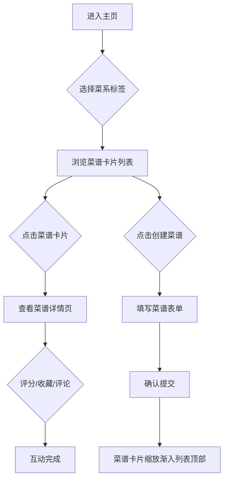

## 1. 产品概述

在线菜谱收藏与分享平台，让用户像管理自己的食谱书一样创建、分类和分享菜谱，支持评分和评论互动。
- 目标用户：美食爱好者、家庭厨师，希望整理和分享个人菜谱的人群
- 核心价值：提供温暖美观的菜谱管理体验，让烹饪知识更易于记录和传播

## 2. 核心功能

### 2.1 用户角色

| 角色 | 注册方式 | 核心权限 |
|------|----------|----------|
| 普通用户 | 无需注册（单用户模式） | 创建、浏览、评分、收藏、评论菜谱 |

### 2.2 功能模块

1. **菜谱主页**：菜系分类标签页切换、菜谱卡片列表、评分交互、收藏功能
2. **菜谱详情页**：完整菜谱展示、食材卡片、步骤展示、评论区
3. **菜谱创建页**：表单输入、封面上传、食材动态增删、富文本步骤编辑、提交确认

### 2.3 页面详情

| 页面名称 | 模块名称 | 功能描述 |
|----------|----------|----------|
| 菜谱主页 | 分类标签页 | 中餐/西餐/日料/甜点四个标签切换，切换时内容平滑过渡 |
| 菜谱主页 | 菜谱卡片 | 缩略图+名称+评分星星（可点击打分，星星跳动动画）+收藏按钮（填充放大缩小动画），悬停上浮阴影 |
| 菜谱详情页 | 大图横幅 | 菜谱封面大图，加载时淡入效果 |
| 菜谱详情页 | 食材卡片 | 食材以卡片形式排列展示 |
| 菜谱详情页 | 步骤展示 | 分步骤显示，配数字序号大圆点 |
| 菜谱详情页 | 评论区 | 渐变边框输入框（聚焦变亮），时间倒序评论，最新评论淡黄色高亮，加载更多分页 |
| 菜谱详情页 | 滚动吸附 | 页面滚动时平滑吸附效果 |
| 菜谱创建页 | 封面上传 | 上传时显示圆环进度动画 |
| 菜谱创建页 | 食材列表 | 动态添加/删除行，添加时平滑下滑动画 |
| 菜谱创建页 | 步骤编辑 | 富文本编辑器 |
| 菜谱创建页 | 提交确认 | 表单提交前弹出确认弹窗 |
| 菜谱创建页 | 提交反馈 | 提交后菜谱卡片缩放渐入动画出现在列表顶部 |

## 3. 核心流程

1. 用户进入主页，通过标签页浏览不同菜系的菜谱
2. 用户点击卡片进入详情页，查看完整菜谱、评分、收藏、发表评论
3. 用户点击创建按钮，填写菜谱表单，提交后菜谱出现在列表顶部

## 4. 用户界面设计

### 4.1 设计风格

- 主色调：淡奶油色背景 (#FFF8F0)，深棕色文字 (#3E2723)，珊瑚色强调 (#FF6B6B)
- 辅助色：暖黄 (#FFD54F)、淡粉 (#FFAB91)、奶白 (#FFF3E0)
- 按钮风格：圆角（12px），珊瑚色填充按钮，悬停时加深
- 字体：圆润手写风格（如 'Caveat' 作为展示字体，'Nunito' 作为正文字体）
- 布局风格：卡片式布局，顶部导航
- 图标：lucide-react 图标库
- 动画：0.3秒 ease-in-out 过渡，缩放渐入、上浮阴影、跳动高亮等微动画

### 4.2 页面设计概览

| 页面名称 | 模块名称 | UI元素 |
|----------|----------|--------|
| 菜谱主页 | 分类标签页 | 圆角标签按钮，选中态珊瑚色填充，切换平滑过渡 |
| 菜谱主页 | 菜谱卡片 | 圆角卡片，缩略图+名称+星星+收藏图标，悬停上浮+阴影 |
| 菜谱详情页 | 大图横幅 | 全宽大图，淡入加载 |
| 菜谱详情页 | 食材卡片 | 小圆角卡片网格排列 |
| 菜谱详情页 | 步骤展示 | 数字圆点序号+步骤描述 |
| 菜谱详情页 | 评论区 | 渐变边框输入框，时间倒序卡片列表，加载更多按钮 |
| 菜谱创建页 | 表单 | 圆角输入框，动态食材行，富文本编辑器，确认弹窗 |

### 4.3 响应式设计

- 桌面优先设计，最小宽度1024px完整展示
- 卡片列表在宽屏下3列，中屏2列，窄屏1列
- 详情页内容区最大宽度960px居中

### 4.4 性能要求

- 页面渲染帧率不低于30fps
- 图片懒加载
- 动画使用CSS transform/opacity保证GPU加速
