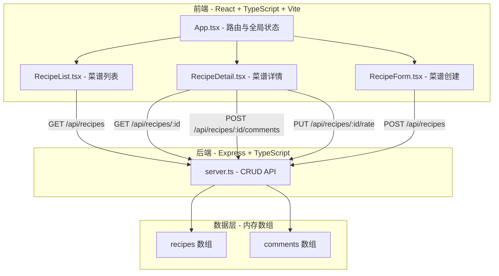
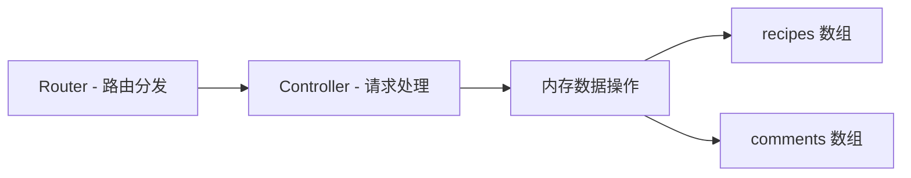
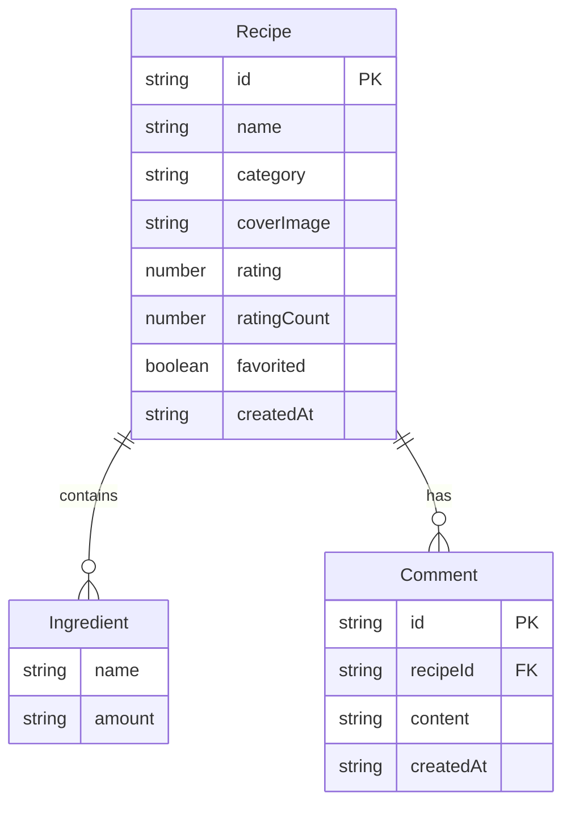

## 1. 架构设计



## 2. 技术说明

- 前端：React 18 + TypeScript + Vite + TailwindCSS
- 初始化工具：vite-init (react-express-ts 模板)
- 后端：Express 4 + TypeScript + cors
- 数据库：内存数组存储（模拟数据，无需数据库）
- 状态管理：zustand
- 路由：react-router-dom
- 图标：lucide-react
- 富文本编辑：react-quill（轻量级富文本编辑器）

## 3. 路由定义

| 路由 | 用途 |
|------|------|
| / | 菜谱主页，按菜系分类展示菜谱列表 |
| /recipe/:id | 菜谱详情页，展示完整菜谱、评分和评论 |
| /create | 菜谱创建页，表单创建新菜谱 |

## 4. API 定义

### 4.1 TypeScript 类型定义

```typescript
interface Recipe {
  id: string;
  name: string;
  category: 'chinese' | 'western' | 'japanese' | 'dessert';
  coverImage: string;
  ingredients: Ingredient[];
  steps: string;
  rating: number;
  ratingCount: number;
  favorited: boolean;
  createdAt: string;
}

interface Ingredient {
  name: string;
  amount: string;
}

interface Comment {
  id: string;
  recipeId: string;
  content: string;
  createdAt: string;
}
```

### 4.2 API 端点

| 方法 | 路径 | 请求体 | 响应 | 描述 |
|------|------|--------|------|------|
| GET | /api/recipes | - | Recipe[] | 获取所有菜谱（支持 ?category= 筛选） |
| GET | /api/recipes/:id | - | Recipe | 获取单个菜谱详情 |
| POST | /api/recipes | Recipe (无id) | Recipe | 创建新菜谱 |
| PUT | /api/recipes/:id/rate | { rating: number } | Recipe | 评分 |
| PUT | /api/recipes/:id/favorite | - | Recipe | 切换收藏 |
| GET | /api/recipes/:id/comments | - | Comment[] | 获取评论（支持 ?page=&limit= 分页） |
| POST | /api/recipes/:id/comments | { content: string } | Comment | 发表评论 |

## 5. 服务器架构图



## 6. 数据模型

### 6.1 数据模型定义



### 6.2 初始化数据

服务启动时在内存中预置8-12条示例菜谱数据，涵盖四个菜系分类，每条菜谱包含2-4条评论。
