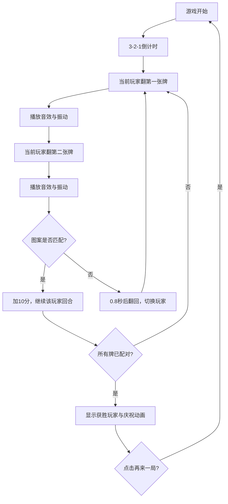

## 1. 产品概述
基于触觉反馈的双人拼图记忆对战游戏，玩家通过翻牌配对获取分数，配合音频与振动反馈增强沉浸体验。
- 主要目的：提供一款结合多感官反馈（视觉、听觉、触觉）的双人对战记忆游戏
- 目标用户：休闲游戏玩家、朋友家庭聚会娱乐场景
- 产品价值：通过多感官反馈机制提升记忆游戏的趣味性和互动性

## 2. 核心特性

### 2.1 用户角色
| 角色 | 参与方式 | 核心权限 |
|------|----------|----------|
| 玩家1 | 本地双人同屏 | 翻牌操作、查看分数 |
| 玩家2 | 本地双人同屏 | 翻牌操作、查看分数 |

### 2.2 功能模块
1. **游戏主界面**：4x4翻牌矩阵、玩家信息面板、游戏状态蒙层
2. **游戏引擎模块**：回合管理、分数计算、胜负判定
3. **卡牌生成模块**：4x4矩阵生成、随机图案与颜色分配、洗牌算法
4. **反馈模块**：Web Audio API合成音效、Web Vibration API振动反馈

### 2.3 页面详情
| 页面名称 | 模块名称 | 功能描述 |
|----------|----------|----------|
| 游戏主界面 | 翻牌矩阵 | 4x4共16张卡牌，支持翻转动画、悬停效果、配对检测 |
| 游戏主界面 | 玩家信息面板 | 双栏显示两名玩家头像、昵称、分数，当前回合高亮外发光动画 |
| 游戏主界面 | 游戏状态蒙层 | 3-2-1倒计时动画、获胜玩家庆祝动画、再来一局按钮 |

## 3. 核心流程
游戏开始 → 倒计时3-2-1 → 玩家1翻开第一张牌（播放音效+振动）→ 玩家1翻开第二张牌（播放音效+振动）→ 判定是否配对 → 配对成功：加分并继续该玩家回合 / 配对失败：0.8秒后翻回，切换至玩家2 → 重复直至所有配对完成 → 显示获胜玩家 → 点击再来一局重置游戏

## 4. 用户界面设计

### 4.1 设计风格
- **主色调**：深色径向渐变背景（中心#1A252C，边缘#0D1B2A），游戏面板#2C3E50，玩家面板#34495E
- **强调色**：玩家回合高亮#F39C12，分数黄色#F1C40F，卡牌颜色随机从8色调色板抽取
- **卡牌背面**：深蓝色渐变#1E3A5F到#2B4F7E，中心银色问号图标
- **按钮样式**：圆角按钮，悬停上浮效果，阴影过渡
- **字体**：现代无衬线字体，白色为主，分数用黄色粗体突出
- **布局风格**：左右分栏布局（70%/30%），卡片式设计，圆角处理
- **动效**：卡牌Y轴翻转动画0.3秒，悬停上浮5px带阴影，玩家回合外发光动画0.3秒

### 4.2 页面设计概述
| 页面名称 | 模块名称 | UI元素 |
|----------|----------|--------|
| 游戏主界面 | 翻牌矩阵 | 4x4网格布局，卡牌圆角12px，悬停上浮动画，0.3秒翻转动画，多边形图案+随机底色 |
| 游戏主界面 | 玩家信息面板 | 左侧双卡片，圆角16px，内边距20px，圆形头像半径40px，昵称白色16px，分数黄色24px粗体，当前回合外发光 |
| 游戏主界面 | 状态蒙层 | 半透明黑色背景，居中白色文字，倒计时渐入渐出，获胜者卡片放大1.2倍闪烁3次，再来一局按钮 |

### 4.3 响应式设计
- 桌面端优先设计，左右分栏布局
- 移动端适配为上下布局，游戏面板在上，玩家信息在下
- 卡牌尺寸根据视口自适应调整
- 触摸操作优化，确保点击区域足够大
