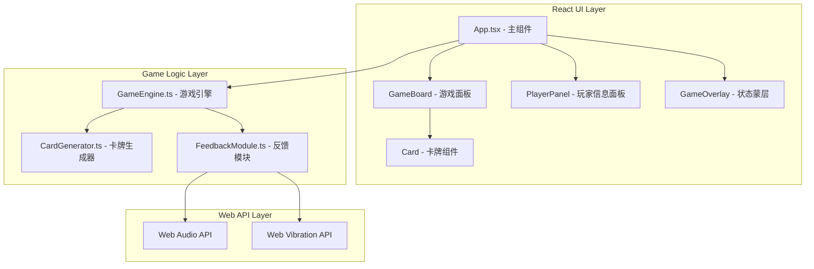

## 1. 架构设计



## 2. 技术说明
- 前端框架：React 18 + TypeScript
- 构建工具：Vite 5 + @vitejs/plugin-react
- 唯一ID生成：uuid
- 音频：Web Audio API原生合成
- 振动：Web Vibration API
- 状态管理：GameEngine类实例管理 + React useState/useEffect
- 样式方案：CSS Modules / 内联样式

## 3. 目录结构
```
.
├── package.json
├── index.html
├── tsconfig.json
├── vite.config.js
└── src/
    ├── App.tsx           # 主组件
    ├── GameEngine.ts     # 游戏引擎（回合、得分、胜负）
    ├── CardGenerator.ts  # 卡牌生成（4x4矩阵、洗牌）
    └── FeedbackModule.ts # 音频与振动反馈
```

## 4. 核心模块定义

### 4.1 类型定义
```typescript
interface Card {
  id: string;
  patternIndex: number;   // 图案类型索引 0-7
  colorIndex: number;      // 颜色索引 0-7
  isFlipped: boolean;      // 是否翻开
  isMatched: boolean;      // 是否已配对
}

interface Player {
  id: number;
  name: string;
  score: number;
}

type GamePhase = 'countdown' | 'playing' | 'gameover';
```

### 4.2 GameEngine 接口
```typescript
class GameEngine {
  constructor(cardGenerator: CardGenerator, feedbackModule: FeedbackModule);
  startGame(): void;
  flipCard(cardId: string): void;
  getState(): GameState;
  onStateChange(callback: (state: GameState) => void): void;
  resetGame(): void;
}
```

### 4.3 CardGenerator 接口
```typescript
class CardGenerator {
  generateCards(): Card[];   // 生成4x4共16张牌，8对
  shuffle(cards: Card[]): Card[];
}
```

### 4.4 FeedbackModule 接口
```typescript
class FeedbackModule {
  playPatternSound(patternIndex: number): void;   // 根据图案播放合成音
  triggerVibration(patternIndex: number): void;   // 根据图案触发振动模式
}
```

## 5. 性能指标
- 翻牌动画保持60FPS（使用CSS transform: rotateY）
- 音频播放延迟低于50ms（Web Audio API提前创建AudioContext）
- 游戏引擎每帧计算耗时不超过8ms（纯同步逻辑，无重型计算）
