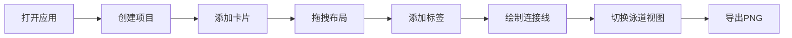

## 1. 产品概述

灵感板是一款面向插画师和漫画作者的创意管理工具，帮助用户在自由画布上组织角色设定、分镜草稿和配色方案，通过可视化卡片和连接线构建创意关系网络。

- 核心价值：提供沉浸式创意工作空间，支持自由布局与结构化视图切换，提升创作灵感的组织效率
- 目标用户：插画师、漫画作者、游戏美术设计师、概念艺术家

## 2. 核心功能

### 2.1 用户角色

| 角色 | 注册方式 | 核心权限 |
|------|----------|----------|
| 创作者 | 无需注册，本地使用 | 创建项目、管理卡片、导出灵感板 |

### 2.2 功能模块

1. **画布系统**：无限画布、拖拽平移、滚轮缩放、点阵网格背景
2. **卡片系统**：角色卡片、场景卡片、色票卡片，支持拖拽、编辑、删除
3. **标签与泳道**：卡片标签管理、按标签自动分组、泳道视图切换
4. **连接线系统**：贝塞尔曲线连接、关系标注、点击删除
5. **工具栏**：添加卡片、视图切换、导出、撤销重做
6. **导出功能**：PNG图片导出、透明背景、自定义文件名

### 2.3 页面详情

| 页面名称 | 模块名称 | 功能描述 |
|----------|----------|----------|
| 主界面 | 左侧工具栏 | 折叠/展开、添加卡片、泳道切换、导出、撤销重做 |
| 主界面 | 画布区域 | 无限画布、平移缩放、卡片渲染、连接线绘制 |
| 主界面 | 卡片编辑浮层 | 双击卡片打开、完整表单编辑、标签管理 |
| 主界面 | 泳道视图 | 按标签分组、垂直泳道布局、动画过渡 |

## 3. 核心流程

用户打开应用 → 创建/选择项目 → 在画布上添加角色/场景/色票卡片 → 拖拽布局卡片位置 → 添加标签分类 → 绘制连接线表示关系 → 切换泳道视图查看分组 → 导出PNG保存灵感板

## 4. 用户界面设计

### 4.1 设计风格

- **主色调**：深紫暗色主题，背景 #1E1B2E，卡片背景 #2D283E，边框 #413D57
- **强调色**：品红紫 #A277D1，用于按钮高亮和交互元素
- **辅助色**：浅灰紫 #D3CDE0（文字），#7C6FBA（连接线）
- **卡片样式**：圆角 12px，悬停发光阴影 0 0 12px #7C6FBA66
- **字体**：现代无衬线字体，清晰易读
- **布局风格**：左侧工具栏 + 中央画布，沉浸式工作空间

### 4.2 页面设计概述

| 页面名称 | 模块名称 | UI元素 |
|----------|----------|--------|
| 主界面 | 左侧工具栏 | 64px 折叠态 / 220px 展开态，背景 #25213A，图标按钮，悬停缩放动画 |
| 主界面 | 画布区域 | 点阵网格背景（点距30px，点大小2px，透明度0.3），卡片自由布局 |
| 主界面 | 角色卡片 | 200×280px，上方渐变色头像区，下方名字、描述、标签 |
| 主界面 | 场景卡片 | 280×200px，几何图案缩略图 + 标题 |
| 主界面 | 色票卡片 | 160×100px，渐变色条 + 十六进制色值 |
| 主界面 | 编辑浮层 | 背景 #1E1B2E，半透明遮罩，圆角 20px，宽度 600px |
| 主界面 | 泳道视图 | 虚线分隔（#3C3566），卡片按时间排列 |

### 4.3 响应式

- **桌面优先**：左侧工具栏 + 中央画布
- **移动端**（<768px）：底部悬浮工具栏（高度64px，图标横向排列）
- **画布自适应**：填满剩余屏幕空间

### 4.4 动画与交互

- 工具栏按钮悬停：0.2s 缩放 1.05 倍 + 亮度提高 20%
- 卡片拖拽：弹性动画，ease-out 缓动，0.3s
- 卡片悬停：0.3s 发光外阴影
- 视图切换：0.5s 位置插值过渡
- 平滑物理弹簧动画效果
