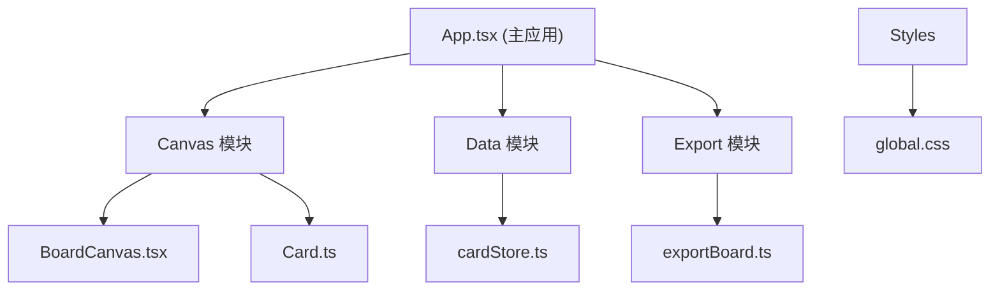

## 1. 架构设计



## 2. 技术描述

- **前端框架**：React 18 + TypeScript
- **构建工具**：Vite 5 + @vitejs/plugin-react
- **状态管理**：React Context + useReducer（卡片状态）
- **画布渲染**：HTML5 Canvas 2D API
- **图片导出**：html-to-image
- **唯一ID**：uuid
- **路径别名**：@/ 指向 src/

## 3. 模块划分

| 模块 | 路径 | 职责 |
|------|------|------|
| 画布模块 | src/canvas/ | 画布渲染、卡片拖拽、缩放、连接线绘制 |
| 数据模块 | src/data/ | 卡片状态管理、增删改查、标签分组 |
| 导出模块 | src/export/ | PNG导出、文件名生成、下载触发 |
| 样式模块 | src/styles/ | 全局样式、主题变量、动画定义 |

## 4. 数据模型

### 4.1 卡片类型定义

```typescript
type CardType = 'character' | 'scene' | 'swatch';

interface BaseCard {
  id: string;
  type: CardType;
  x: number;
  y: number;
  title: string;
  description: string;
  tags: string[];
  createdAt: number;
}

interface CharacterCard extends BaseCard {
  type: 'character';
  primaryColor: string;
  secondaryColor: string;
}

interface SceneCard extends BaseCard {
  type: 'scene';
  thumbnailPattern: string;
}

interface SwatchCard extends BaseCard {
  type: 'swatch';
  colors: string[];
}

type Card = CharacterCard | SceneCard | SwatchCard;

interface Connection {
  id: string;
  fromCardId: string;
  toCardId: string;
  label?: string;
}

interface BoardState {
  cards: Card[];
  connections: Connection[];
  projectName: string;
  swimlaneView: boolean;
  zoom: number;
  panX: number;
  panY: number;
}
```

### 4.2 状态管理

- 使用 React Context + useReducer 管理全局状态
- 提供 useCardStore hook 方便组件访问
- 支持撤销/重做（历史记录栈）

## 5. 性能优化

- 画布使用 Canvas 2D 渲染，避免 DOM 重排
- 拖拽操作使用 requestAnimationFrame 保证 55fps+
- 导出使用离屏渲染，避免阻塞 UI 超过 1 秒
- 卡片按需重绘，使用脏矩形优化

## 6. 文件结构

```
src/
├── main.tsx          # 入口文件
├── App.tsx           # 主应用组件
├── canvas/
│   ├── BoardCanvas.tsx  # Canvas组件
│   └── Card.ts          # 卡片绘制类
├── data/
│   └── cardStore.ts     # 状态管理
├── export/
│   └── exportBoard.ts   # 导出功能
└── styles/
    └── global.css       # 全局样式
```
