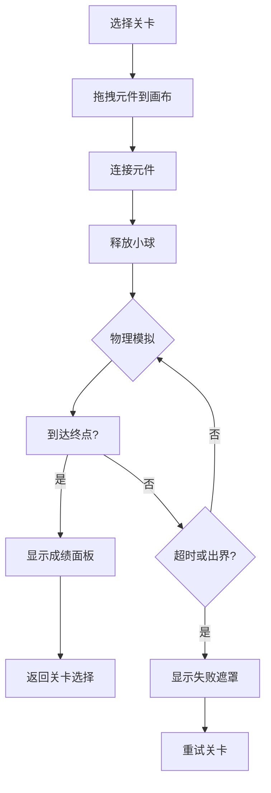

## 1. 产品概述

一个基于杠杆、滑轮和斜面组合的物理谜题游戏，玩家通过拖动和连接简单机械元件，将小球从起点运送到终点。系统实时模拟重力、摩擦力和张力，挑战玩家的物理思维和创造力。

- 核心目标：通过搭建机械装置解决物理谜题，寓教于乐
- 目标用户：学生、物理爱好者、解谜游戏玩家
- 产品价值：将抽象的物理概念转化为直观的互动体验

## 2. 核心功能

### 2.1 用户角色
| 角色 | 注册方式 | 核心权限 |
|------|----------|----------|
| 玩家 | 无需注册，本地存储进度 | 选择关卡、搭建装置、查看成绩 |

### 2.2 功能模块
1. **关卡选择界面**：显示5个预设关卡，展示累计星数
2. **游戏主界面**：左侧元件库、中间画布、顶部UI信息栏
3. **物理模拟系统**：实时重力、碰撞、摩擦力、张力模拟
4. **成绩评级系统**：计时、步数统计、1-3星评级

### 2.3 页面详情
| 页面名称 | 模块名称 | 功能描述 |
|----------|----------|----------|
| 关卡选择 | 关卡卡片 | 展示关卡名称、解锁状态、获得星数 |
| 关卡选择 | 总星数显示 | 显示累计获得的星星总数 |
| 游戏主界面 | 元件库面板 | 可拖拽的机械元件列表（杠杆、滑轮、斜面、绳索、固定点） |
| 游戏主界面 | SVG画布 | 放置元件、显示小球运动轨迹、吸附网格 |
| 游戏主界面 | UI信息栏 | 计时器、步数计数器、重置/暂停按钮 |
| 游戏主界面 | 过关面板 | 显示用时、步数、星级评价 |
| 游戏主界面 | 失败遮罩 | 超时或出界时显示重试按钮 |

## 3. 核心流程

玩家选择关卡 → 拖拽元件到画布（网格吸附）→ 连接元件（绳索）→ 释放小球 → 物理模拟运行 → 到达终点（过关评级）或失败（重试）

## 4. 用户界面设计

### 4.1 设计风格
- 主色调：浅灰背景 #E5E7EB，元件采用功能色区分
- 杠杆：棕色 #8B4513，滑轮：灰色 #6B7280，斜面：灰色 #9CA3AF
- 小球：红色 #EF4444，终点：绿色 #22C55E
- 计时器：红色 #DC2626，步数：蓝色 #2563EB
- 扁平矢量风格，简洁几何造型
- 元件项：圆角8px，高60px
- 响应式：窗口宽度<768px时缩放因子0.7

### 4.2 页面设计概述
| 页面名称 | 模块名称 | UI元素 |
|----------|----------|--------|
| 关卡选择 | 关卡网格 | 卡片式布局，显示星数图标，hover高亮效果 |
| 游戏主界面 | 元件库 | 左侧固定200px宽面板，可拖拽图标，拖拽时虚线占位 |
| 游戏主界面 | 画布 | SVG背景网格20px间距，元件吸附动画0.1s，终点脉冲动画1s周期 |
| 游戏主界面 | UI信息栏 | 右上角计时器和步数，重置按钮，暂停面板 |
| 游戏主界面 | 成绩面板 | 居中弹窗，星级动画，用时和步数显示 |

### 4.3 响应式设计
- Desktop-first设计
- 窗口宽度<768px时整体缩放0.7倍
- 触摸设备支持拖拽操作
- 画布自适应窗口大小

### 4.4 动画效果
- 终点区域：边框绿色渐变脉冲动画，周期1s
- 网格吸附：元件平滑移动到吸附位置，0.1s过渡
- 小球：红色渐变高光效果
- 过关星星：依次点亮动画
- 失败遮罩：淡入半透明黑色覆盖层
