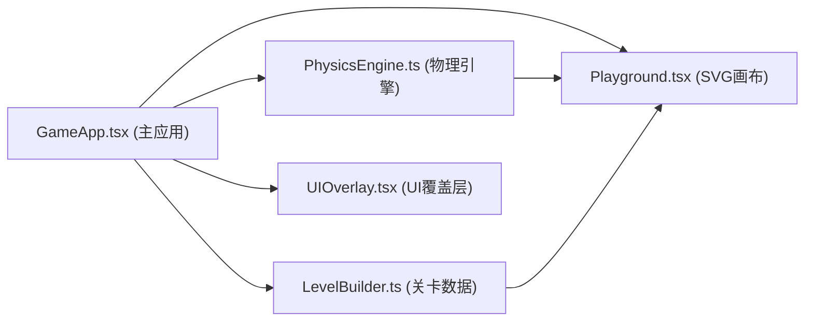

## 1. 架构设计



## 2. 技术描述

- 前端框架：React 18 + TypeScript
- 构建工具：Vite 5
- 状态管理：React useState/useRef + 自定义Hook
- 渲染方式：SVG矢量图形
- 物理模拟：自研PhysicsEngine模块（60fps，每帧<10ms）
- 初始化方式：Vite脚手架创建项目

## 3. 项目结构

```
auto234/
├── package.json
├── vite.config.js
├── tsconfig.json
├── index.html
└── src/
    ├── PhysicsEngine.ts    # 物理引擎核心
    ├── LevelBuilder.ts     # 关卡配置
    ├── GameApp.tsx         # 主应用组件
    └── components/
        ├── Playground.tsx  # SVG游戏画布
        └── UIOverlay.tsx   # UI信息覆盖层
```

## 4. 模块接口定义

### 4.1 PhysicsEngine 模块

```typescript
// 物理对象类型
type BodyType = 'ball' | 'lever' | 'pulley' | 'incline' | 'rope' | 'anchor';

interface Vector2 {
  x: number;
  y: number;
}

interface RigidBody {
  id: string;
  type: BodyType;
  position: Vector2;
  velocity: Vector2;
  mass: number;
  rotation: number;
  angularVelocity: number;
  width?: number;
  height?: number;
  radius?: number;
  isStatic: boolean;
  restitution: number;  // 弹性系数
  friction: number;     // 摩擦系数
}

interface RopeConstraint {
  id: string;
  bodyA: string;
  bodyB: string;
  anchorA: Vector2;
  anchorB: Vector2;
  length: number;
  tension: number;
}

interface PhysicsState {
  bodies: RigidBody[];
  constraints: RopeConstraint[];
  ballId: string;
  goalPosition: Vector2;
  goalRadius: number;
}

class PhysicsEngine {
  constructor(gravity: number = 9.8);
  setState(state: PhysicsState): void;
  getState(): PhysicsState;
  step(deltaTime: number): void;  // 单帧物理更新
  checkGoalReached(): boolean;
  checkBallOutOfBounds(bounds: { width: number; height: number }): boolean;
}
```

### 4.2 LevelBuilder 模块

```typescript
interface ElementDefinition {
  id: string;
  type: BodyType;
  x: number;
  y: number;
  width?: number;
  height?: number;
  radius?: number;
  isStatic: boolean;
}

interface LevelDefinition {
  id: number;
  name: string;
  description: string;
  availableElements: BodyType[];
  maxSteps: number;
  timeLimit: number;  // 秒
  startPosition: Vector2;
  goalPosition: Vector2;
  preplacedElements: ElementDefinition[];
  starThresholds: { time: number; steps: number }[];  // 3星、2星、1星
}

class LevelBuilder {
  static getLevels(): LevelDefinition[];
  static getLevel(id: number): LevelDefinition | undefined;
}
```

### 4.3 游戏状态

```typescript
type GameStatus = 'selecting' | 'building' | 'running' | 'paused' | 'won' | 'lost';

interface GameState {
  status: GameStatus;
  currentLevel: number | null;
  elapsedTime: number;
  steps: number;
  totalStars: number;
  levelStars: Record<number, number>;
  placedElements: PlacedElement[];
  connections: Connection[];
}
```

## 5. 关卡定义

### 5.1 五个预设关卡
| 关卡ID | 名称 | 可用元件 | 描述 |
|--------|------|----------|------|
| 1 | 初识杠杆 | 杠杆、固定点、绳索 | 只用杠杆将小球弹到终点 |
| 2 | 滑轮升降 | 杠杆、滑轮、固定点、绳索 | 加入滑轮改变力的方向 |
| 3 | 斜面滑行 | 杠杆、斜面、固定点、绳索 | 利用斜面+杠杆组合 |
| 4 | 机械联动 | 全部元件 | 杠杆+滑轮+斜面综合应用 |
| 5 | 自由搭建 | 全部元件 | 自由模式，无步数限制 |

## 6. 物理模拟核心算法

### 6.1 重力模拟
- 重力加速度：9.8 m/s²（需转换为像素/帧²）
- 每帧更新：velocity.y += gravity * deltaTime

### 6.2 碰撞检测
- 圆与矩形碰撞检测（小球与杠杆/斜面）
- 圆与圆碰撞检测（小球与滑轮）
- 碰撞响应：法向速度反弹 + 切向速度摩擦

### 6.3 绳索张力
- 距离约束：两锚点距离不超过绳长
- 超出时施加张力修正位置

### 6.4 斜面滑动
- 分解重力为法向和切向分量
- 切向分量产生滑动加速度
- 摩擦力阻碍相对运动
