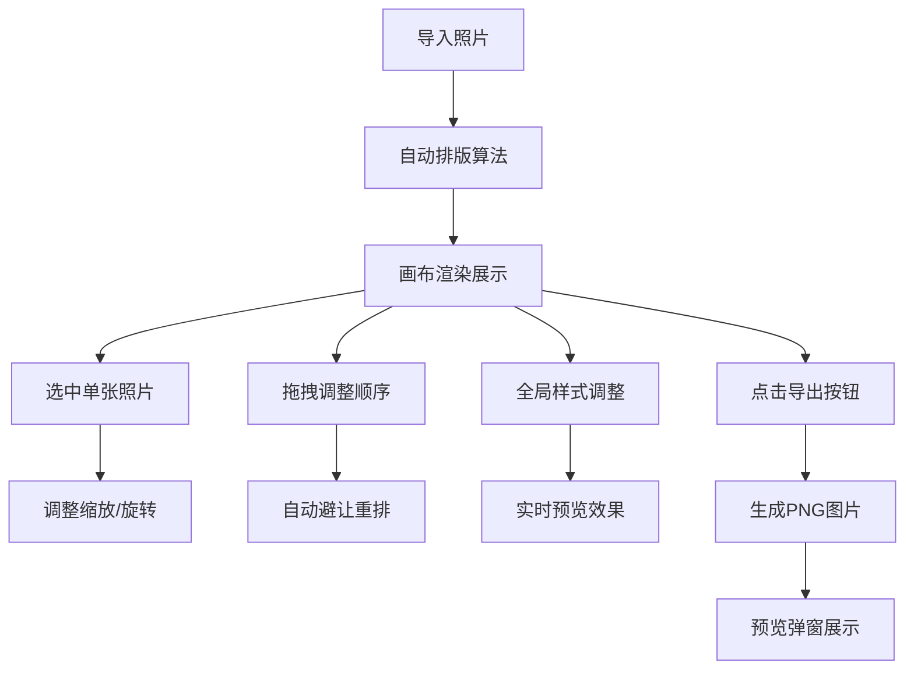

## 1. 产品概述

PhotoStory Builder 是一款面向独立摄影师和旅行博主的智能照片排版工具，能够自动将10-30张照片排版成视觉故事（类似杂志或画册内页），解决手动拖拽拼图耗时且难以统一风格的痛点。

- 核心价值：让用户专注于选择照片和撰写叙事文字，而非繁琐的排版工作
- 目标用户：独立摄影师、旅行博主、内容创作者
- 市场价值：提供专业级排版效果的同时大幅提升工作效率

## 2. 核心功能

### 2.1 用户角色
| 角色 | 注册方式 | 核心权限 |
|------|----------|----------|
| 普通用户 | 无需注册，本地使用 | 使用所有排版、编辑、导出功能 |

### 2.2 功能模块
1. **照片管理模块**：照片导入、缩略图预览、拖拽排序
2. **自动排版模块**：基于宽高比的智能排列、自动留白、页码显示
3. **照片编辑模块**：单张照片缩放、旋转、拖拽重新排序
4. **全局样式模块**：圆角、阴影、字体缩放、行距统一调整
5. **导出模块**：PNG图片导出、预览弹窗

### 2.3 页面详情
| 页面名称 | 模块名称 | 功能描述 |
|---------|---------|----------|
| 主页面 | 左栏缩略图列表 | 64x64px缩略图、悬停放大效果、拖拽排序 |
| 主页面 | 中间画布区域 | A4比例画布、自动排版算法、拖拽重排、选中呼吸动画 |
| 主页面 | 右栏属性面板 | 单张照片缩放/旋转、全局样式控制、导出按钮 |
| 弹窗 | 导出预览 | 黑色半透明背景、PNG预览、淡入动画 |

## 3. 核心流程

用户导入10-30张照片 → 系统自动排版到A4画布 → 用户点击选中照片调整缩放/旋转 → 拖拽照片调整顺序（自动避让动画）→ 在全局面板统一调整样式 → 点击导出生成PNG → 预览确认后保存

## 4. 用户界面设计

### 4.1 设计风格
- **主色调**：暖棕色系 - 米白#F7F3E8（画布背景）、浅褐#E0D8C6（画布区背景）、琥珀#B8860B（强调色）、深褐#5C4B37（文字主色）
- **按钮样式**：圆角矩形，悬停背景变为琥珀色#B8860B，文字变白，过渡0.2s ease-in-out
- **字体**：标题使用衬线体Georgia，字号根据照片宽度自动计算（5%，12-32px）
- **布局风格**：三栏结构，左240px、中自适应、右300px
- **控件风格**：Slider控件磨砂质感灰色#C4B7A6，选中态琥珀色#B8860B

### 4.2 页面设计概述
| 页面名称 | 模块名称 | UI元素 |
|---------|---------|--------|
| 主页面 | 左栏缩略图 | 背景#ECE7DE，缩略图64x64px圆角6px，间距4px，悬停scale(1.05)放大0.15s |
| 主页面 | 中间画布 | A4比例，背景米白#F7F3E8，深褐色投影#8B7B61（5px），照片间距8px，右上角页码 |
| 主页面 | 右栏面板 | 背景#F0EBE0，滑块磨砂质感，分组清晰 |
| 弹窗 | 导出预览 | 黑色半透明#000000CC，宽度90%视口，淡入动画0.3s |

### 4.3 响应式设计
- 桌面端（≥900px）：三栏完整展示
- 移动端（<900px）：左右栏隐藏为图标按钮，点击侧边抽屉滑出
- 画布最小宽度600px，保证排版质量
- 触摸设备优化拖拽交互

### 4.4 动画效果
- 照片选中：2px琥珀色边框 + 0.3s宽高呼吸动画
- 拖拽重排：其他照片自动避让，0.2s弹性过渡
- 悬停效果：缩略图放大0.15s，按钮背景过渡0.2s
- 弹窗淡入：0.3s ease-in-out
- 全局过渡：统一0.2s ease-in-out

## 5. 性能要求
- 拖拽重排动画帧率≥30fps
- 20张照片PNG导出时间≤2秒
- 画布resize时平滑重计算
