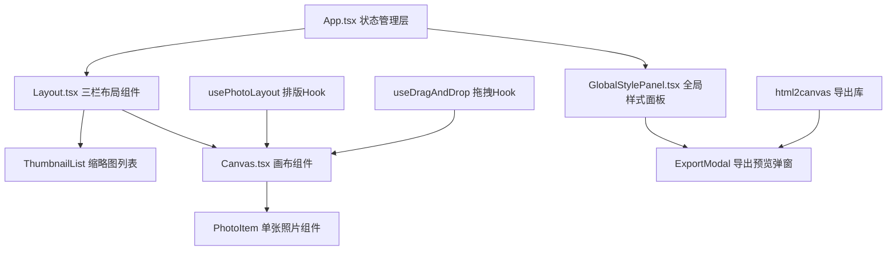

## 1. 架构设计



## 2. 技术描述

- **前端框架**：React@18 + TypeScript@5
- **构建工具**：Vite@5 + @vitejs/plugin-react
- **样式方案**：CSS Modules + CSS Variables（主题色统一管理）
- **辅助库**：uuid（生成唯一ID）、html2canvas（PNG导出）
- **状态管理**：React useState + useReducer（本地状态，无需Redux）
- **动画方案**：CSS Transitions + Keyframes（避免额外动画库，保证性能）
- **拖拽实现**：原生HTML5 Drag and Drop API + 自定义位置计算

## 3. 项目结构

```
auto235/
├── package.json
├── vite.config.js
├── tsconfig.json
├── index.html
└── src/
    ├── App.tsx              # 主应用组件，全局状态管理
    ├── main.tsx             # 应用入口
    ├── index.css            # 全局样式 + CSS变量
    ├── types/
    │   └── photo.ts         # 照片数据类型定义
    ├── utils/
    │   ├── layout.ts        # 自动排版算法
    │   └── export.ts        # 导出工具函数
    ├── hooks/
    │   ├── usePhotoLayout.ts   # 排版逻辑Hook
    │   └── useDragAndDrop.ts   # 拖拽逻辑Hook
    └── components/
        ├── Layout.tsx       # 三栏布局 + 响应式抽屉
        ├── Canvas.tsx       # 画布组件 + 自动排版
        ├── PhotoItem.tsx    # 单张照片组件
        ├── ThumbnailList.tsx # 缩略图列表
        ├── GlobalStylePanel.tsx # 全局样式面板
        ├── PhotoPropertyPanel.tsx # 单张照片属性面板
        └── ExportModal.tsx  # 导出预览弹窗
```

## 4. 核心数据模型

### 4.1 TypeScript 类型定义

```typescript
interface Photo {
  id: string;
  url: string;
  width: number;
  height: number;
  aspectRatio: number;
  title: string;
  scale: number;      // 0.8 - 1.5
  rotation: number;   // -15 - 15
  position?: { x: number; y: number };
  renderedWidth?: number;
  renderedHeight?: number;
}

interface GlobalStyle {
  borderRadius: number;     // 0 - 20px
  shadowIntensity: 'none' | 'soft' | 'medium' | 'hard';
  fontSizeScale: number;    // 0.8 - 1.2
  lineHeight: number;       // 1.2 - 2.0
}

interface LayoutConfig {
  canvasWidth: number;
  canvasHeight: number;
  padding: number;
  gap: number;
}
```

### 4.2 状态结构

```typescript
interface AppState {
  photos: Photo[];
  selectedPhotoId: string | null;
  globalStyle: GlobalStyle;
  isExporting: boolean;
  showExportModal: boolean;
  exportDataUrl: string | null;
}
```

## 5. 排版算法设计

### 5.1 自动排版流程
1. 计算A4比例画布尺寸（基于当前容器宽度）
2. 将照片按宽高比分类（横图、竖图、方图）
3. 使用行优先贪心算法：
   - 每行尝试填充多张照片，保持统一行高
   - 计算行内照片缩放比例，使总宽度匹配画布宽度
   - 照片间距固定8px
   - 处理最后一行居中对齐
4. 为每张照片计算精确位置和渲染尺寸

### 5.2 拖拽重排算法
1. 拖拽开始时记录源位置索引
2. 拖拽过程中计算鼠标在画布中的位置
3. 根据位置判断目标插入索引
4. 其他照片应用避让动画（transform: translate）
5. 松开时更新photos数组顺序并触发重排

## 6. 性能优化策略

### 6.1 渲染优化
- 使用React.memo包裹PhotoItem组件
- 拖拽时使用CSS transform而非top/left定位
- 避免重排过程中更新整个photos数组，仅更新位置信息
- 使用requestAnimationFrame确保动画流畅

### 6.2 导出优化
- 使用html2canvas的scale参数控制导出质量
- 导出前临时移除动画效果
- 对大照片进行适当压缩
- 显示加载状态提升用户体验

### 6.3 响应式优化
- 使用ResizeObserver监听画布尺寸变化
- 防抖处理resize事件（100ms延迟）
- 抽屉动画使用GPU加速（transform: translate3d）

## 7. 导出功能实现

```typescript
// 导出流程
const exportToPNG = async (canvasRef: React.RefObject<HTMLDivElement>) => {
  const element = canvasRef.current;
  if (!element) return;
  
  const canvas = await html2canvas(element, {
    backgroundColor: '#F7F3E8',
    scale: 2, // 2倍分辨率
    useCORS: true,
    logging: false,
  });
  
  return canvas.toDataURL('image/png');
};
```

## 8. 动画实现要点

### 8.1 选中呼吸动画
```css
@keyframes breathe {
  0%, 100% { transform: scale(1); }
  50% { transform: scale(1.02); }
}

.photo-selected {
  border: 2px solid #B8860B;
  animation: breathe 0.3s ease-in-out;
}
```

### 8.2 弹性过渡
```css
.photo-item {
  transition: transform 0.2s cubic-bezier(0.34, 1.56, 0.64, 1);
}
```
