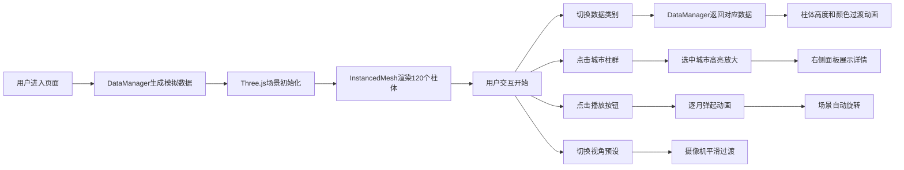

## 1. 产品概述

交互式三维气候数据可视化仪表盘，为气象研究员提供全球主要城市过去十年间气象数据的沉浸式三维展示。解决传统二维图表难以同时展示空间维度和季节维度的痛点，支持温度、降水、风速三类数据的直观对比与深入分析。

- **目标用户**：气象研究员、气候分析师、环境科学从业者
- **核心价值**：通过三维空间可视化直观呈现气候模式的时空演变，提升数据洞察效率

## 2. 核心功能

### 2.1 功能模块

1. **三维场景主视图**：10个城市的12个月度气象数据柱状图，支持数据类别切换和城市高亮
2. **左侧控制面板**：城市多选、数据类别下拉、年份范围滑块、视角预设按钮
3. **城市详情面板**：城市基本信息、年度趋势折线图、统计数据展示
4. **动画控制栏**：播放/暂停按钮、时间进度指示、自动旋转开关
5. **FPS计数器**：实时显示帧率，监控性能

### 2.2 页面详情

| 页面名称 | 模块名称 | 功能描述 |
|----------|----------|----------|
| 主仪表盘 | 三维柱状图 | 10城市×12月度数据的三维可视化，柱体高度映射数值，支持InstancedMesh性能优化 |
| 主仪表盘 | 数据类别切换 | 温度/降水/风速三选一，柱体颜色主题渐变过渡动画0.5秒 |
| 主仪表盘 | 城市交互 | 点击城市柱群高亮放大1.2倍，其他城市透明度降至0.3 |
| 主仪表盘 | 时间回放 | 柱体按月份逐月弹起动画，间隔0.2秒，支持播放/暂停 |
| 主仪表盘 | 视角控制 | 4个预设视角（正面、俯视45°、侧视、鸟瞰），平滑过渡1秒，easeOutCubic缓动 |
| 详情面板 | 趋势图表 | Canvas绘制年度趋势折线图，线宽2px，颜色与数据类别对应 |
| 详情面板 | 统计数据 | 显示年度均值、极值（最大值/最小值） |
| 控制面板 | 城市筛选 | 多选框控制城市显示/隐藏，默认全选 |
| 控制面板 | 年份滑块 | 范围滑块控制数据年份，默认2020-2023 |

## 3. 核心流程

## 4. 用户界面设计

### 4.1 设计风格

- **主色调**：深色科技感主题，背景#0F172A，面板#1E293B/#1F2937
- **强调色**：温度渐变#EF4444→#3B82F6，降水渐变#06B6D4→#10B981，风速渐变#6B7280→#8B5CF6
- **控件颜色**：滑块轨道#475569，滑块圆点#3B82F6
- **按钮样式**：圆角8px，悬停背景变色0.2秒过渡，点击微缩反馈
- **字体**：使用现代无衬线字体，标题16px半粗体，正文12px常规
- **布局**：左侧固定控制面板280px，右侧三维场景自适应，详情面板320px悬浮

### 4.2 页面设计概览

| 页面名称 | 模块名称 | UI元素 |
|----------|----------|--------|
| 主仪表盘 | 三维场景 | 半透明地面网格（#334155，透明度0.2），120个渐变柱体，CSS2DRenderer城市标签（白色12px） |
| 主仪表盘 | 控制面板 | 城市多选列表、类别下拉选择器、年份范围滑块、四个视角预设按钮 |
| 主仪表盘 | 详情面板 | 城市名称、经纬度坐标、Canvas折线图、统计数据卡片 |
| 主仪表盘 | 动画控制栏 | 播放/暂停按钮、时间进度条、自动旋转开关 |
| 主仪表盘 | FPS计数器 | 右上角小号字体#9CA3AF |

### 4.3 响应式设计

- **桌面端（≥768px）**：左侧控制面板固定展开，三维场景自适应剩余空间
- **移动端（<768px）**：左侧控制面板收缩为悬浮按钮，点击展开/收起，详情面板改为底部滑出
- **触摸优化**：支持单指旋转、双指缩放、双指平移

### 4.4 3D场景设计

- **环境光**：强度0.6，提供基础照明
- **平行光**：方向(-1, 1, 1)，产生柔和阴影效果
- **摄像机**：透视相机，初始距离25单位，缩放范围10-50单位
- **交互**：鼠标左键旋转、滚轮缩放、右键平移
- **动画**：自动旋转角速度0.01 rad/s，柱体高度过渡动画，选中缩放1.2倍
- **材质**：MeshStandardMaterial配合InstancedMesh，确保120个柱体仅1次draw call
