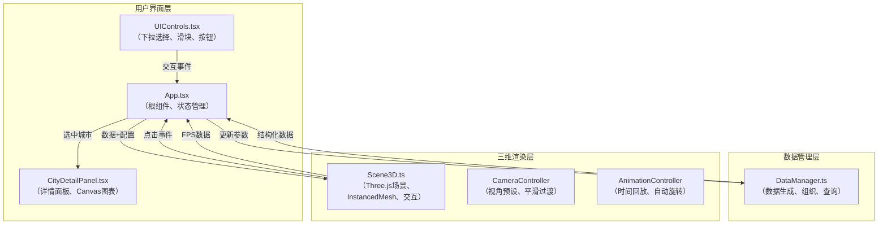

## 1. 架构设计



## 2. 技术栈描述

- **前端框架**：React@18 + TypeScript@5
- **构建工具**：Vite@5 + @vitejs/plugin-react@4
- **三维渲染**：Three.js@0.160 + @types/three@0.160
- **工具库**：uuid@9
- **状态管理**：React useState/useRef 本地状态，DataManager单例管理数据
- **性能优化**：InstancedMesh减少draw call，BufferGeometry复用，requestAnimationFrame节流

## 3. 目录结构

```
src/
├── App.tsx                 # 根组件，协调各模块
├── DataManager.ts          # 数据生成与管理模块
├── Scene3D.ts              # Three.js场景管理
├── UIControls.tsx          # 左侧控制面板组件
├── CityDetailPanel.tsx     # 城市详情面板组件
├── types.ts                # 类型定义
└── utils/
    ├── animation.ts        # 动画缓动函数
    └── color.ts            # 颜色渐变工具
```

## 4. 数据模型

### 4.1 类型定义

```typescript
// 城市信息
interface City {
  id: string;
  name: string;
  lat: number;
  lng: number;
  position: { x: number; z: number };
}

// 数据类别
type DataCategory = 'temperature' | 'precipitation' | 'windSpeed';

// 单月数据
interface MonthData {
  month: number;      // 0-11
  year: number;
  temperature: number; // °C
  precipitation: number; // mm
  windSpeed: number;  // m/s
}

// 城市年度数据
interface CityYearData {
  cityId: string;
  year: number;
  months: MonthData[];
}

// 可视化配置
interface VisualConfig {
  category: DataCategory;
  selectedCities: string[];
  yearRange: [number, number];
  isPlaying: boolean;
  autoRotate: boolean;
}

// 数值映射配置
interface ValueMapping {
  min: number;
  max: number;
  heightMin: number;
  heightMax: number;
  colorStart: string;
  colorEnd: string;
}
```

### 4.2 数据流向

1. **数据生成**：DataManager根据城市列表和时间范围生成真实感模拟数据
2. **数据组织**：按城市→年份→月份三级结构存储，支持快速查询
3. **数据转换**：Scene3D接收数据后转换为InstancedMesh所需的矩阵数组和颜色数组
4. **状态更新**：UIControls触发事件→App更新状态→DataManager重新查询→Scene3D更新渲染

## 5. 核心模块设计

### 5.1 DataManager

- **单例模式**：全局唯一实例，确保数据一致性
- **模拟算法**：基于真实气候特征生成数据（纬度、季节、城市类型）
- **查询接口**：`getData(cities, category, yearRange)` 返回结构化数据
- **统计计算**：`getStats(cityId, category, yearRange)` 返回均值、极值

### 5.2 Scene3D

- **InstancedMesh**：120个柱体使用单个draw call
- **射线检测**：Raycaster处理城市点击事件
- **CSS2DRenderer**：城市标签悬浮显示
- **动画系统**：TWEEN.js实现高度过渡、视角切换、弹起动画
- **输入处理**：OrbitControls支持旋转、缩放、平移

### 5.3 UIControls

- **受控组件**：所有输入控件值由App状态管理
- **防抖处理**：滑块拖动使用防抖优化性能
- **响应式布局**：<768px时转为悬浮折叠模式

## 6. 性能优化策略

| 优化点 | 实现方式 | 预期效果 |
|--------|----------|----------|
| Draw Call优化 | InstancedMesh渲染120个柱体 | 从120次降至1次 |
| 几何体重用 | 所有柱体共享同一个BoxBufferGeometry | 内存占用减少90% |
| 材质复用 | 同类别柱体共享材质实例，仅更新instanceColor | GPU内存优化 |
| 动画节流 | 使用Clock.getDelta()控制动画帧间隔 | 稳定30fps以上 |
| 按需渲染 | 仅在数据变化或交互时更新矩阵 | CPU使用率降低 |
| 标签优化 | CSS2DRenderer使用CSS transform而非DOM重排 | 标签动画流畅 |

## 7. 调用关系说明

- **App.tsx → DataManager.ts**：调用`generateAllData()`初始化，`getData()`获取数据，`getStats()`获取统计
- **App.tsx → Scene3D.ts**：调用`init(mountPoint)`初始化，`updateData(data, config)`更新场景
- **App.tsx → UIControls.tsx**：传递`config`和`onConfigChange`回调
- **App.tsx → CityDetailPanel.tsx**：传递`selectedCity`和`stats`数据
- **Scene3D.ts → App.tsx**：通过`onCityClick`回调通知点击事件，`onFpsUpdate`回调传递帧率
