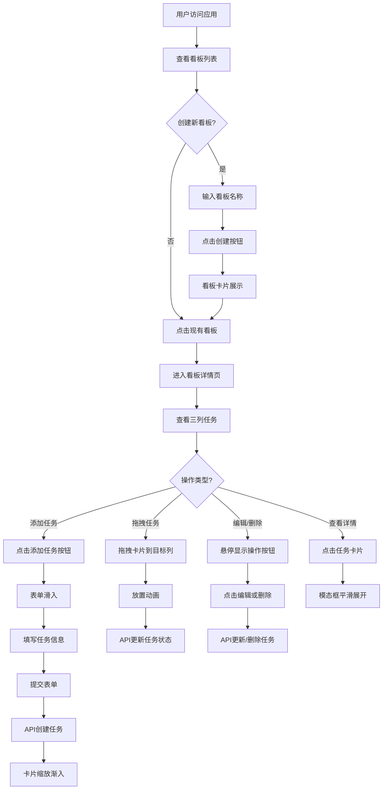

## 1. 产品概述

在线任务协作看板应用，支持团队成员创建看板、管理任务卡片、通过拖拽修改任务状态，实现高效的项目协作和任务追踪。

- 主要用途：团队任务管理、项目进度跟踪、工作流程可视化
- 目标用户：产品团队、开发团队、项目管理者
- 产品价值：提升团队协作效率，清晰展示任务状态，支持实时数据同步

## 2. 核心功能

### 2.1 用户角色

| 角色 | 注册方式 | 核心权限 |
|------|----------|----------|
| 普通用户 | 无需注册，直接使用 | 创建看板、管理任务、拖拽排序、数据同步 |

### 2.2 功能模块

1. **看板列表页**：看板创建、看板卡片展示、看板导航
2. **看板详情页**：三列任务展示、任务卡片拖拽、任务CRUD操作
3. **任务管理**：任务创建、编辑、删除、状态更新、详情展示
4. **实时同步**：前后端API通信、数据状态同步

### 2.3 页面详情

| 页面名称 | 模块名称 | 功能描述 |
|---------|---------|----------|
| 看板列表页 | 顶部导航栏 | 应用标题、看板创建入口 |
| 看板列表页 | 看板创建表单 | 输入看板名称、点击创建按钮 |
| 看板列表页 | 看板卡片列表 | 展示所有看板卡片、悬停动效、点击进入 |
| 看板详情页 | 列标题区域 | 三列标题、任务数量徽章、渐变背景 |
| 看板详情页 | 任务卡片列表 | 卡片展示、滚动容器、自定义滚动条 |
| 看板详情页 | 任务卡片 | 悬停动效、编辑/删除按钮、点击展开详情 |
| 看板详情页 | 拖拽功能 | 拖拽跟随、半透明阴影、放置动画、API同步 |
| 看板详情页 | 添加任务表单 | 底部滑入动画、表单验证、提交加载动画 |
| 看板详情页 | 任务详情模态框 | 平滑展开动画、完整任务信息展示 |

## 3. 核心流程

## 4. 用户界面设计

### 4.1 设计风格

- **主色调**：深蓝色 #1e3a5f（导航栏），浅灰色 #f5f5f5（背景），白色 #ffffff（卡片）
- **辅助色**：红色 #e74c3c（高优先级），黄色 #f39c12（中优先级），绿色 #27ae60（低优先级）
- **列背景**：淡蓝渐变（待办）、淡黄渐变（进行中）、淡绿渐变（已完成）
- **按钮风格**：圆角8px、悬停过渡动画、加载状态动效
- **字体**：使用 'Segoe UI', 'PingFang SC', 'Microsoft YaHei' 等现代无衬线字体
- **布局风格**：卡片式设计、圆角8px、细微阴影、充足留白
- **图标风格**：简洁线性图标、统一尺寸

### 4.2 页面设计概述

| 页面名称 | 模块名称 | UI元素 |
|---------|---------|--------|
| 看板列表页 | 顶部导航栏 | 深蓝色背景、白色文字、居左标题、右侧创建输入框 |
| 看板列表页 | 看板卡片 | 白色背景、圆角8px、阴影、悬停放大+阴影加深 |
| 看板详情页 | 列容器 | 三列等宽、渐变标题栏、任务数量徽章、最大高度限制 |
| 看板详情页 | 任务卡片 | 白色背景、圆角8px、悬停上浮、编辑/删除图标渐显 |
| 看板详情页 | 添加任务表单 | 底部滑入、表单控件间距合理、提交按钮加载动画 |
| 看板详情页 | 模态框 | 半透明遮罩、居中卡片、平滑展开动画、关闭按钮 |

### 4.3 响应式设计

- **桌面端**：三列等宽（33%），列间距24px
- **平板设备**：两列布局（50%），列间距16px
- **手机端**：单列全宽（100%），列间距12px，垂直排列
- **触摸优化**：增大点击区域，支持触摸拖拽

### 4.4 动效规范

- **过渡动画**：0.3s ease-in-out 统一应用于所有交互
- **悬停效果**：卡片放大、阴影加深、元素上浮
- **拖拽效果**：半透明跟随、阴影效果、放置动画
- **表单动效**：底部滑入、加载旋转、失败抖动
- **卡片入场**：缩放+渐入动画
- **模态框**：背景淡入、内容缩放展开

## 5. 性能要求

- **拖拽响应**：≤16ms（60fps）
- **API响应**：≤200ms（本地）
- **同步延迟**：≤500ms
- **动画流畅度**：所有过渡动画保持60fps
