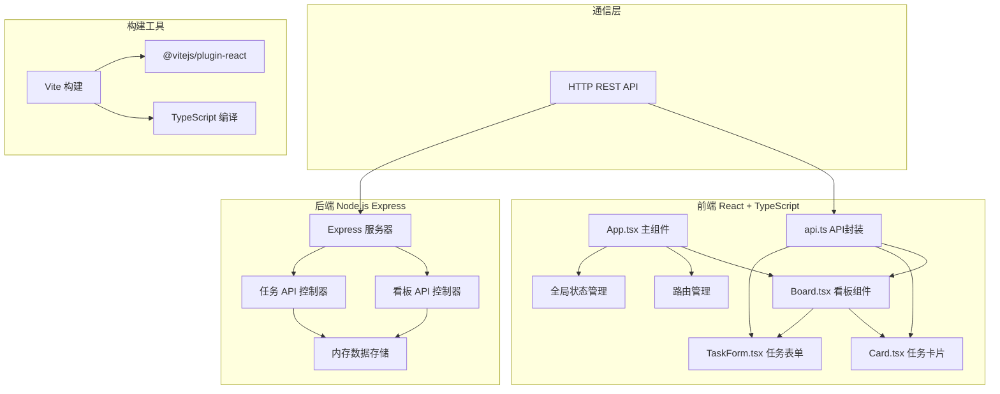
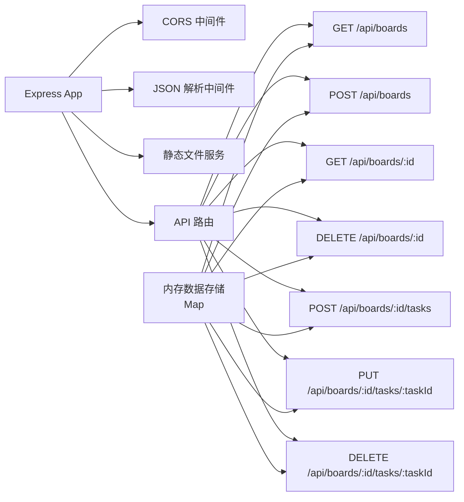
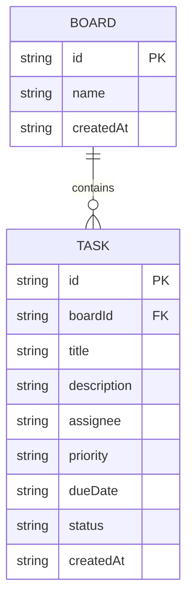

## 1. 架构设计



## 2. 技术描述

- **前端**：React@18 + TypeScript@5 + Vite@5
- **后端**：Express@4 + CORS 中间件
- **数据存储**：内存存储（使用 Map 数据结构）
- **唯一标识**：uuid@9 生成唯一ID
- **HTTP客户端**：原生 fetch API 封装
- **样式方案**：CSS Modules / 原生 CSS + CSS 变量
- **初始化工具**：npm 初始化项目结构

## 3. 项目结构

```
auto24/
├── package.json          # 项目依赖和脚本
├── vite.config.js        # Vite 构建配置
├── tsconfig.json         # TypeScript 配置
├── index.html            # 入口 HTML
├── server.js             # Express 后端服务器
└── src/
    ├── App.tsx           # 主组件 - 路由、状态、拖拽
    ├── Board.tsx         # 看板组件 - 列渲染、拖拽监听
    ├── Card.tsx          # 卡片组件 - 任务展示、详情弹窗
    ├── TaskForm.tsx      # 表单组件 - 新增/编辑任务
    ├── api.ts            # API 封装
    └── types.ts          # TypeScript 类型定义
```

## 4. 路由定义

| 路由 | 页面 | 说明 |
|------|------|------|
| `/` | 看板列表页 | 展示所有看板卡片，支持创建新看板 |
| `/board/:id` | 看板详情页 | 展示三列任务，支持拖拽和任务管理 |

## 5. API 定义

### 5.1 TypeScript 类型

```typescript
interface Task {
  id: string;
  title: string;
  description: string;
  assignee: string;
  priority: 'high' | 'medium' | 'low';
  dueDate: string;
  status: 'todo' | 'inProgress' | 'done';
  createdAt: string;
}

interface Board {
  id: string;
  name: string;
  createdAt: string;
}

interface BoardWithTasks extends Board {
  tasks: Task[];
}
```

### 5.2 接口定义

| 方法 | 路径 | 描述 | 请求体 | 响应 |
|------|------|------|--------|------|
| GET | `/api/boards` | 获取所有看板 | - | `Board[]` |
| POST | `/api/boards` | 创建看板 | `{ name: string }` | `Board` |
| GET | `/api/boards/:id` | 获取单个看板（含任务） | - | `BoardWithTasks` |
| DELETE | `/api/boards/:id` | 删除看板 | - | `{ success: boolean }` |
| POST | `/api/boards/:id/tasks` | 创建任务 | `Omit<Task, 'id' 'createdAt'>` | `Task` |
| PUT | `/api/boards/:id/tasks/:taskId` | 更新任务 | `Partial<Task>` | `Task` |
| DELETE | `/api/boards/:id/tasks/:taskId` | 删除任务 | - | `{ success: boolean }` |

## 6. 服务器架构



## 7. 数据模型

### 7.1 ER 图



### 7.2 内存数据结构

```javascript
// 内存存储结构
const boards = new Map();
// key: boardId
// value: {
//   id: string,
//   name: string,
//   createdAt: string,
//   tasks: Map<taskId, Task>
// }
```

## 8. 前端核心逻辑

### 8.1 拖拽实现

- 使用原生 HTML5 Drag and Drop API
- 拖拽开始时设置 `dataTransfer` 数据和拖拽效果
- 拖拽过程中使用 `dragover` 事件允许放置
- 拖拽结束时更新状态并调用 API
- 拖拽时添加半透明效果和跟随阴影

### 8.2 状态管理

- 使用 React `useState` 和 `useReducer` 管理本地状态
- 看板列表和任务数据通过 Context 或 Props 传递
- API 调用使用 `useEffect` 和 `useCallback` 优化性能

### 8.3 动画实现

- CSS Transition 实现悬停、展开、滑入等效果
- CSS Keyframes 实现加载动画、抖动效果
- 拖拽动画使用 transform 和 opacity 属性优化性能
