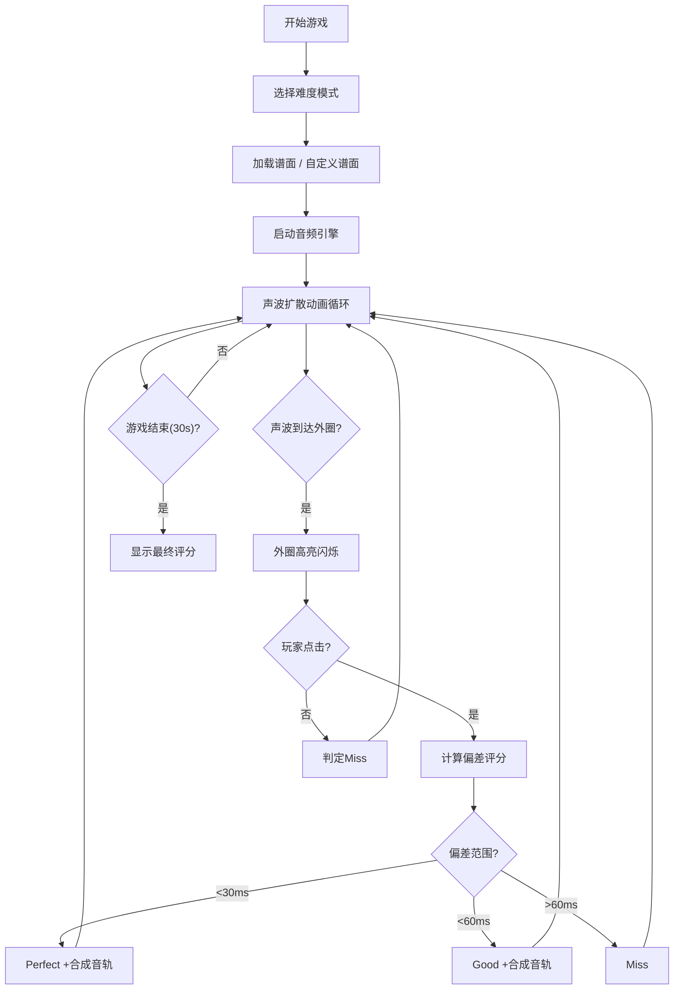

## 1. 产品概述
电子音乐节奏游戏「SonicBeats」，玩家跟随屏幕上不断扩散的彩色圆形声波，在声波到达外圈时点击对应区域获得评分，系统实时合成对应音轨的音频，模拟 DJ 混音体验。

- 目标用户：电子音乐爱好者、休闲游戏玩家
- 核心价值：将声波可视化与节奏游戏结合，提供沉浸式电子音乐创作与游戏体验

## 2. 核心功能

### 2.1 功能模块
1. **主游戏舞台**：环形舞台，声波从圆心向外扩散，支持点击判定与评分
2. **音轨控制面板**：四条音轨（鼓、贝斯、旋律、效果）的开关、音量控制、波形预览
3. **难度与谱面系统**：三种预设难度模式（简单/普通/困难），支持自定义谱面编辑
4. **音频合成引擎**：基于 Web Audio API 的实时音轨合成，BPM 控制

### 2.2 页面详情

| 页面名称 | 模块名称 | 功能描述 |
|-----------|-------------|---------------------|
| 主应用页 | 环形舞台 | 声波扩散动画（60FPS）、点击判定、波纹反馈、外圈高亮闪烁 |
| 主应用页 | 音轨控制面板 | 4条音轨竖排展示，开关按钮（带缩放动画）、音量滑块（增益控制）、实时波形预览Canvas |
| 主应用页 | 模式选择区 | 3种难度模式切换按钮，BPM滑块（80-180），预设/自定义谱面切换 |
| 主应用页 | 谱面编辑区 | 12等分扇区点击放置节拍点，JSON导出功能 |
| 主应用页 | 评分显示区 | Perfect/Good/Miss 实时评分显示，连击计数 |

## 3. 核心流程

## 4. 用户界面设计

### 4.1 设计风格
- **主色调**：深色渐变背景（顶部#0F0C29 → 底部#302B63）
- **音轨颜色**：鼓#FF4757、贝斯#2ED573、旋律#1E90FF、效果#FFA502
- **舞台**：环形（半径300px），外圈发光#FFFFFF15，内圈深灰
- **字体**：现代电子感，使用 Orbitron（标题）+ Rajdhani（正文）组合
- **动画**：声波扩散、点击波纹（0.3s消失）、按钮缩放（0.2s）、外圈高亮（0.1s白色过渡）

### 4.2 页面设计概述

| 页面名称 | 模块名称 | UI元素 |
|-----------|-------------|-------------|
| 主应用页 | 环形舞台 | 全屏背景、中央环形、同心圆声波（颜色对应音轨）、12扇区细分线、点击波纹动画 |
| 主应用页 | 音轨面板 | 200px宽卡片（#1A1A2E，圆角12px）、4条音轨行、开关按钮、渐变滑块、Canvas波形 |
| 主应用页 | 控制区 | BPM滑块、模式按钮组、开始/停止按钮、导出JSON按钮 |
| 主应用页 | 评分HUD | 右上角分数显示、连击计数器、Perfect/Good/Miss弹出提示 |

### 4.3 响应性
- Desktop-first 设计，最小分辨率 1280×800
- 舞台区域使用绝对定位居中，保持圆形比例
- 音轨面板固定左侧，控制面板固定底部
- 触摸设备支持扇区区域点击

### 4.4 性能要求
- 渲染帧率：稳定 60FPS（requestAnimationFrame）
- 音频延迟：≤ 50ms（Web Audio API 直接调度）
- 内存占用：单页应用，Canvas 对象池复用
