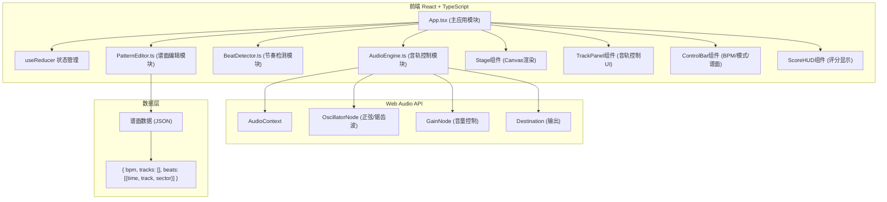

## 1. 架构设计



## 2. 技术描述
- **前端**：React@18 + TypeScript@5 + Vite@5
- **状态管理**：useReducer（复杂状态机，游戏流程控制）
- **音频引擎**：Web Audio API（原生，无第三方依赖）
- **渲染**：HTML5 Canvas（舞台声波、波形预览）
- **动画**：requestAnimationFrame（60FPS循环）
- **工具库**：uuid（唯一ID生成）

## 3. 核心模块接口定义

### 3.1 AudioEngine 类 (src/audio/AudioEngine.ts)
```typescript
type TrackType = 'drum' | 'bass' | 'melody' | 'effect';

interface TrackConfig {
  type: TrackType;
  color: string;
  enabled: boolean;
  volume: number; // 0-1
  waveform: 'sine' | 'sawtooth' | 'square' | 'triangle';
  frequency: number;
}

class AudioEngine {
  constructor();
  init(): Promise<void>; // 初始化AudioContext（需用户交互）
  setBPM(bpm: number): void;
  getBeatInterval(): number; // ms
  toggleTrack(type: TrackType): void;
  setVolume(type: TrackType, volume: number): void;
  playBeat(type: TrackType, when?: number): void; // 触发音轨合成
  startLoop(): void; // 启动节拍循环
  stopLoop(): void;
  dispose(): void;
  onBeat: (beatIndex: number, time: number) => void; // 节拍回调
}
```

### 3.2 BeatDetector 类 (src/rhythm/BeatDetector.ts)
```typescript
interface ActiveWave {
  id: string;
  track: TrackType;
  color: string;
  startRadius: number;
  endRadius: number;
  startTime: number;
  duration: number; // ms，从圆心到外圈的时间
  sector: number; // 0-11
  hit: boolean;
  rated: boolean;
}

type Rating = 'perfect' | 'good' | 'miss';

interface RatingResult {
  rating: Rating;
  deviation: number; // ms，正数=早点击，负数=晚点击
  score: number;
}

class BeatDetector {
  constructor(stageRadius: number);
  setBPM(bpm: number): void;
  start(): void; // 启动动画循环
  stop(): void;
  spawnWave(track: TrackType, sector: number, delay?: number): void; // 生成声波
  handleClick(x: number, y: number, centerX: number, centerY: number): RatingResult | null;
  getActiveWaves(): ActiveWave[]; // 当前活跃声波列表（供渲染）
  getFrameData(): { waves: ActiveWave[]; highlights: number[] }; // 每帧数据
  onFrame: (data: FrameData) => void;
  onRating: (result: RatingResult) => void;
}
```

### 3.3 PatternEditor 类 (src/editor/PatternEditor.ts)
```typescript
interface BeatPoint {
  id: string;
  time: number; // ms，从0开始
  track: TrackType;
  sector: number; // 0-11
}

interface Pattern {
  name: string;
  bpm: number;
  duration: number; // ms，默认30000
  tracks: Record<TrackType, { enabled: boolean; volume: number }>;
  beats: BeatPoint[];
}

type Difficulty = 'easy' | 'normal' | 'hard';

class PatternEditor {
  constructor();
  generatePreset(difficulty: Difficulty): Pattern;
  addBeat(time: number, track: TrackType, sector: number): BeatPoint;
  removeBeat(id: string): void;
  getPattern(): Pattern;
  setPattern(pattern: Pattern): void;
  exportJSON(): string; // 导出谱面JSON字符串
  importJSON(json: string): Pattern;
  getBeatsInSector(sector: number): BeatPoint[];
  clear(): void;
}
```

## 4. 游戏状态定义 (useReducer State)
```typescript
interface GameState {
  phase: 'idle' | 'playing' | 'paused' | 'editing' | 'finished';
  bpm: number;
  difficulty: Difficulty;
  pattern: Pattern | null;
  score: number;
  combo: number;
  maxCombo: number;
  perfectCount: number;
  goodCount: number;
  missCount: number;
  currentTime: number; // ms
  selectedTrack: TrackType; // 编辑模式下选中的音轨
}
```

## 5. 性能优化策略
1. **Canvas 渲染优化**：
   - 声波数据与渲染分离，BeatDetector 内部维护状态
   - requestAnimationFrame 只做脏矩形重绘
   - 离屏 Canvas 预渲染波形底图

2. **音频低延迟**：
   - AudioContext.currentTime 调度，而非 setTimeout
   - OscillatorNode 对象池，避免频繁 GC
   - 预调度 100ms 内的音频事件

3. **动画性能**：
   - CSS transforms 处理 UI 动画（按钮缩放等）
   - will-change 提升舞台 Canvas 合成层
   - 声波对象复用（uuid 对象池）

## 6. 目录结构
```
src/
├── audio/
│   └── AudioEngine.ts
├── rhythm/
│   └── BeatDetector.ts
├── editor/
│   └── PatternEditor.ts
├── components/
│   ├── Stage.tsx          # 舞台Canvas渲染
│   ├── TrackPanel.tsx     # 左侧音轨面板
│   ├── ControlBar.tsx     # 底部控制栏
│   ├── ScoreHUD.tsx       # 评分HUD
│   └── WaveformCanvas.tsx # 单音轨波形预览
├── types/
│   └── index.ts           # 全局类型定义
├── App.tsx
└── index.tsx
```
