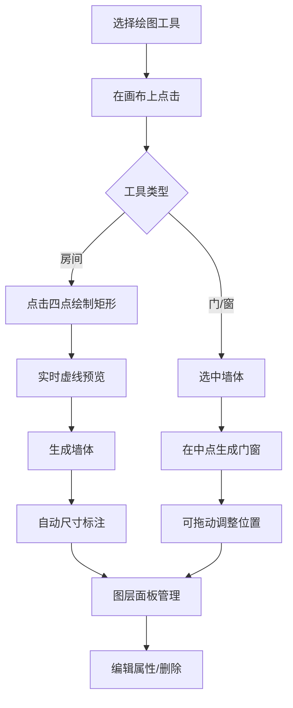

## 1. 产品概述

在线建筑平面草图绘制与尺寸标注工具，让用户通过拖动和点击快速绘制房间、门窗等基本建筑元素，并自动生成带尺寸标注的平面图。

- 主要用途：快速绘制建筑平面草图，自动生成尺寸标注
- 目标用户：建筑师、室内设计师、房产经纪人、装修从业者
- 核心价值：降低绘图门槛，提高草图绘制效率，自动标注减少人工计算

## 2. 核心功能

### 2.1 功能模块

1. **绘图引擎**：Canvas 绘制、缩放平移、网格吸附
2. **尺寸计算**：墙体长度角度计算、尺寸标注位置与文本生成
3. **房间与墙体绘制**：点击四点创建矩形房间，自动生成墙体
4. **门窗添加**：在墙体中点生成门窗，可拖动调整位置
5. **自动尺寸标注**：每面墙外侧自动生成标注线与文本
6. **图层面板**：元素列表、选择高亮、属性编辑、删除
7. **交互操作**：滚轮缩放、空格拖拽平移、坐标显示

### 2.2 页面详情

| 页面名称 | 模块名称 | 功能描述 |
|---------|---------|----------|
| 主界面 | 左侧工具栏 | 绘图工具按钮、图层面板、属性编辑 |
| 主界面 | 右侧绘图区 | Canvas 画布、缩放比例显示、坐标显示 |

## 3. 核心流程

用户选择房间工具 → 在绘图区点击四个点 → 实时显示虚线预览 → 完成点击后生成矩形房间与四面墙体 → 自动计算并生成尺寸标注 → 选中墙体 → 点击门窗按钮 → 在墙体中点生成门窗 → 可拖动调整门窗位置 → 可在图层面板编辑属性或删除

## 4. 用户界面设计

### 4.1 设计风格

- **主色调**：深灰 #2D3748（工具栏背景）、浅灰 #F8F9FA（绘图区背景）
- **强调色**：蓝色 #3182CE（选中高亮）、橙色 #ED8936（门板）
- **墙体色**：深灰 #4A5568
- **标注色**：灰色 #718096
- **按钮风格**：图标+文字，悬停背景变化，0.2秒过渡动画
- **字体**：标注使用 monospace，界面使用系统字体
- **布局风格**：左侧工具栏（240px）+ 右侧绘图区的两栏布局

### 4.2 页面设计概览

| 页面名称 | 模块名称 | UI 元素 |
|---------|---------|--------|
| 主界面 | 工具栏 | 深色背景、圆角8px、图标+文字按钮、悬停效果 |
| 主界面 | 绘图区 | 浅灰背景、Canvas画布、右上角缩放比例、右下角坐标 |
| 主界面 | 图层面板 | 元素列表、选中高亮、属性编辑区 |

### 4.3 响应式设计

- 桌面端（≥768px）：左侧工具栏 + 右侧绘图区的两栏布局
- 移动端（<768px）：工具栏折叠为顶部导航条，绘图区占满剩余空间
- 触摸操作优化：支持触摸拖拽和缩放

### 4.4 动效设计

- 按钮悬停：背景色过渡 0.2s
- 缩放：平滑插值 0.2s
- 门开启：圆弧动画
- 选中状态：边框高亮过渡
