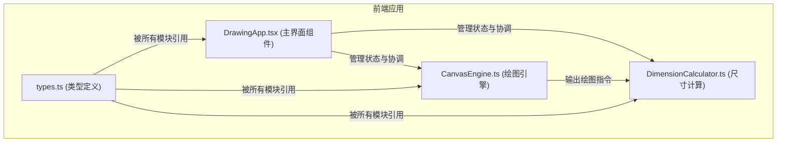

## 1. 架构设计



## 2. 技术描述

- **前端框架**：React@18 + TypeScript
- **构建工具**：Vite
- **UI 方案**：原生 CSS + 内联样式（无 UI 库，按需求精确实现）
- **状态管理**：React useState/useReducer（轻量级，配合模块划分）
- **绘图技术**：HTML5 Canvas 2D
- **依赖包**：react, react-dom, typescript, vite, @vitejs/plugin-react, uuid

## 3. 文件结构

```
├── package.json
├── vite.config.js
├── tsconfig.json
├── index.html
└── src/
    ├── types.ts              # 数据类型定义
    ├── CanvasEngine.ts       # Canvas 绘图引擎
    ├── DimensionCalculator.ts # 尺寸计算与标注
    └── DrawingApp.tsx        # 主界面组件
```

## 4. 数据模型

### 4.1 核心类型定义

```typescript
interface Point {
  x: number;
  y: number;
}

interface Wall {
  id: string;
  start: Point;
  end: Point;
  thickness: number;
  color: string;
}

interface Door {
  id: string;
  wallId: string;
  position: number; // 沿墙体的比例位置 0-1
  width: number;
  swingAngle: number; // 开启角度
  color: string;
}

interface Window {
  id: string;
  wallId: string;
  position: number; // 沿墙体的比例位置 0-1
  width: number;
  height: number;
  color: string;
}

interface Room {
  id: string;
  walls: string[]; // wall ids
  points: Point[];
}

interface Dimension {
  id: string;
  wallId: string;
  startPoint: Point;
  endPoint: Point;
  text: string;
  textPosition: Point;
  offset: number;
}

type Tool = 'select' | 'room' | 'door' | 'window';

interface DrawingState {
  rooms: Room[];
  walls: Wall[];
  doors: Door[];
  windows: Window[];
  dimensions: Dimension[];
  selectedElementId: string | null;
  selectedElementType: 'wall' | 'door' | 'window' | null;
  currentTool: Tool;
  zoom: number;
  pan: Point;
  isDrawing: boolean;
  drawingPoints: Point[];
}
```

### 4.2 模块职责

**CanvasEngine.ts**
- 管理 Canvas 上下文
- 处理缩放（0.5x - 3x）和平移
- 网格吸附
- 鼠标/触摸事件处理
- 绘制墙体、门窗、标注
- 坐标转换（屏幕坐标 ↔ 画布坐标）

**DimensionCalculator.ts**
- 计算墙体长度与角度
- 生成尺寸标注位置
- 计算标注文本位置
- 确保标注朝外不重叠

**DrawingApp.tsx**
- 主界面布局（工具栏 + 绘图区）
- 状态管理
- 工具切换
- 图层面板
- 属性编辑
- 协调各模块交互

## 5. 性能优化策略

- 使用 requestAnimationFrame 实现流畅动画
- 离屏 canvas 缓存静态元素
- 仅在数据变化时重绘
- 缩放使用 CSS transform 或 canvas 缩放矩阵
- 鼠标事件节流
