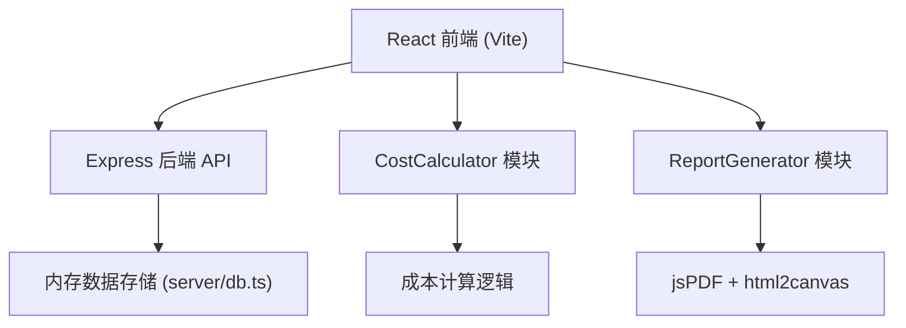
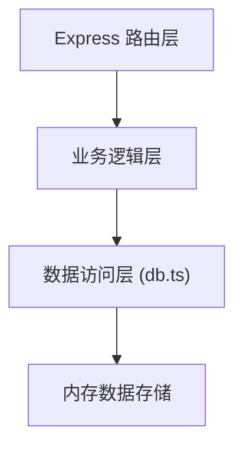
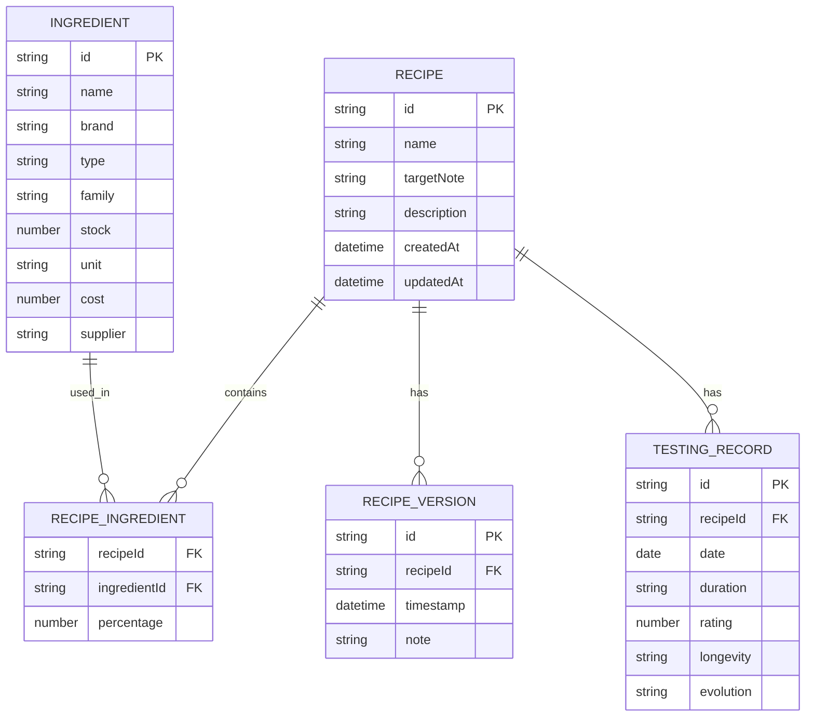

## 1. 架构设计



## 2. 技术说明

- **前端框架**：React 18 + TypeScript + Vite
- **状态管理**：React useState/useContext（轻量级全局状态）
- **样式方案**：原生 CSS + CSS 变量（无 Tailwind，按需求精确控制样式）
- **后端框架**：Express 4 + cors 中间件
- **数据存储**：内存数据库（server/db.ts），模拟 CRUD 操作
- **PDF生成**：jsPDF + html2canvas
- **唯一ID**：uuid
- **拖拽排序**：原生 HTML5 Drag & Drop API

## 3. 路由定义

| 路由 | 用途 |
|------|------|
| /ingredients | 原料库页面 |
| /recipes | 配方列表页面 |
| /recipes/:id | 配方详情/编辑页面 |
| /testing | 试香记录页面 |
| /reports | 报告中心页面 |

## 4. API 定义

### 4.1 原料接口

| 方法 | 路径 | 描述 | 请求体 | 响应 |
|------|------|------|--------|------|
| GET | /api/ingredients | 获取所有原料 | - | Ingredient[] |
| POST | /api/ingredients | 添加新原料 | IngredientInput | Ingredient |
| PUT | /api/ingredients/:id | 更新原料 | IngredientInput | Ingredient |
| DELETE | /api/ingredients/:id | 删除原料 | - | { success: boolean } |

### 4.2 配方接口

| 方法 | 路径 | 描述 | 请求体 | 响应 |
|------|------|------|--------|------|
| GET | /api/recipes | 获取所有配方 | - | Recipe[] |
| GET | /api/recipes/:id | 获取单个配方详情 | - | Recipe |
| POST | /api/recipes | 创建新配方 | RecipeInput | Recipe |
| PUT | /api/recipes/:id | 更新配方（创建版本） | RecipeInput | Recipe |
| GET | /api/recipes/:id/versions | 获取配方版本历史 | - | RecipeVersion[] |
| POST | /api/recipes/:id/rollback/:versionId | 回滚到指定版本 | - | Recipe |

### 4.3 试香记录接口

| 方法 | 路径 | 描述 | 请求体 | 响应 |
|------|------|------|--------|------|
| GET | /api/testings | 获取所有试香记录 | - | TestingRecord[] |
| POST | /api/testings | 添加试香记录 | TestingInput | TestingRecord |

### 4.4 类型定义

```typescript
interface Ingredient {
  id: string;
  name: string;
  brand: string;
  type: string;
  family: string;
  stock: number;
  unit: string;
  cost: number;
  supplier: string;
}

interface RecipeIngredient {
  ingredientId: string;
  percentage: number;
}

interface Recipe {
  id: string;
  name: string;
  targetNote: string;
  description: string;
  ingredients: RecipeIngredient[];
  createdAt: string;
  updatedAt: string;
  versions: RecipeVersion[];
}

interface RecipeVersion {
  id: string;
  timestamp: string;
  note: string;
  ingredients: RecipeIngredient[];
}

interface TestingRecord {
  id: string;
  recipeId: string;
  date: string;
  duration: string;
  rating: number;
  longevity: string;
  evolution: string;
}

interface CostReport {
  totalCostPer10ml: number;
  ingredientCosts: { id: string; name: string; cost: number; percentage: number }[];
}
```

## 5. 服务端架构图



## 6. 数据模型

### 6.1 数据模型定义



### 6.2 初始数据

- 预置 15-20 种常见香料原料（玫瑰精油、檀香、香草、麝香等）
- 预置 2-3 个示例配方
- 预置若干试香记录作为演示
