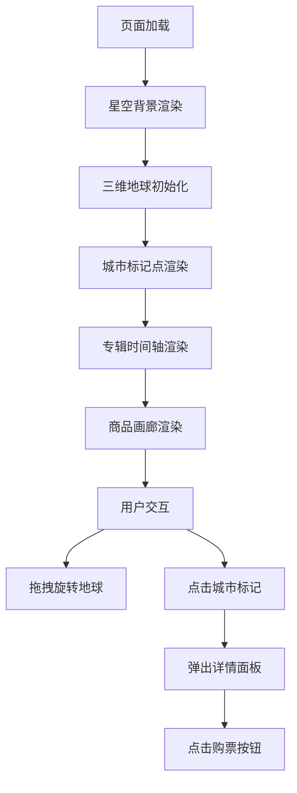

## 1. 产品概述
小众独立乐队三维地球可视化品牌页面，帮助独立音乐人和乐队展示巡演路线、专辑发布日历以及周边商品，以沉浸式三维地球界面呈现品牌形象。
- 目标用户：独立乐队主理人、音乐厂牌、独立音乐人
- 核心价值：通过具有视觉冲击力的3D地球交互展示，提升乐队品牌形象，增强粉丝互动体验

## 2. 核心功能

### 2.1 功能模块
1. **三维地球主界面**：沉浸式全屏暗色星空主题，Three.js渲染的三维地球，支持鼠标拖拽旋转和缩放
2. **巡演城市标记**：地球表面发光城市标记点，点击弹出演出详情面板
3. **专辑发布日历**：左侧时间轴展示专辑发布信息，环绕地球旋转光点动画
4. **周边商品画廊**：底部横向滚动商品展示
5. **城市详情面板**：点击城市后显示演出信息与购票链接

### 2.2 页面详情

| 页面名称 | 模块名称 | 功能描述 |
|-----------|----------|---------|
| 主页面 | 三维地球场景 | 全屏暗色星空背景，Three.js地球渲染，自转、拖拽旋转、缩放交互 |
| 主页面 | 城市标记点 | 发光脉动圆点悬浮于地球经纬度位置，点击选中高亮 |
| 主页面 | 城市信息面板 | 显示城市名、演出日期、场馆、购票按钮，始终面向用户 |
| 主页面 | 专辑时间轴 | 左下角浮动面板，纵向排列专辑信息，金色光晕突出最新专辑 |
| 主页面 | 专辑漂浮光点 | 未发布专辑对应环绕地球旋转光点 |
| 主页面 | 商品画廊 | 底部固定区域，横向滚动卡片，左右箭头导航 |

## 3. 核心流程

用户打开页面 → 地球缓慢自转展示 → 鼠标拖拽旋转/缩放地球 → 点击城市标记 → 弹出演出详情面板 → 点击购票跳转 → 浏览专辑时间轴 → 滚动查看周边商品

## 4. 用户界面设计

### 4.1 设计风格
- 主色调：深空蓝紫渐变（顶部#0B0D17 → 底部#1A1B3A）
- 强调色：橙红色#FF6B35（城市标记、购票按钮）、青色#00D4AA（专辑光点）、金色#FFD700（最新专辑光晕）
- 字体：现代无衬线字体，暗色系背景配合发光效果
- 圆角风格：圆角12px卡片、半透明毛玻璃质感面板
- 按钮：圆角8px，悬停亮度提升过渡

### 4.2 页面设计概述

| 页面名称 | 模块名称 | UI元素 |
|---------|---------|---------|
| 主页面 | 星空背景 | 全屏渐变+深空蓝紫渐变，全屏铺满 |
| 主页面 | 三维地球 | 半径200px，高分辨率纹理，半透明经纬网格，60秒自转一圈 |
| 主页面 | 城市标记点 | 半径6px发光圆点#FF6B35，悬浮高度15px，2秒脉动动画（1.0→1.3倍缩放） |
| 主页面 | 城市信息面板 | 宽320px，半透明背景#1A1B3AE0，边框#FF6B3566，圆角12px |
| 主页面 | 专辑时间轴 | 宽260px，左下40px/80px定位，#1A1B3AB3背景，圆角16px |
| 主页面 | 专辑光点 | 半径4px，#00D4AA，轨道300px，15秒周期 |
| 主页面 | 商品画廊 | 高180px，#0B0D17E6背景，卡片200px宽，圆角12px |

### 4.3 响应式设计
- 桌面端优先设计
- 屏幕宽度<768px时：
  - 地球半径缩小至120px
  - 专辑日历宽度180px，移动至左上角
  - 商品画廊高度140px
  - 所有动画帧率保持45fps以上

### 4.4 3D场景指南
- 环境：深空星空背景，无HDRI环境
- 光照：环境光+方向光，地球表面柔和光照
- 相机：透视相机，初始距离适中
- 交互：OrbitControls实现拖拽旋转缩放，0.5秒阻尼缓动
- 动画：地球自转动画、城市点脉动动画、专辑光点环绕动画
- 性能：保持45fps以上，合理控制渲染优化
