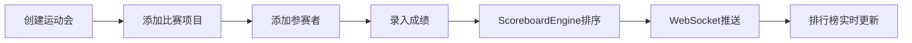

## 1. 产品概述
社区运动会赛事管理与实时排行榜系统，解决社区趣味运动会报名统计与成绩更新效率低下的问题。
- 核心价值：让组织者轻松创建赛事、管理报名、录入成绩，实现排行榜实时更新与大屏展示
- 目标用户：社区健身爱好者、赛事组织者、参赛者与观众

## 2. 核心特性

### 2.1 用户角色
| 角色 | 注册方式 | 核心权限 |
|------|----------|----------|
| 赛事组织者 | 直接使用管理面板 | 创建运动会、添加项目、管理参赛者、录入成绩 |
| 裁判 | 通过管理面板录入 | 选择项目与参赛者、提交成绩 |
| 观众 | 访问排行榜页面 | 查看实时排行榜与成绩更新 |

### 2.2 功能模块
1. **赛事管理模块**：创建运动会、设置基本信息、添加多个比赛项目
2. **参赛者管理模块**：添加参赛者、自动生成参赛编号、支持一人报多项
3. **成绩录入模块**：按项目录入成绩、支持计时类与分数类两种类型
4. **实时排行榜模块**：按项目分组排名、动态柱状条对比、前三名高亮展示
5. **WebSocket实时推送模块**：成绩变更实时同步到所有连接的客户端

### 2.3 页面详情
| 页面名称 | 模块名称 | 功能描述 |
|---------|---------|----------|
| 主控制台 | 管理面板 | 创建运动会、添加项目、管理参赛者、录入成绩表单与表格 |
| 主控制台 | 排行榜预览 | 实时展示各项目排行榜、前三名卡片、柱状条动画对比 |
| 排行榜大屏 | 排行榜展示 | 全屏展示实时排行榜、项目切换选项卡、动画过渡效果 |

## 3. 核心流程
组织者创建运动会并添加项目 → 添加参赛者到各项目 → 裁判选择项目与参赛者录入成绩 → 系统自动排序计算排行榜 → 通过WebSocket推送到所有观众页面 → 排行榜界面实时更新展示

## 4. 用户界面设计

### 4.1 设计风格
- **主色调**：深灰背景 #1E293B，卡片背景 #334155，亮橙强调色 #F97316
- **奖牌配色**：金牌渐变 #FBBF24，银牌 #9CA3AF，铜牌 #CD7F32
- **柱条配色**：背景 #475569，填充 #3B82F6
- **字体**：展示字体使用 Orbitron（运动科技感），正文字体使用 Inter
- **布局**：桌面端双栏布局（左管理右预览），移动端上下布局
- **圆角**：卡片 16px，输入框 8px
- **阴影**：中粗阴影，营造层次感

### 4.2 页面设计概览
| 页面名称 | 模块名称 | UI元素 |
|---------|---------|--------|
| 主控制台 | 管理面板 | 表单输入框（聚焦橙色边框）、参赛者列表（悬停高亮）、圆形头像占位 |
| 主控制台 | 排行榜预览 | 前三名渐变卡片、名次数字加粗24px、横向柱状条动画对比 |
| 排行榜大屏 | 排行榜展示 | 项目选项卡（下划线滑动动画）、卡片列表、柱状条0.5秒过渡动画 |

### 4.3 响应式设计
- 桌面端（≥768px）：双栏布局，左侧管理面板，右侧排行榜预览
- 移动端（<768px）：上下布局，管理面板折叠为可展开顶部抽屉，排行榜满屏显示
- 触摸优化：按钮最小高度44px，输入框足够大便于触摸操作

